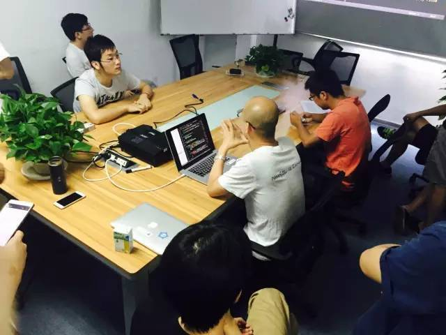
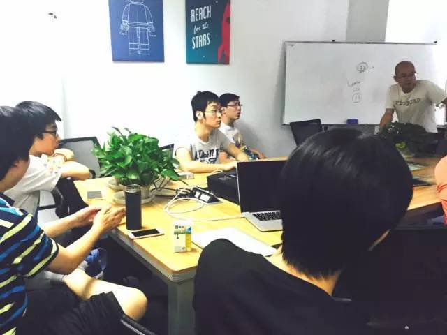
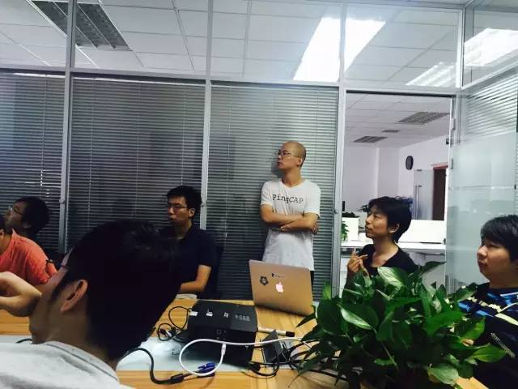
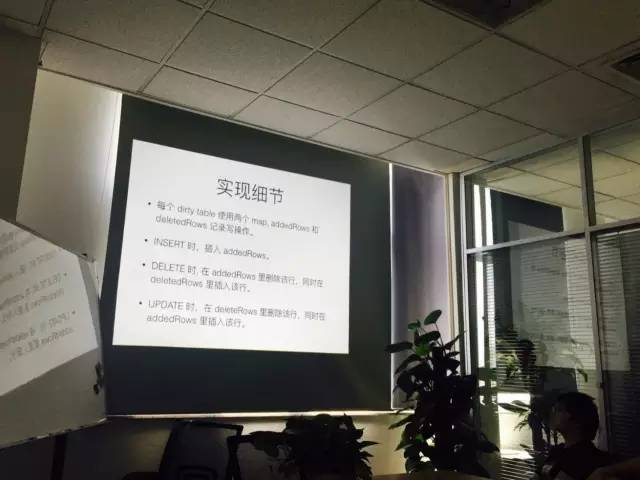
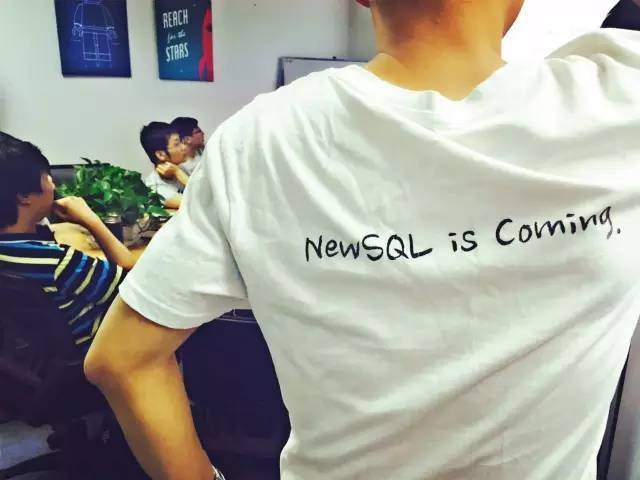

今天是 PingCAP 第 10 期 Meetup ，跟京东小伙伴就 Raft group 中出现网络隔离时的 stale read 的问题做了充分讨论交流。之后进行的分享主题是《TiKV 的网络模拟测试》和《TiDB 的条件下推优化》。

### 随机讨论

 

Raft group 中出现网络隔离时，会有 stale read 的问题。目前我们考虑采用 region leader 的方案，保证在出现网络隔离的情况下，也能保证读的正确性。大家对其中的实现细节，以及各种方案的优缺点进行了讨论。

### 刘奇《TiKV 的网络模拟测试》

 

刘奇 | PingCAP

TiKV 如何做分布式系统测试。目前已经构建了一套测试框架，提供设置网络延迟、网络隔离、节点掉线等功能，用于构建测试用例。

### 周昱行《TiDB 的条件下推优化》

 

周昱行 | PingCAP

使用基于 Row 的 Merge 算法，解决存在脏数据时，使用 TiDB 下推 API 优化的问题。

TiDB 的下推 API 相比基础的 API 对读性能有着几个数量级的提升，任何无法使用下推 API 的操作的请求，性能都慢到完全无法接受的程度。但是之前的实现并不能保证所有读请求都可以走下推 API, 当事务有写操作以后，无法使用下推 API。无法使用的原因是，事务提交之前，事务内写入的数据是对事务自身是可见的，下推 API 只能读到已提交的数据，返回的结果是错误的。

一个很常见的场景是在一个事务内 UPDATE 多个 Row，会退化到使用基础 KV API。

 

本周 TiDB 的一个更新，通过设计实现了一种基于 Row 的 Merge 算法，解决了这个问题。

小花絮： 赠送 PingCAP 家褶皱版美背 T 恤买家秀一只。大家周末愉快 ;P

 

