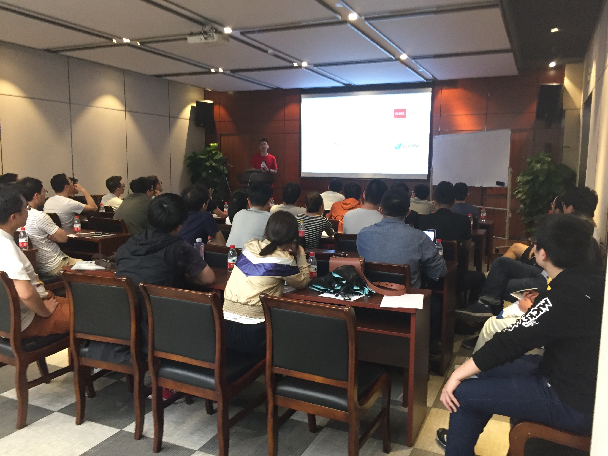
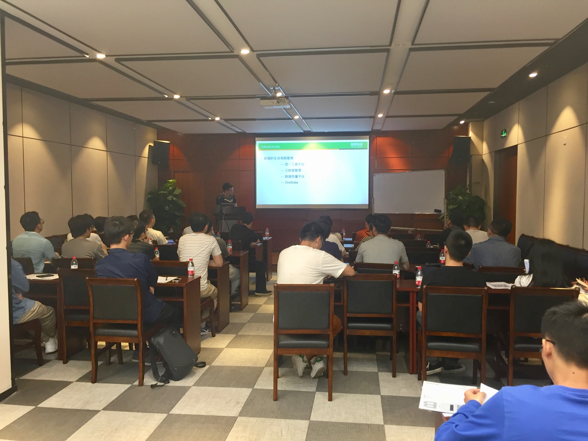
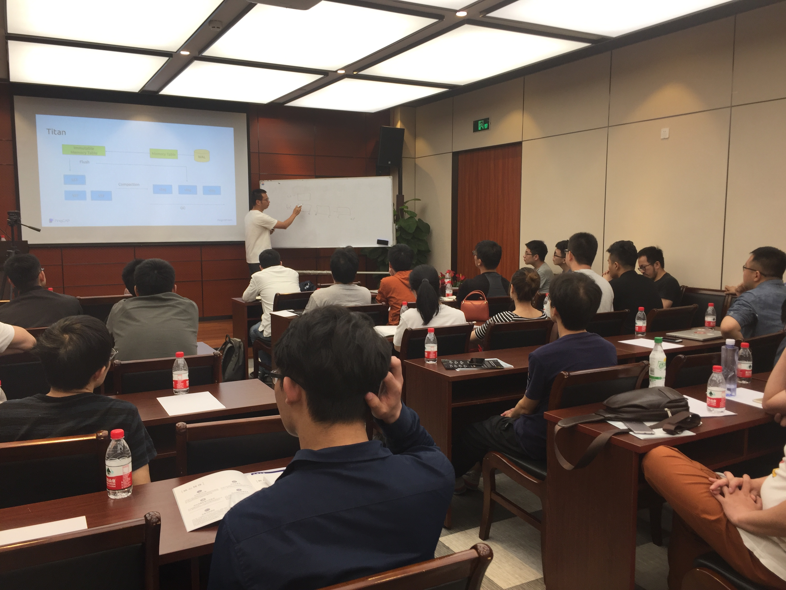

## Topic 1：Log, Observability and Filebeat

>讲师介绍：王鹏翰，Dashbase.Inc 研发工程师，参与研发下一代日志搜索引擎。

+ [视频 | Infra Meetup No.101：Log, Observability and Filebeat](https://v.qq.com/x/page/x0870a9uwkl.html)
+ [PPT 链接](https://eyun.baidu.com/s/3ht0kKss)

本次分享王鹏翰老师首先阐述了 Log 和 observability 是什么，以及建立可观察性（observability）的三个主要手段：logging, metrics, tracing。然后对 Filebeat 的设计架构，实现细节，以及如何对 filebeat 进行合理的监控进行了介绍。最后分享了在生产环境中 50TB/day 日志传输量下的 filebeat 调优细节。

## Topic 2：易果集团的数据平台建设历程

>讲师介绍：罗瑞星，曾就职于前程无忧，参加过 Elasticsearch 官方文档中文翻译工作，现任易果集团数据架构专家，负责易果集团大数据平台架构，数据中台，数据仓库建设等工作。

+ [视频 | Infra Meetup No.101：易果集团的数据平台建设历程](https://v.qq.com/x/page/o0870vuug3w.html)
+ [PPT 链接](https://eyun.baidu.com/s/3ht0kKss)

本次分享罗瑞星老师为大家介绍了易果集团大数据体系的发展历程，主要包括：

1. 数据工具的演进，调度工具，数据交换工具等；

2. 数据架构的演进，包括离线架构，实时架构等。

3. 最后详细介绍了 TiDB 在易果集团的使用，以及未来规划。

## Topic 3：The Evolution of TiKV

>讲师介绍：唐刘，PingCAP 首席架构师。

+ [视频 | Infra Meetup No.101：The Evolution of TiKV](https://v.qq.com/x/page/o0870vuug3w.html)
+ [PPT 链接](https://eyun.baidu.com/s/3ht0kKss)

本次分享唐刘老师首先介绍了 3.0 整个 TiDB 集群的架构变化，主要包括如何通过 TiKV + TiFlash 来实现真正的 HTAP。然后介绍了 3.0 TiKV 的一些性能优化，最后按照 TiKV 架构自底向上，详细介绍了 engine、Raft、transaction、scheduler 等后面需要做的事情。

