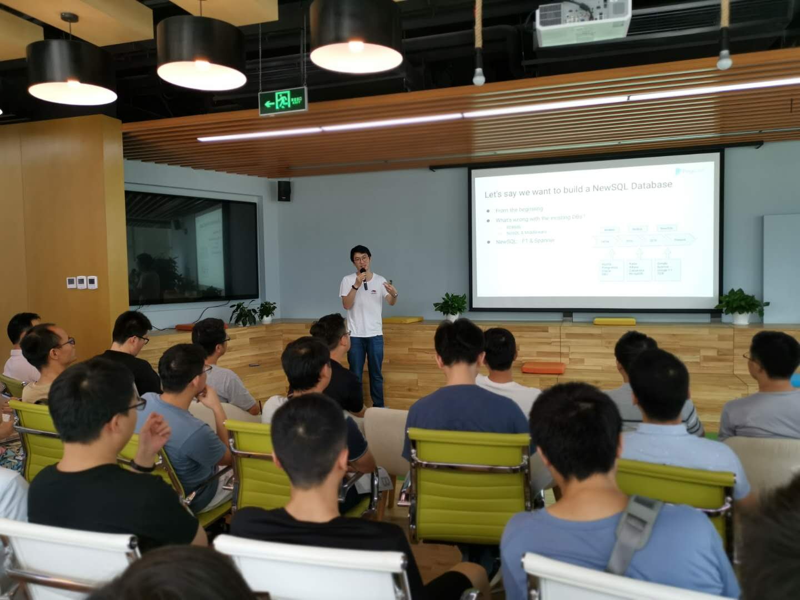
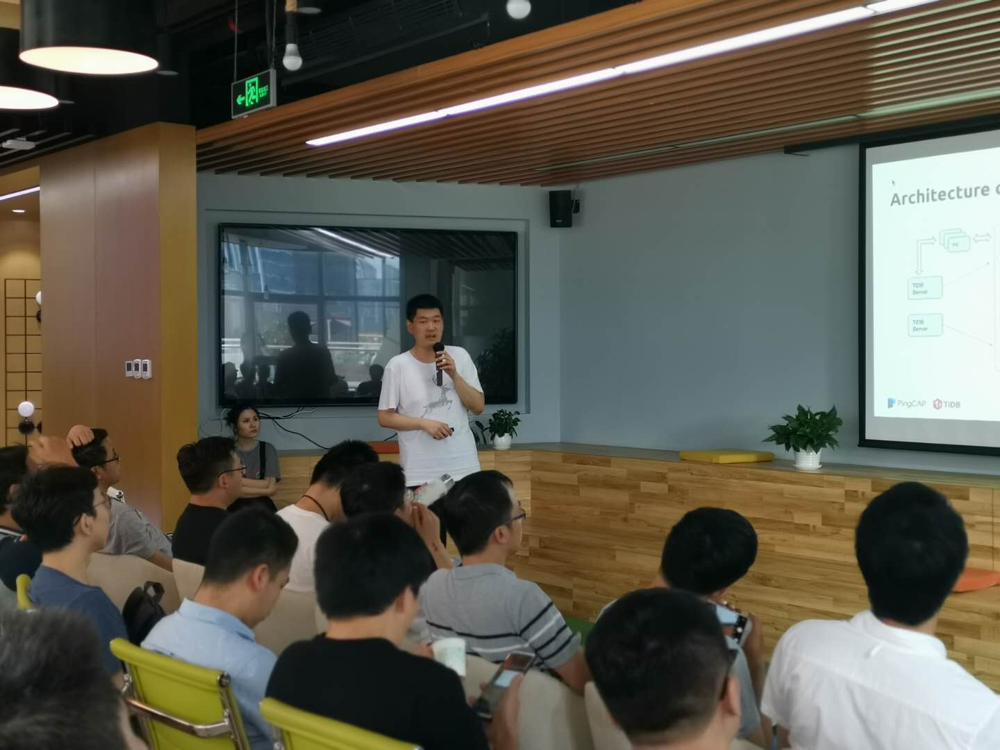

## Topic 1：How We Build TiDB

>讲师介绍：姚维，TiDB 核心开发工程师，分布式数据库专家，我司华南区总经理。知名开源数据库中间件 Atlas 作者。

+ [视频 | Infra Meetup No.102：How We Build TiDB](https://www.bilibili.com/video/av53229886/?p=1)
+ [PPT 链接](https://eyun.baidu.com/s/3eThrXPg)

本次分享姚维老师从数据库发展的历程讲起，讲解了 TiDB 的使命。以及从底向上的描述我们是怎么去实现一个 HTAP 数据库的，内容包括如果实现容错性，如果实现扩展性，如何在分布式的事务型 KV 存储之上构建完整的 SQL 系统。

## Topic 2：TiDB Ecosystem Tools 概览

>讲师介绍：杨非，TiDB Ecosystem Tools Team 研发工程师，目前主要负责数据迁移平台 TiDB DM 的设计与开发工作。

+ [视频 | Infra Meetup No.102：TiDB Ecosystem Tools 概览](https://www.bilibili.com/video/av53229886/?p=2)

杨非老师围绕 TiDB 生态系统架构中数据同步相关工具展开介绍，内容包括工具的架构设计，实现原理和使用场景等。具体工具包括以下三款：从 TiDB 集群实时同步数据到自定义下游的工具 TiDB-Binlog，从 MySQL/MariaDB 同步数据到 TiDB 的工具 Data Migration，以及支持将数据从 SQL 文件或 csv 格式文件快速导入 TiKV 集群的 TiDB-lightning toolset。
