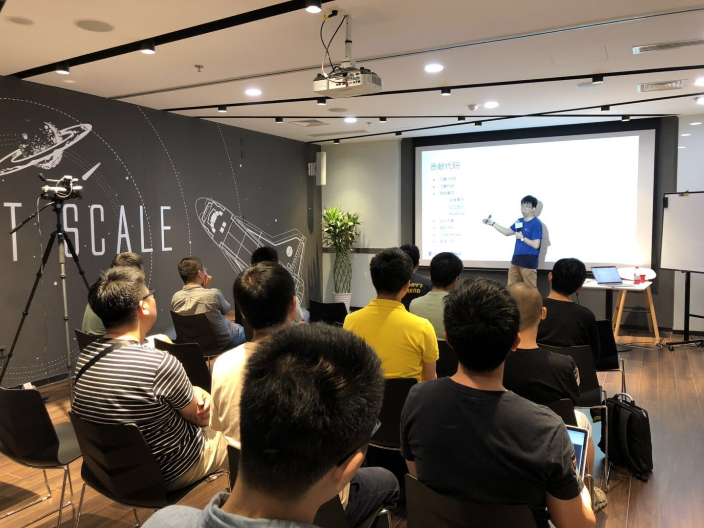

## Topic ：TiDB 开源社区专题

>讲师介绍：PingCAP 技术 VP，TiDB Tech Lead，前网易有道、360 搜索资深研发。

+ [视频 | Infra Meetup No.103：TiDB 开源社区专题](https://www.bilibili.com/video/av54022423)
+ [PPT 链接](https://eyun.baidu.com/s/3snnXy13)

本次 Talk 申砾老师首先给大家介绍了 TiDB 的演进历史，社区发展现状。然后详细介绍了如何参与到 TiDB 开源社区中，从了解社区、学习 TiDB 代码，到做出第一个贡献，接下来不断地做更加深入地贡献，成为 committer 甚至 maintainer。在这个过程中，我们准备了很多相关资料，帮助社区了解 TiDB 技术细节以及社区治理规范，希望能和大家一起构建一个全球顶尖的开源社区。