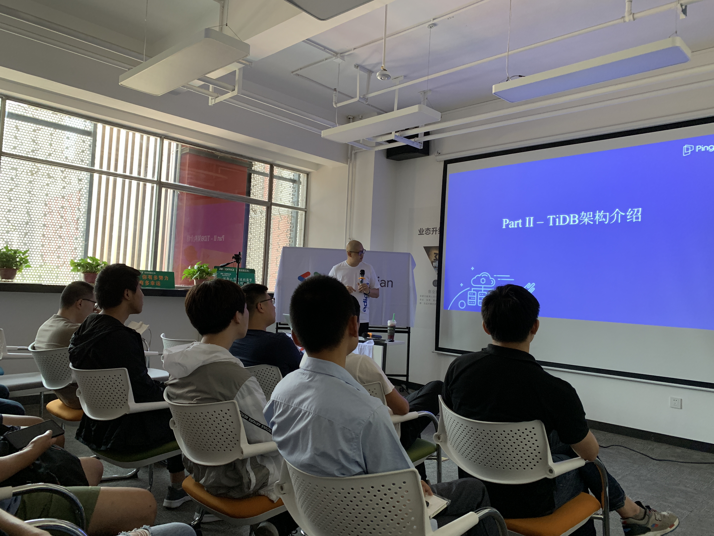
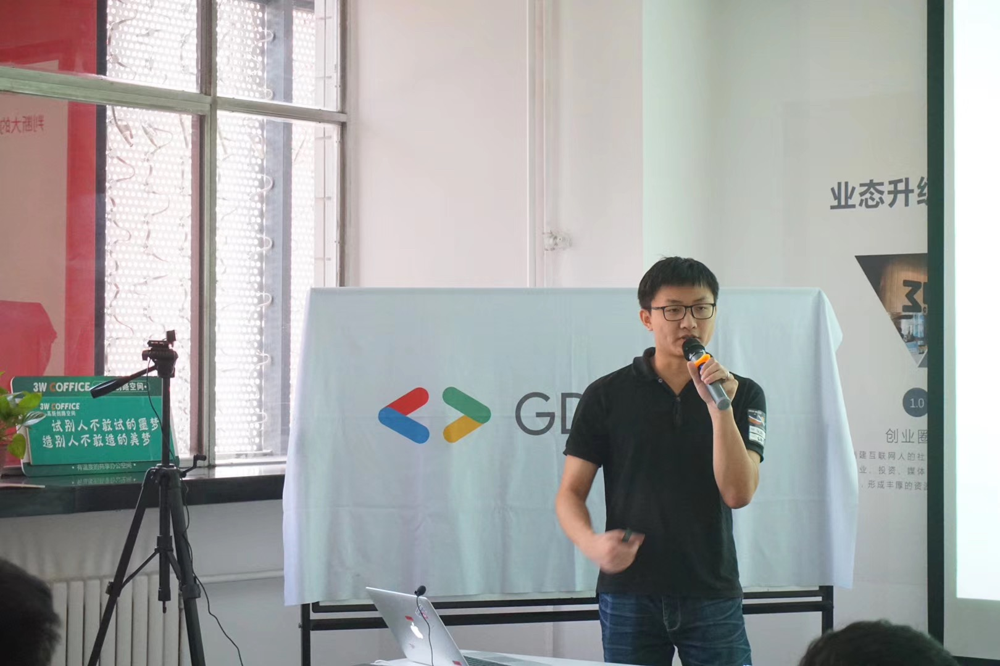

## Topic 1：云原生数据库的核心特点 - TiDB 架构及发展

>讲师介绍：杨洋，TiDB contributor。

+ [视频 | Infra Meetup No.104：云原生数据库的核心特点 - TiDB 架构及发展](https://www.bilibili.com/video/av53937983/?p=1)
+ [PPT 链接](https://eyun.baidu.com/s/3kWhhRmR)

杨洋老师本次分享的主要内容为：

1. 介绍了云原生的概念及演化；

2. 结合云原生的特点分析传统数据库在架构方面的不足；

3. 着重介绍云原生数据库在架构方面的特点；

4. 作为云原生数据库中的佼佼者 TiDB 的技术架构是怎样的；

5. TiDB 版本的演进，用户案例展示，技术社区活动介绍。

## Topic 2：反应式编程之 Spring WebFlux

>讲师介绍：张锦文，现任职于金数据，主任工程师，前 ThoughtWorks 高级咨询师，AWS 助理架构师，《Scala 编程实战》合译者，有丰富的开发及工程实践，喜欢技术及编程挑战，热爱开源技术，贡献过 Pact-JVM 等开源框架，擅长 Java 生态及 DevOPS 技术。

+ [视频 | Infra Meetup No.104：反应式编程之 Spring WebFlux](https://www.bilibili.com/video/av53937983/?p=2)
+ [PPT 链接](https://eyun.baidu.com/s/3kWhhRmR)

张锦文老师本次分享主要讲述了计算机由单核到多核的处理架构的变化，接着从理论出发指出多线程编程所面临的问题，并给出了解决方案，进一步详细介绍了反应式编程的由来及反应式编程宣言：

- Responsive

- Resilient

- Elastic

- Message-Driven

然后理论落地引出函数式编程并进一步讲述了其特点：

- 副作用

- 不可变及幂等性

- 惰性求职

- 函数式一等公民

最后介绍了 Spring WebFlux 在反应式编程中的应用以及它的核心组件，并结合工程实践分享了项目中的踩坑过程。