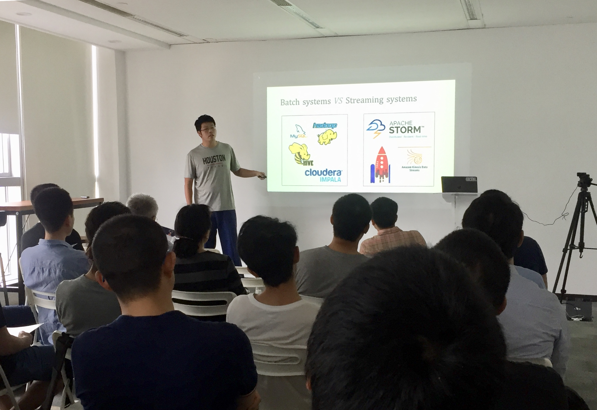
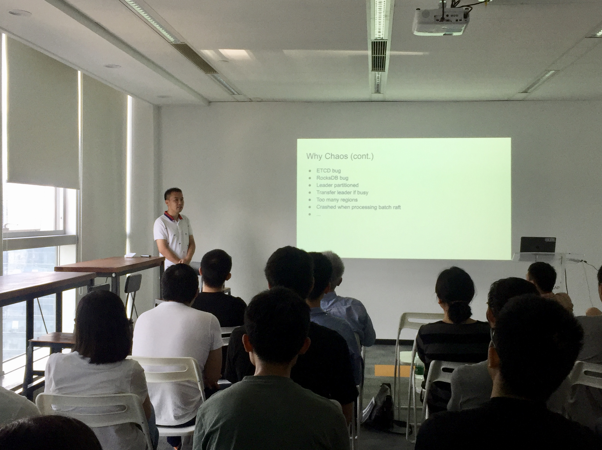

## Topic 1：Happy Hacking TiDB

>讲师介绍：杜川，数据库技术爱好者，TiDB Committer。主要专业方向是分布式关系型计算，关注数据库优化器和执行引擎相关技术。目前主要从事云数据库相关开发工作。

+ [视频 | Infra Meetup No.105：Happy Hacking TiDB](https://www.bilibili.com/video/av54630162/?p=1)
+ [PPT 链接](https://eyun.baidu.com/s/3eSQxiZg)

本次杜川老师的分享主要分成三个部分： 

1. 首先通过对现有 Streaming 系统和 Batch 系统的分析，讨论了在数据处理领域 Streaming 和 Batch 的异同，明确了 Streaming 的核心本质，探讨了 Streaming 和 Batch 融合处理的可能性和必要性，并对现有类似系统进行了简单的分析。

2. 简单回顾了 RDMS 中经典的 Volcano 模型的执行流程，探讨了在 RDMS 上支持 Streaming 处理的难点以及 Streaming SQL 设计的关键要素。

3. 介绍了 TBSSQL 的设计思路，架构设计和若干关键技术点的方案选择，展示了 TBSSQL 的运行 Demo。并以 TBSSQL 为例，简单介绍了在 TiDB 上增加一个 Feature 的大致思路和入手点。

## Topic 2：Chaos Practice in TiDB

>讲师介绍：舒科，PingCAP 研发工程师。主要方向是 TiDB 质量保障，关注提升测试质量和效率的新技术。

+ [视频 | Infra Meetup No.105：Chaos Practice in TiDB](https://www.bilibili.com/video/av54630162/?p=2)
+ [PPT 链接](https://eyun.baidu.com/s/3eSQxiZg)

本次分享舒科老师首先介绍了什么是 Chaos、为什么要用 Chaos，然后分享了我司使用 Chaos 的经验以及在错误注入上的一些积累，最后分享了我司薛定谔系统的基本概念和架构，以及 Chaos Operator 相关的内容。