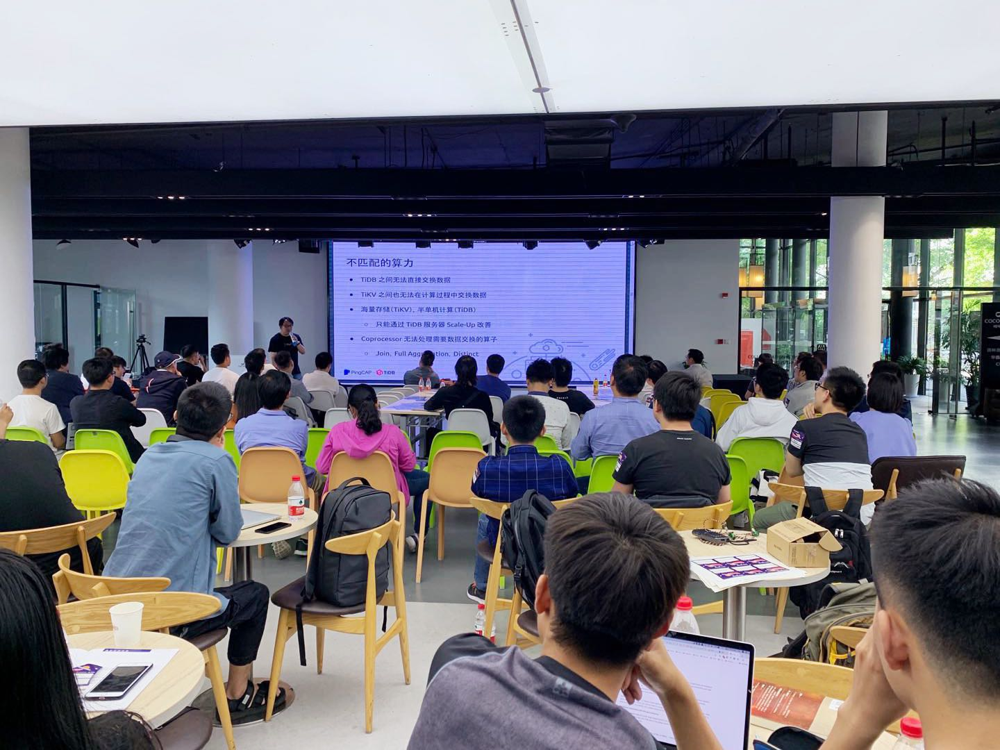

## Topic 1：Alluxio 的新特性介绍与缓存性能优化

>讲师介绍：顾荣，博士毕业于南京大学计算机系，南大 PASA 大数据实验室助理研究员，研究方向大数据处理系统，现担任江苏省计算机学会大数据专家委员会秘书长、中国计算机学会系统软件专委会委员，Alluxio 项目 PMC Member & Maintainer。

+ [PPT 链接](https://eyun.baidu.com/s/3jIUYJS6)

顾博士首先介绍了大数据处理的四大趋势，并分析其驱动新型基础架构方面的需求。为了满足这些需求，接着他介绍了 Alluxio 数据编排的思想，为上层计算框架和底层存储系统构建桥梁。最后，他介绍了 Alluxio 2.0 新特性，以及顾博士所在南大实验室在 Alluxio 缓存优化方面的一些工作，包括通用化缓存调度框架，缓存策略，以及内存读优化等。

## Topic 2：基于仿真技术规划部署和调优大数据集群

>讲师介绍：刘华，来自于 Intel 系统技术与优化部门，负责 Intel 系统建模和模拟解决方案在亚太区的业务推广。目前致力向客户提供基于仿真技术的 Intel®CoFluent™ 大数据技术，帮助客户规划部署和调优大数据集群。

+ [PPT 链接](https://eyun.baidu.com/s/3jIUYJS6)

刘华老师首先探讨了规划部署和调优大数据集群时通常面临的一些挑战: 集群规模规划、硬件配置选型、软件参数优化和可扩展性分析。基于 Intel® CoFluent™ Studio 仿真技术，Intel 开发了端到端大数据集群仿真器——Intel® CoFluent™ Technology For Big Data，利用软硬件协同仿真的方法来应对这些大数据挑战。接着他结合健康监控集群和视屏分析系统中的实例场景，阐述了仿真器是如何执行全栈参数优化，集群规模预测，硬件配置规划和扩展性分析，以及集群容量预测和瓶颈识别等分析和原理。Intel® CoFluent™ Technology For Big Data 可以在软件环境中模拟完整的大规模集群，支持各种 Intel 硬件产品和各种大数据软件栈的模拟。通过灵活的 what-if 分析和精确的量化预测，可以帮助客户快速设部署集群，充分发挥硬件利性能，最小化成本，提供最好的用户体验。

## Topic 3：TiDB 的 HTAP 之路 - 过去，现在和将来

>讲师介绍：马晓宇，PingCAP 分析型产品负责人。曾就职于 Quantcast、网易，负责构建和管理大数据平台。关注分布式系统，SQL 引擎开发等领域。

+ [视频 | Infra Meetup No.106：TiDB 的 HTAP 之路 - 过去，现在和将来](https://www.bilibili.com/video/av54632526/?p=1)
+ [PPT 链接](https://eyun.baidu.com/s/3jIUYJS6)

本次分享马老师从 TiDB 在 HTAP 道路上不断探索的过程为线索，从 TiDB 最初版在分析场景的功能特点，合适与不合适的场景为起始，介绍了为何会引入 TiSpark 组件解决大规模批量计算和大数据生态整合；我们如何优化 TiDB 本体的引擎；以及 TiFlash 又如何帮这个体系彻底解决资源隔离和行列混存的矛盾，从而最终向真 HTAP 数据库演进的过程。

## Topic 4：Zeppelin 在机器学习领域的最新特性和规划

>讲师介绍：刘勋，Zeppelin Committer；Hadoop Submarine Team Member；目前就职网易杭研数据科学中心，负责机器学习平台的开发和建设。关注 Hadoop 、大数据平台和机器学习等领域。

+ [视频 | Infra Meetup No.106：Zeppelin 在机器学习领域的最新特性和规划](https://www.bilibili.com/video/av54632526/?p=2)
+ [PPT 链接](https://eyun.baidu.com/s/3jIUYJS6)

本次分享刘勋老师介绍了 Apache Zeppelin，这是一个可以进行大数据可视化分析的交互式开发系统。刘勋老师首先介绍了在 zeppelin 最新的版本中增加了对 Tensorflow、PyTorch 的深度学习框架的支持。在 zeppelin 中可以完成机器学习的数据预处理、算法开发和调试、算法作业调度的工作，将来还将提供算法的模型 Serving 服务，Workflow 工作流编排等新特性，让 zeppelin 可以完全覆盖机器学习的全流程工作。接着他介绍了 zeppelin 还提供了单机 Docker、分布式、K8s、Yarn 四种系统运行模式，无论你是小规模的开发团队，还是 hadoop 技术栈的大数据团队、K8s 技术栈的云计算团队，zeppelin 都可以让你轻松的进行部署和使用 zeppelin 丰富的数据和算法的开发能力。