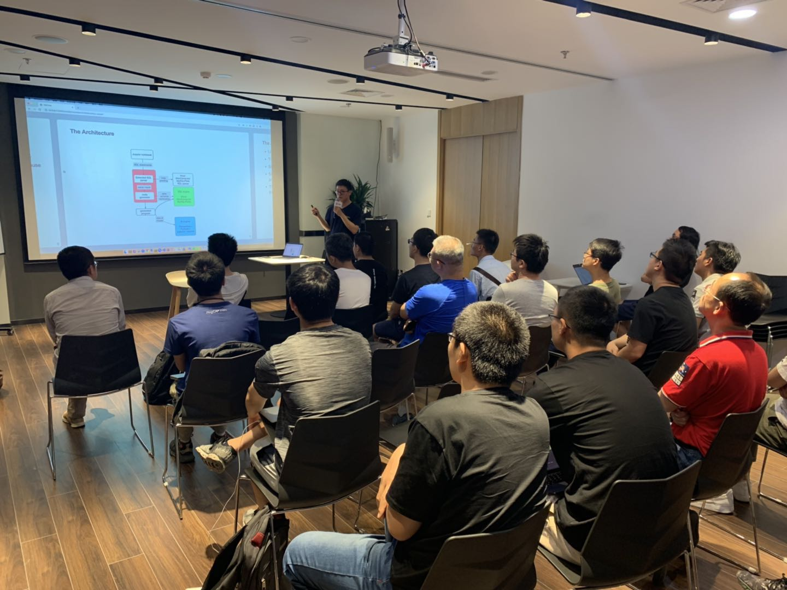

## Topic：SQLFlow: Brings SQL and AI together 

>讲师介绍：武毅，SQLFlow 开发者，开源深度学习引擎 PaddlePaddle 分布式训练设计者和核心开发者，多年在线推荐系统和机器学习相关从业者。

+ [视频 | Infra Meetup No.107：SQLFlow: Brings SQL and AI together](https://www.bilibili.com/video/av56084311)
+ [PPT 链接](https://github.com/sql-machine-learning/sqlflow/tree/develop/cmd/demo/slides/201906 )

本次分享武毅老师介绍了开源项目 SQLFlow (github.com/sql-machine-learning/sqlflow) 的核心设计以及设计挑战，包括：

- SQLFlow 如何做到使用几行 SQL 语言就可以完成模型的训练和预测

- SQLFlow 的设计思想和实现方法

- 2 个关键设计的思考包括：特征推导，可插拔 Parser 设计

最后讨论了 SQLFlow 目前的应用和可能的应用场景。SQLFlow 将会为更多的业务专家提供便捷的工具，快速训练，迭代有助于业务的模型，降低业务专家应用 AI 能力的时间成本和调研成本。