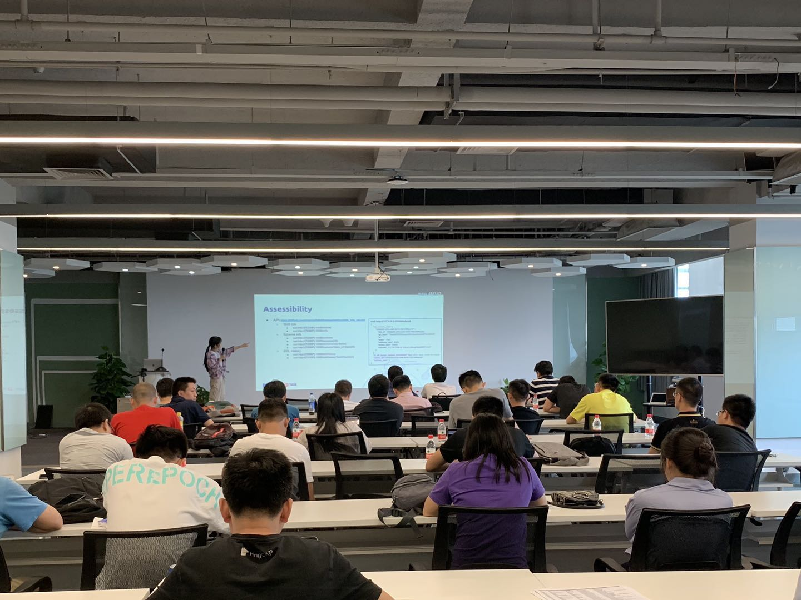
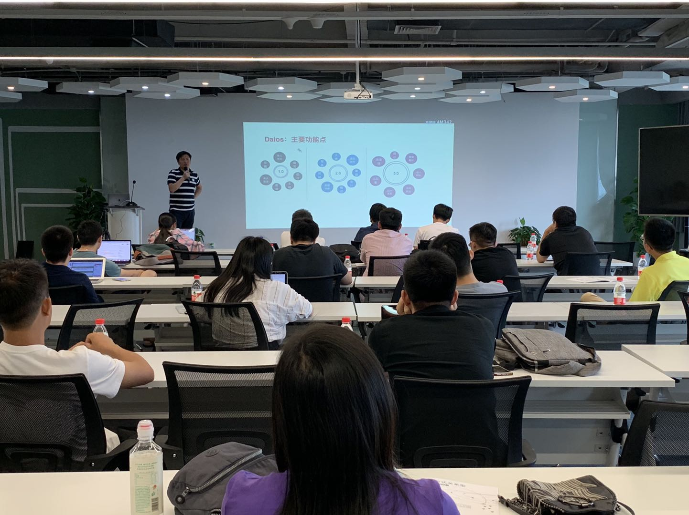
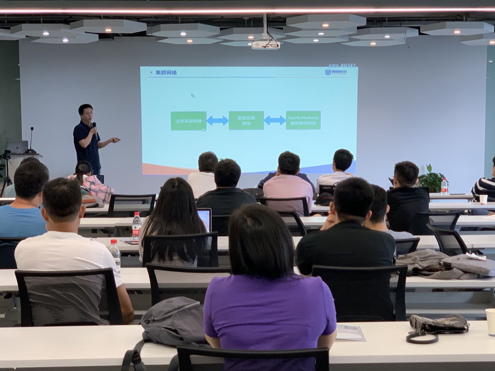

## Topic 1：Deep Dive into TiDB DDL

>讲师介绍：李霞，TiDB 研发工程师，目前主要负责 TiDB 的 online DDL 研发工作，曾就职于京东，从事分布式存储研发工作。

+ [视频 | Infra Meetup No.108：Deep Dive into TiDB DDL](https://www.bilibili.com/video/av56092357/?p=1)
+ [PPT 链接](https://eyun.baidu.com/s/3dG6w5cl)

李霞老师本次分享的主要内容包括：

- F1 online asynchronous DDL 的原理。

- TiDB DDL 的基本框架，详细讲述其实现。

- Add index 的具体流程，并简介了其他几种 DDL 语句实现特性。

- DDL 的一些辅助功能。

最后结合之前介绍的原理和实现，讲解了常见的几个问题以及解决方式。

## Topic 2：数据云平台--访问

>讲师介绍：陈邦义，数据平台产品经理，图尔兹创始人。

+ [视频 | Infra Meetup No.108：数据云平台--访问](https://www.bilibili.com/video/av56092357/?p=2)
+ [PPT 链接](https://eyun.baidu.com/s/3dG6w5cl)

陈邦义老师重点介绍了数据平台的访问入口 Daios。首先是现代数据平台的基本架构，在这其中架构的设计、开发、治理者们面对的是多种数据源带来的数据访问困难。接着介绍了数据访问门户的架构设计、包括 DMS、SAS、Tools 和 Base，以及一些设计理念权衡，其中也强调了数据访问的安全问题和解决办法。最后分享了产品开发过程中的一些挑战性难点，比如调试器、增量 SQL 解析、数据可视化渲染等等。

## Topic 3：基于 Spark 和 TiDB 构建同盾大数据平台经验分享

>讲师介绍：李斌松，同盾大数据平台负责人。

+ [视频 | Infra Meetup No.108：基于 Spark 和 TiDB 构建同盾大数据平台经验分享](https://www.bilibili.com/video/av56092357/?p=3)
+ [PPT 链接](https://eyun.baidu.com/s/3dG6w5cl)

李斌松老师首先介绍了大数据平台的基本架构，通过数据采集、数据交换、otter 方案把所有可能的数据写入 HIVE 表或者 TiDB，构建数据湖，所有使用数据人员通过 WebIDE 使用分析数据，降低使用门槛。接着介绍了平台数据管理的模型设计、数据权限、数据血缘、表元数据信息等方便的内容，其中数据安全是重点，由平台层面的细粒度权限控制和 HDFS ACL 权限校验双重保证。最后介绍了作业运维和作业调度设计和实现。