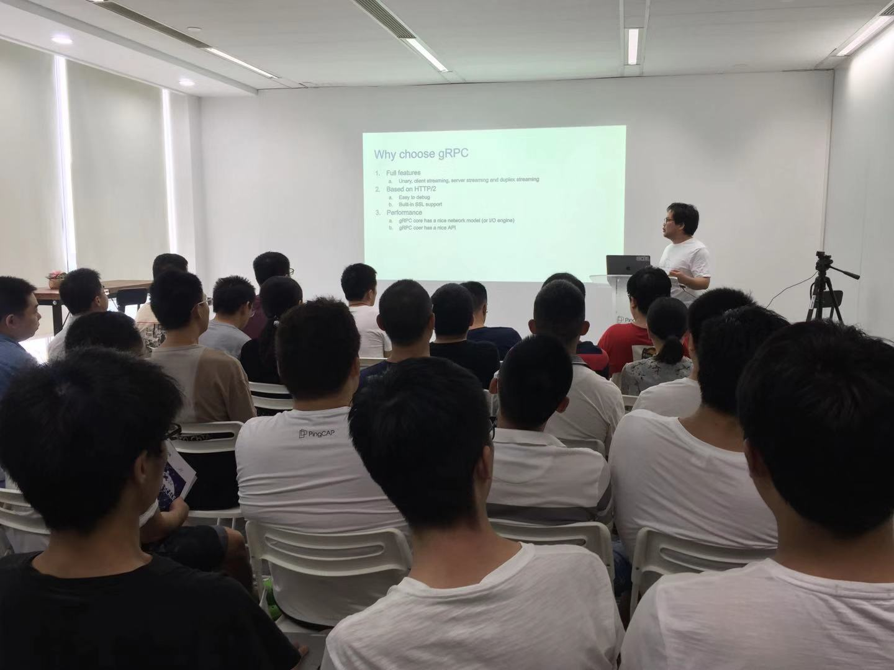
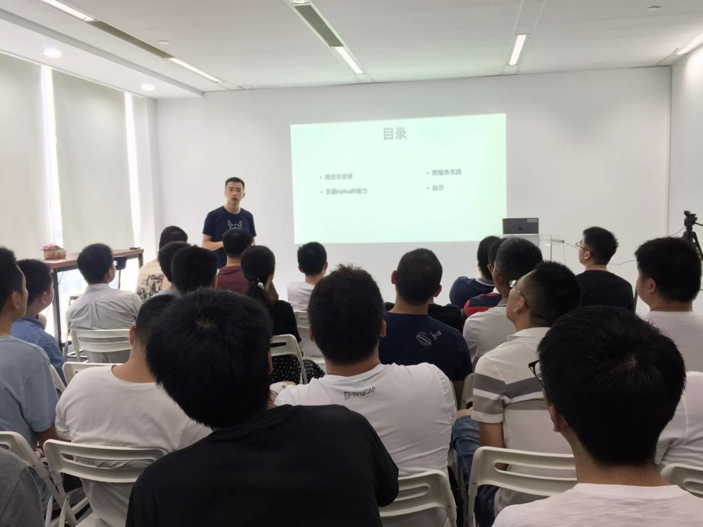

## Topic 1：TiKV internal: How to build a distributed transactional Key-Value storage engine

>讲师介绍：屈鹏，2015 年毕业于四川大学，2017 年加入 PingCAP，目前担任 TiKV 研发工程师，主要专注于 Raft 的优化及其他性能调优等方面。

+ [视频 | Infra Meetup No.109：TiKV internal: How to build a distributed transactional Key-Value storage engine](https://www.bilibili.com/video/av61560884/?p=1)
+ [PPT 链接](https://github.com/pingcap/presentations/blob/master/Infra-meetup/Infra-Meetup-109-%E5%B1%88%E9%B9%8F-TiKV-Internal.pdf)

屈鹏老师的分享主要内容包括：

1. TiKV service 层的主要实现，以及相关的 gRPC 的原理、特性及适用方式；

2. TiKV 分布式冗余复制模块的实现方式及 Raft 算法的基本工作原理及一致性保障；

3. TiKV 分布式事务的实现算法及相关的优化。

同时，介绍了当前正在实现的一些新的特性，方便大家参与到 TiKV 的使用与开发中来。

## Topic 2：构建基于 Kafka 的数据处理微服务链

>讲师介绍：高原，LogicMonitor 成都研发中心首席架构师，在软件体系架构以及分布式系统领域具有多年较深入的理论研究与丰富的工程经验。目前致力于 SaaS 模式的大规模数据处理系统的研究，主持完成具有千亿级数据处理能力的系统研发。

+ [视频 | Infra Meetup No.109：构建基于 Kafka 的数据处理微服务链](https://www.bilibili.com/video/av61560884/?p=2)
+ [PPT 链接](https://github.com/pingcap/presentations/blob/master/Infra-meetup/Infra-Meetup-109-%E9%AB%98%E5%8E%9F-%E6%9E%84%E5%BB%BA%E5%9F%BA%E4%BA%8E%20Kafka%20%E7%9A%84%E6%95%B0%E6%8D%AE%E5%A4%84%E7%90%86%E5%BE%AE%E6%9C%8D%E5%8A%A1%E9%93%BE.pdf)

在《构建以 Kafka 为中心的数据处理微服务链》的主题中，高原老师分享了如下内容：

1. logicmonitor 的 SaaS 模式的 IT 监控业务形态与架构特点，以及历史上如何以水平分割的方式达到日 TB 级数据处理能力。

2. 在更高的数据处理能力需求下，如何辨别并定义务实的系统的演化目标，并按照 AKF 扩展矩阵的思路进行顶层设计。

3. 如何利用 Kubernates 及 ingress 组件来保证可伸缩性与数据的时序要求。

4. 如何用 Kafka 来达到消峰，水平扩展，故障切换等架构需求。
在整个分享中，除具体技术要点，也贯穿着如何识别问题，再针对问题研究技术路线的方法论，可供大家作为解决复杂问题的方法借鉴。

