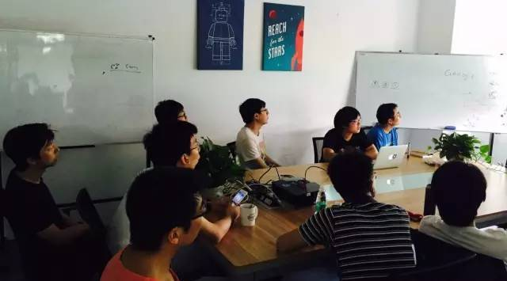
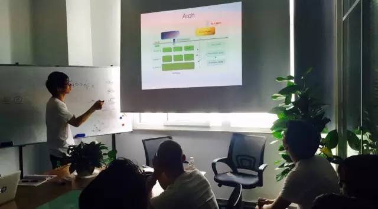

 

今天是 PingCAP 第 11 期 Meetup ，主题是黄梦龙分享的《TiKV 的结构化存储模型优化》和张金鹏分享的《深入解析 LevelDB》。

### 黄梦龙《TiKV 的结构化存储模型优化》

 

黄梦龙 | PingCAP

目前 TiKV 的存储模型是简单的纯 Key-Value，在存储 SQL 结构化数据的过程中会产生比较严重的读写放大问题。我们计划为 TiKV 添加类似于 Hbase 的 ColumnFamily 机制，以使得 TiKV 与 TiDB 成为更加完美的搭档。大家对其中的实现细节，以及各种方案的优缺点进行了探讨。

### 张金鹏 《深入解析 LevelDB》

 

张金鹏 | PingCAP

首先介绍了 LevelDB 的整体架构，以及 LSM Tree 这一数据库中非常经典的结构。之后对 LevelDB 的写和读的流程进行分析，同时介绍 LevelDB 的 snapshot 功能的实现原理，以及 iterator 内部实现，和 iterator 存在的潜在问题。最后介绍 LevelDB 的 compaction 过程，以及存在的问题。

