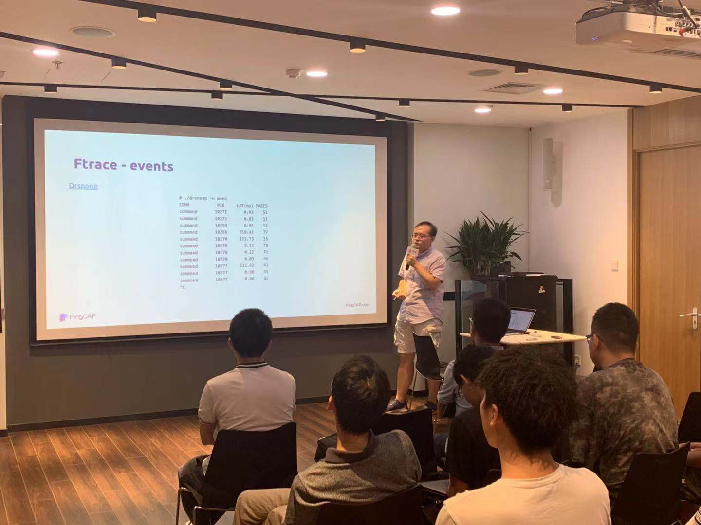

## Topic 1：Linux 内核虚拟机 BPF 原理及应用

>讲师介绍：TiKV 研发工程师，目前主要负责Linux 内核性能诊断分析相关工作。

+ [视频 | Infra Meetup No.110：Linux 内核虚拟机 BPF 原理及应用](https://www.bilibili.com/video/av63518619)
+ [PPT 链接](https://github.com/pingcap/presentations/blob/master/Infra-meetup/Infra-Meetup-110-张文博-BPF%20Principle%20And%20Application.pdf)

张文博老师本次分享的主要内容包括：

- 介绍 Linux kernel 的 tracing 子系统的原理和应用，引出为什么需要 BPF；

- 介绍 BPF 虚拟机体系结构及设计约束，以及如何在约束下编写 eBPF 程序；

- 介绍 Linux kernel 提供的 BPF 调试工具的使用场景；

最后结合之前介绍的原理，分享了我们内部的一些应用场景。