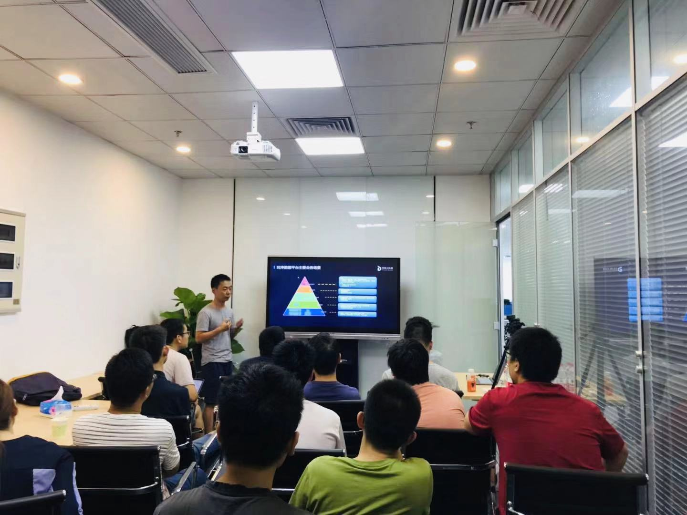
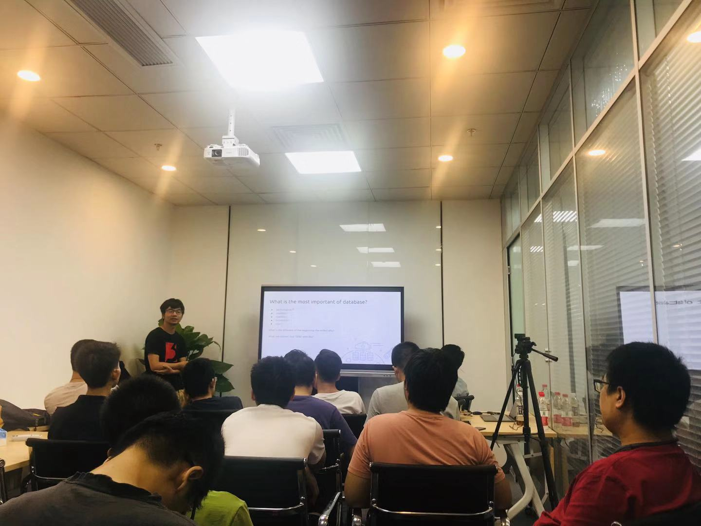

## Topic 1：网易分布式时序数据库（NTSDB）揭秘

>讲师介绍：范欣欣，现就职于网易杭州研究院。负责 HBase、分布式时序数据库以及 Hive 的内核开发运维工作，对 HBase 的底层工作原理有长时间的深入研究和探索。著有《HBase 原理与实践》一书，在个人博客 http://hbasefly.com 撰写了大量有关 HBase 和时序数据库相关技术的文章，深受读者好评。

+ [视频 | Infra Meetup No.111：网易分布式时序数据库（NTSDB）揭秘](https://www.bilibili.com/video/av65689617/?p=1)
+ [PPT 链接](https://github.com/pingcap/presentations/blob/master/Infra-Meetup/Infra-Meetup-111-%E8%8C%83%E6%AC%A3%E6%AC%A3-%E7%BD%91%E6%98%93%E5%88%86%E5%B8%83%E5%BC%8F%E6%97%B6%E5%BA%8F%E6%95%B0%E6%8D%AE%E5%BA%93%EF%BC%88NTSDB%EF%BC%89%E6%8F%AD%E7%A7%98.pdf)

范欣欣老师本次分享的主要内容包括：

1. 时序数据库在网易内部的主要应用场景；

2. 时间序列数据逻辑模型；

3. 网易时序数据库 NTSDB 分布式架构；

4. 网易时序数据库 NTSDB 内核功能实现，主要从时序数据存储格式以及倒排索引实现机制两方面进行介绍。

分享的最后，和现场伙伴们讨论了部分聚合查询效率的优化思路以及基于时序数据特性进行的系统资源优化。

## Topic 2：我们构建数据库背后的故事

>讲师介绍：周强，TiKV 工具团队负责人。

+ [视频 | Infra Meetup No.111：我们构建数据库背后的故事](https://www.bilibili.com/video/av65689617/?p=2)
+ [PPT 链接](https://github.com/pingcap/presentations/blob/master/Infra-Meetup/Infra-Meetup-111-%E5%91%A8%E5%BC%BA-%E6%88%91%E4%BB%AC%E6%9E%84%E5%BB%BA%E6%95%B0%E6%8D%AE%E5%BA%93%E8%83%8C%E5%90%8E%E7%9A%84%E6%95%85%E4%BA%8B.pdf)

本次分享周强老师介绍了 PingCAP 内部工具需求及工程实践，主要包括:

1. 数据库系统的 key point；

2. schrodinger 和 chaos 在公司的内部应用；

3. 如何构建 TiDB 的 benchmark as a service；

4. ebpf 在公司内部的开发和应用；

5. 基于 label 和 webhook 的提效工具 bot。

在分享的最后，还探讨了一些工具系统的应用场景和前景。

