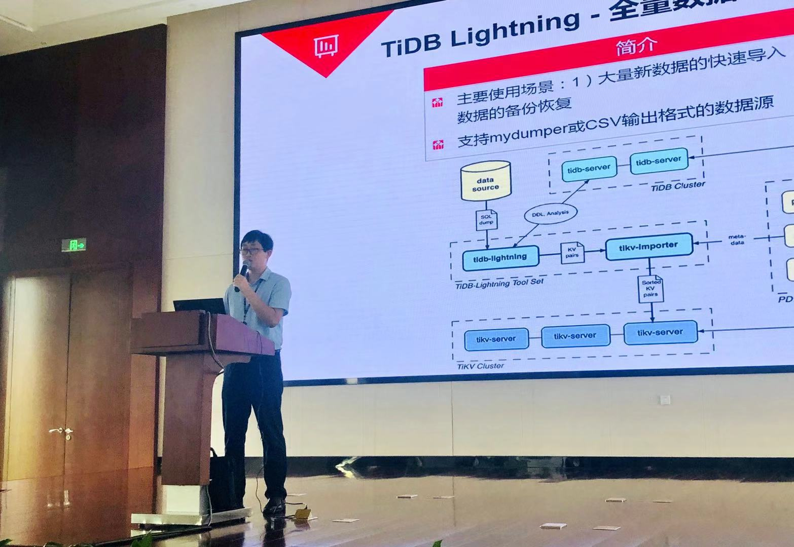
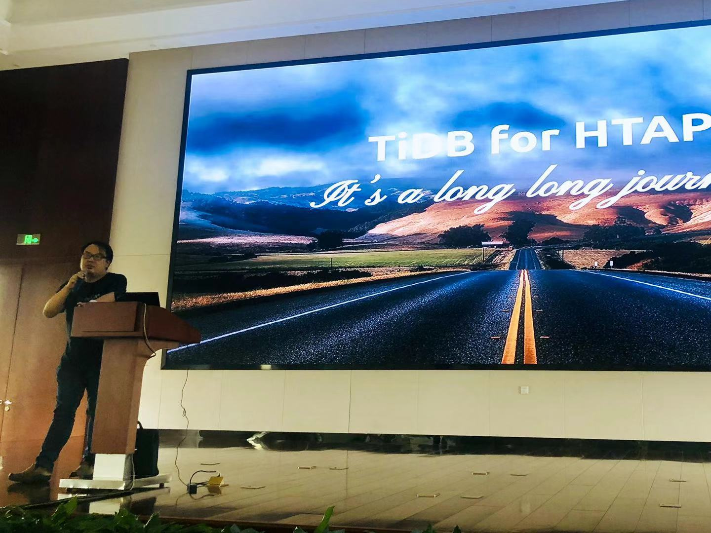
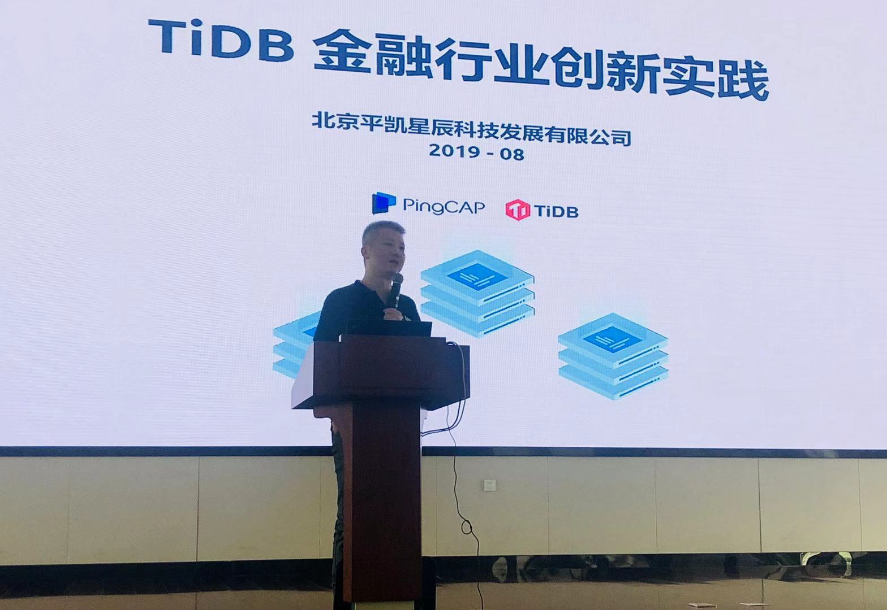

## Topic 1：TiDB 在华泰的落地实践与经验分享

>讲师介绍：孙伟，目前主要负责华泰证券分布式数据库系统建设，10 余年数据库从业经验。曾就职于 IBM，在 DB2 实验室从事多年 support 工作，对数据库的运作原理有比较深的理解，很早就开始使用 DB2 DPF 分布式数据库。

+ [视频 | Infra Meetup No.112：TiDB 在华泰的落地实践与经验分享](https://www.bilibili.com/video/av66576249/?p=1)
+ [PPT 链接](https://github.com/pingcap/presentations/blob/master/Infra-Meetup/Infra-Meetup-112-%E5%AD%99%E4%BC%9F-TiDB%20%E5%9C%A8%E5%8D%8E%E6%B3%B0%E7%9A%84%E8%90%BD%E5%9C%B0%E5%AE%9E%E8%B7%B5%E4%B8%8E%E7%BB%8F%E9%AA%8C%E5%88%86%E4%BA%AB.pdf)

孙伟老师本次分享的主要内容包括：

1. 从生产系统遇到的问题出发，说明为什么进行分布式数据库的调研工作；

2. 总结选择 TiDB 的 5 大原因；

3. TiDB 的整体架构，简单介绍了 TiDB 的相关技术概念；

4. 业务系统上 TiDB 的落地方式，介绍了 6 步走计划；

5. 实际使用 TiDB 中遇到的问题与解决方案，以及 TiDB 的使用注意事项。

在分享的最后，还探讨了后续使用 TiDB 的计划。

## Topic 2：TiDB 的 HTAP 之路

>讲师介绍：马晓宇，PingCAP 列式存储引擎 TiFlash 研发负责人，TiSpark 研发负责人，分布式计算专家，大数据领域知名专家，前硅谷 Quantcast 技术负责人、前网易杭州研究院 Hadoop 平台技术负责人。长期专注分布式系统，SQL 引擎开发等领域。

+ [视频 | Infra Meetup No.112：TiDB 的 HTAP 之路](https://www.bilibili.com/video/av66576249/?p=2)
+ [PPT 链接](https://github.com/pingcap/presentations/blob/master/Infra-Meetup/Infra-Meetup-112-%E9%A9%AC%E6%99%93%E5%AE%87-TiDB%20%E7%9A%84%20HTAP%20%E4%B9%8B%E8%B7%AF.pdf)

本次分享马晓宇老师以 TiDB 产品的 AP 方向发展为主轴，分享了 TiDB 在 AP 方向各个阶段的优缺点，以及新品 TiFlash 的介绍和整体架构上的展望。分享内容主要包括：

1. 为何 TiDB 会做 AP 进而 HTAP；

2. 引入 TiSpark 的原因以及 TiSpark 的架构；

3. 加强 TiDB 优化器 / 执行器的原因及原理；

4. 引入 TiFlash 的原因和架构详解；

5. 当前版本缺少的功能以及对未来的展望。

## Topic 3：TiDB 金融行业实践

>讲师介绍：余军，金融行业首席架构师，20 年企业级开源软件架构经验。前富麦科技 CTO，前 Red Hat 中国区解决方案业务总监，前惠普分布式计算高级技术专家，长期从事金融行业开源架构和专家服务，长期专注于企业级分布式系统 / 高可用架构设计及开源 IT 战略规划咨询。

+ [视频 | Infra Meetup No.112：TiDB 的 HTAP 之路](https://www.bilibili.com/video/av66576249/?p=3)
+ [PPT 链接](https://github.com/pingcap/presentations/blob/master/Infra-Meetup/Infra-Meetup-112-%E4%BD%99%E5%86%9B-TiDB%20%E9%87%91%E8%9E%8D%E8%A1%8C%E4%B8%9A%E5%AE%9E%E8%B7%B5.pdf)

本次分享余军老师介绍了 TiDB 在开源生态、开源项目运营、TiDB 技术人才培养体系、商业落地场景和金融行业具体成功案例几个方面的情况，分享内容主要包括：

1. TiDB 的开源项目治理结构组成；

2. TiDB 开源生态和目前所处的同领域国际地位；

3. TiDB Univeristy 培训体系  以及高校联合人才计划；

4. TiDB 在银行、保险、证券行业的关键业务场景的落地案例和经验分享；

5. TiDB 里程碑版本 3.0 的重要特性以及性能提升和架构演进方向。