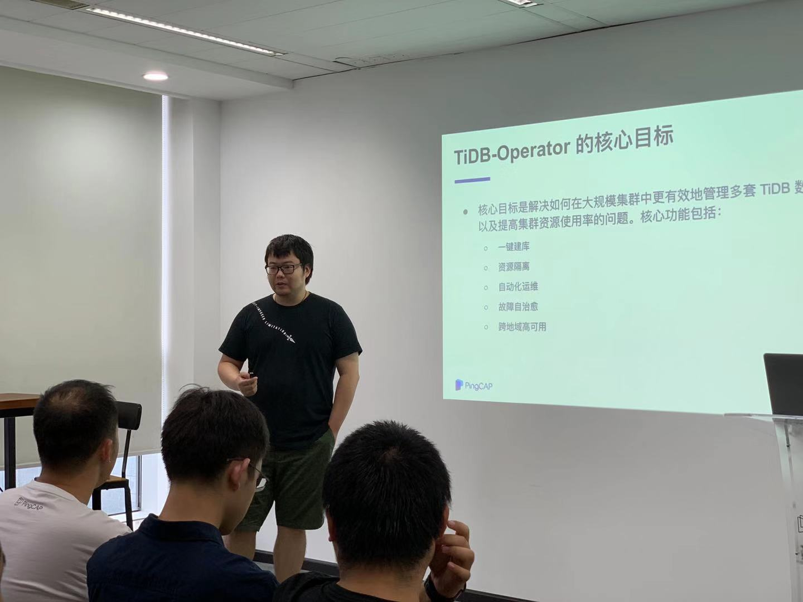

## Topic：TiDB Operator 的设计与实现

>讲师介绍：尹亮，PingCAP Cloud Team 开发工程师。网络编程、存储爱好者，目前从事 K8s 相关的开发工作。

+ [视频 | Infra Meetup No.113：TiDB Operator 的设计与实现](https://www.bilibili.com/video/av67331122)
+ [PPT 链接](https://github.com/pingcap/presentations/blob/master/Infra-Meetup/Infra-Meetup-113-%E5%B0%B9%E4%BA%AE-TiDB%20Operator%20%E8%AE%BE%E8%AE%A1%E4%B8%8E%E5%AE%9E%E7%8E%B0.pdf)

本次分享尹亮老师的主要内容包括：

- K8s 中 Operator 模式的基本原理和设计思路；

- TiDB Operator 本身的 API 自定义对象的设计；

- 实现 TiDB Operator 的功能时，主要遇到的难点和解决方案；

- 对最近正在进行开发的 TEP 平台做了简单的介绍，并且简要对比了 AA 架构和 CRD 架构。