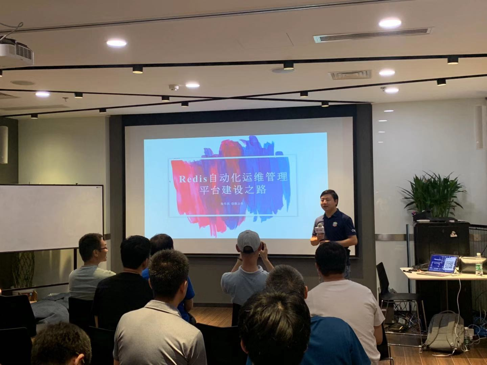

## Topic 1：TiDB 高可用架构的设计要点

>讲师介绍：李坤，PingCAP 互联网架构师，TiDB User Group Ambassador，前美团、去哪儿数据库专家。

+ [视频 | Infra Meetup No.114：TiDB 高可用架构的设计要点](https://www.bilibili.com/video/av67333523/?p=1)
+ [PPT 链接](https://github.com/pingcap/presentations/blob/master/Infra-Meetup/Infra-Meetup-114-%E6%9D%8E%E5%9D%A4-TiDB%20%E9%AB%98%E5%8F%AF%E7%94%A8%E6%9E%B6%E6%9E%84%E7%9A%84%E8%AE%BE%E8%AE%A1%E8%A6%81%E7%82%B9.pdf)

本次分享李坤老师从高可用系统的目标开始，介绍了 TiDB 高可用架构的设计要点，包括：

- 高可用系统的设计目标

- 主从机构和集群架构的高可用区别

- TiDB 高可用性的特点及各组件的高可用原理

- TiDB 组件的高可用原理

然后介绍了 TiDB 在 raft 的工程实践上对于可用性提高做的优化，并重点介绍了各种场景下，TiDB 的高可用表现，包括：

- TiKV-server 故障

- PD-server 故障

- TiDB-server 故障

- Region leader 切换

- Region balance 重建副本

最后，从实践角度，介绍了两地三中心、三地三中心、binlog 同步的集中方案的落地部署细节。

## Topic 2：5G 风起，由数据库的历程变化看发展

>讲师介绍：张甦，数据库爱好者、腾讯云 TVP、51CTO 专家博主、MongoDB 中文社区核心成员、TiDB User Group 北京区 Co-leader、图书《MySQL 王者晋级之路》，《MongoDB 运维实战》的作者。

+ [视频 | Infra Meetup No.114：5G 风起，由数据库的历程变化看发展](https://www.bilibili.com/video/av67333523/?p=2)
+ [PPT 链接](https://github.com/pingcap/presentations/blob/master/Infra-Meetup/Infra-Meetup-114-%E5%BC%A0%E7%94%A6-5G%20%E9%A3%8E%E8%B5%B7%EF%BC%8C%E7%94%B1%E6%95%B0%E6%8D%AE%E5%BA%93%E7%9A%84%E5%8E%86%E7%A8%8B%E5%8F%98%E5%8C%96%E7%9C%8B%E5%8F%91%E5%B1%95.pdf)

本次分享张甦老师从移动通讯发展的历程同步透视数据库能力的变迁，进而预测 5G 时代将会给数据库带来的重大变革，主要内容包括：
  
1. 数据库发展历程剖析；

2. 1G~4G 通讯时代下，各种开源数据库的最佳实践及特性介绍，其中包含 MySQL、MongoDB、TiDB；

3. 5G 时代下，数据库的变革及发展方向；

4. 5G、AI、云化，推进实时数据库的发展；

5. 最后介绍了数据信息科技、国产自主可控、开源大势所趋这几个方面内容。

## Topic 3：CockroachDB 分布式事务优化

>讲师介绍：贺伟，2016 年加入京东，专注于分布式存储领域的设计和开发，对文档检索，共识算法，分布式存储有比较深入的理解，目前负责 CockroachDB 的研发推广工作。

+ [视频 | Infra Meetup No.114：CockroachDB 分布式事务优化](https://www.bilibili.com/video/av67333523/?p=3)
+ [PPT 链接](https://github.com/pingcap/presentations/blob/master/Infra-Meetup/Infra-Meetup-114-%E8%B4%BA%E4%BC%9F-CockroachDB%E5%88%86%E5%B8%83%E5%BC%8F%E4%BA%8B%E5%8A%A1%E4%BC%98%E5%8C%96.pdf)

本次分享贺伟老师介绍了开源分布式数据库 CockroachDB 分布式事务优化，主要内容包括:

- CockroachDB 介绍；

- CockroachDB 分布式事务回顾；

- CockroachDB 分布式事务优化的核心思想；

- CockroachDB 分布式事务的优化思路和实践； 

- CockroachDB 分布式事务优化的实践经验。

## Topic 4：Redis 自动化运维管理平台建设之路

>讲师介绍：张冬洪，极数云舟对外合作部总监、技术专家，Redis 中国用户组主席，中国计算机行业协会开源数据库专业委员会执行秘书长，中国计算机学会会员，中国 MySQL 用户组主席团成员，阿里云 MVP、腾讯云 TVP，前新浪微博数据库主管。

+ [视频 | Infra Meetup No.114：Redis 自动化运维管理平台建设之路](https://www.bilibili.com/video/av67333523/?p=4)
+ [PPT 链接](https://github.com/pingcap/presentations/blob/master/Infra-Meetup/Infra-Meetup-114-%E5%BC%A0%E5%86%AC%E6%B4%AA-Redis%E8%87%AA%E5%8A%A8%E5%8C%96%E8%BF%90%E7%BB%B4%E7%AE%A1%E7%90%86%E5%B9%B3%E5%8F%B0%E5%BB%BA%E8%AE%BE%E4%B9%8B%E8%B7%AF.pdf)

张冬洪老师分享的重点内容包括：

- Redis 的发展现状和需求来源，重点介绍了 Redis 的典型应用场景；

- Redis 自动化运维管理平台设计功能要点，总结锤炼出功能体系架构以及极数云舟推出的高可用一体化解决方案；

- Redis 自动化运维管理平台设计实现，详细介绍了工单系统、慢查询、高可用、一键部署、备份恢复、监控告警、智能决策、弹性扩缩容、容量预估、数据迁移、数据校验等等功能设计细节；

- Redis 的未来规划，介绍了 Memcached、Pika、Codis、Aerospike 的组件的功能和特点。

本次分享，从需求到功能，从功能到设计，全面总结介绍了 Redis 自动化运维管理平台的功能实现，为 Redis 运维管理平台化、自动化、服务化、智能化、精细化的运营和建设提供参考借鉴。