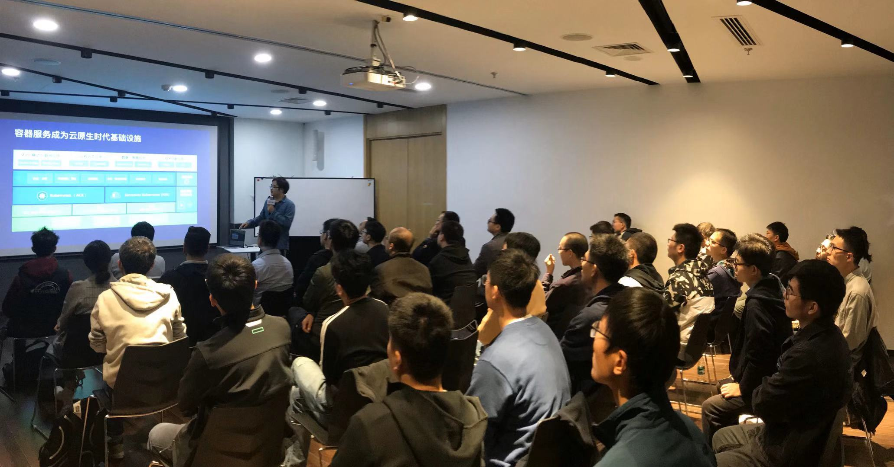
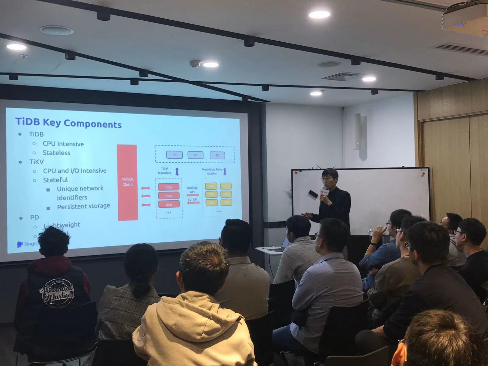

## Topic 1：阿里云容器服务 ACK 的架构演进

>讲师介绍：李鹏，阿里云容器服务高级架构师。

+ [视频 | Infra Meetup No.115：阿里云容器服务 ACK 的架构演进](https://www.bilibili.com/video/av73921805/?p=1)

本次分享李鹏老师结合阿里云容器 ACK 服务大规模互联网用户落地场景，针对开源存储，云存储和云原生存储的现在，以及未来架构演进行深入探讨。李鹏老师针对对云原生存储和云存储的思考，分享了三个观点：

1. 云原生存储是云存储 UI，面向应用的申明式应用层存储。
公有云：Cloud Native Storage = Declarative API + Cloud Storage
专有云：Cloud Native Storage = Declarative API + Native Storage

2. 云原生存储是重用云存储基础设施红利，是在核心存储，应用存储之上的分层存储，不需要重新发明轮子。

3. 云原生控制平面实现效率，自治方面能力，最大化减小存储稳定和安全隐患。

在运用存储选择，针对不同落地场景，使用不同的容器存储实现性能的最优化，不同应用落地案例，比如数据库、AI 计算、流式计算、高性能计算、日志等场景和相应的存储选择。

针对目前云原生应用在存储性能、弹性、高可用、加密、隔离、可观测性、生命周期遇到的各种挑战，提出了云原生存储 v2 的各种解决方案和演进路径。其中就 TiDB 在云原生架构中的扩容能力，本地盘到 ESSD 的存储选择和改进，以及不同云原生存储的 QoS 的保障能力和遇到的挑战与会者做了互动沟通。

## Topic 2：分布式数据库在云环境下的实践

>讲师介绍：张海龙 ，PingCAP Cloud 研发工程师，目前主要从事 TiDB on Kubernetes 的设计和研发工作。

+ [视频 | Infra Meetup No.115：分布式数据库在云环境下的实践](https://www.bilibili.com/video/av73921805/?p=2)
+ [PPT 链接](https://github.com/pingcap/presentations/blob/master/Infra-Meetup/Infra-Meetup-115-zhanghailong-%E5%88%86%E5%B8%83%E5%BC%8F%E6%95%B0%E6%8D%AE%E5%BA%93%E5%9C%A8%E4%BA%91%E7%8E%AF%E5%A2%83%E4%B8%8B%E7%9A%84%E5%AE%9E%E8%B7%B5.pdf)

在《分布式数据库在云环境下的实践》的主题演讲中，张海龙老师分享了如下内容：

1. 介绍了 TiDB 的架构，并简单分析了分布式数据库在云时代的发展机遇与挑战。

2. 分布式数据库如何根据自身架构设计在 Kubernetes 上的选择合适的存储类型。

3. 介绍分布式数据库如何根据自身业务特性在 Kubernetes 上选择合适的资源类型，如果 Kubernetes 默认资源无法满足产品需求，有哪些方式可以解决问题。

4. TiDB 通过 TiDB Operator 在 Kubernetes 上运行的实践。

5. TiDB 和公有云的集成实践。

6. 目前 TiDB on Cloud 遇到的挑战和后续的演进。
