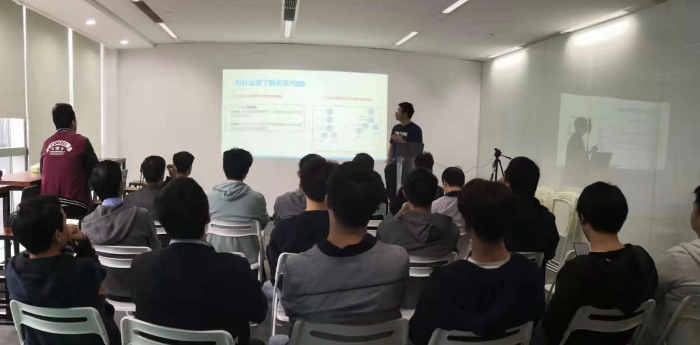
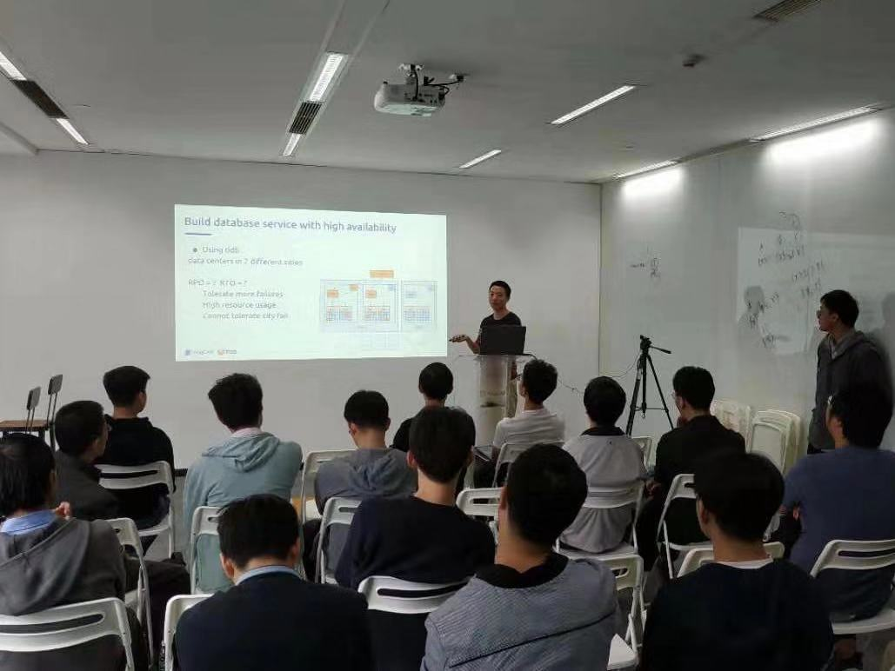

## Topic 1：SQL 语言漫谈

>讲师介绍：杜川, 数据库技术爱好者，TiDB Committer。主要专业方向是分布式关系型计算，关注数据库优化器和执行引擎相关技术。目前主要从事云数据库相关开发工作。

+ [视频 | Infra Meetup No.116：SQL 语言漫谈](https://www.bilibili.com/video/av73925883/?p=1)
+ [PPT 链接](https://github.com/pingcap/presentations/blob/master/Infra-Meetup/Infra-Meetup-116-duchuan-SQL%E8%AF%AD%E8%A8%80%E6%BC%AB%E8%B0%88.pdf)

杜川老师分享了如下内容:

1. 分享首先介绍了关系代数理论。关系代数是 SQL 的理论基础，SQL 中很多行为都可以从关系代数中得到理论解释。另一方面，SQL 的设计并没有完全遵循关系代数理论（比如说 NULL 的存在），导致 SQL 在实际使用中可能遇到一些比较隐晦的坑。分享中对这个点进行了一些介绍和拓展。

2. 以关系代数为基础，介绍了各个 SQL 算子的实现以及各个 SQL 算子的执行顺序，并以具体的例子阐释了 SQL 使用中的一些常见误区。 

3. 结合当前分布式计算的普及和对数据实时性的追求，简单介绍了分布式以及实时场景下 SQL 实现的特点。

## Topic 2：构建高可用数据库服务

>讲师介绍：徐锐，PingCAP SQL Architecture Team 研发工程师，数据库和分布式技术爱好者，目前从事 TiDB SQL Engine 相关开发工作。

+ [视频 | Infra Meetup No.116：构建高可用数据库服务](https://www.bilibili.com/video/av73925883/?p=2)
+ [PPT 链接](https://github.com/pingcap/presentations/blob/master/Infra-Meetup/Infra-Meetup-116-xurui-%E5%88%86%E5%B8%83%E5%BC%8F%E7%B3%BB%E7%BB%9F%E5%92%8C%E9%AB%98%E5%8F%AF%E7%94%A8.pdf)

徐锐老师分享了以下内容：

1. 可靠性和可用性的概念以及区别，相应的数学描述和理论知识。

2. 面对金融级数据库服务的需求，面临的可用性挑战和难点。

3. 依据 CAP 理论建立相应的数学模型，描述解决金融场景可用性难题的方法，并介绍一致性协议（算法）的作用和相关概念。

4. 介绍基于一致性协议构建高可用数据库日志服务的关键技术点，包括如何基于一致性协议实现数据库日志一致性，以及无主选举，日志同步，流量控制，分布式事务等相关概念。

5. 介绍 TiDB 日志模块和数据分片方式，以及 TiDB 作为开源产品工业级别 RAFT 实现，如何基于 TiDB 部署经典的数据库服务解决方案，包括如何实现多活等。

6. 介绍 TiDB 相关学习内容包括 Talent Plan 和 PingCAP University 等扩展资源。

