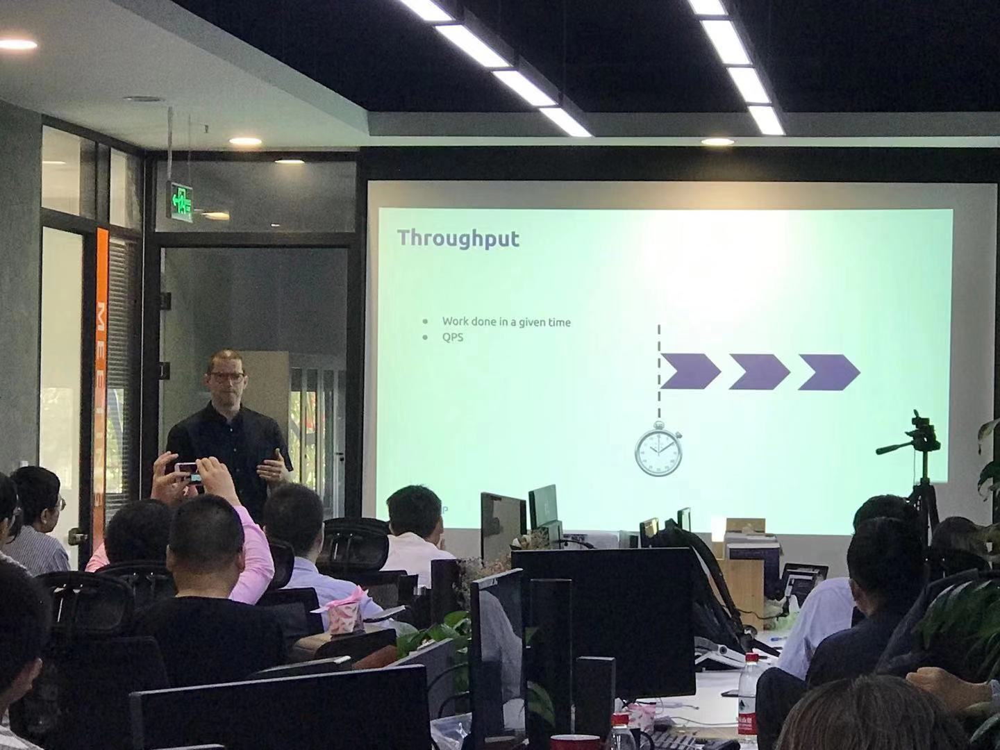

## Topic 1：TiDB 悲观事务的设计与实现

>讲师介绍：赵磊，TiKV 研发工程师。

+ [视频 | Infra Meetup No.117：TiDB 悲观事务的设计与实现](https://www.bilibili.com/video/av73931273/?p=1)
+ [PPT 链接](https://github.com/pingcap/presentations/blob/master/Infra-Meetup/Infra-Meetup-117-zhaolei-TiDB%20%E6%82%B2%E8%A7%82%E9%94%81.pdf)

赵磊老师分享了以下主要内容：

1. 悲观事务与乐观事务的对比，TiDB 乐观事务在一些场景的局限性及要实现悲观事务的原因。

2. MySQL 悲观事务的行为。

3. 如何在 Percolator 的基础上实现的悲观事务，如何解决锁阻塞读的问题，以及如何实现的等锁和死锁。

4. 如何进行测试来保证悲观事务的正确性，以及如何使用 TiDB 的悲观事务。

## Topic 2：Introduction to performance engineering

>讲师介绍：Nick Cameron，PingCAP Senior Database Engineer，Rust core team.

+ [视频 | Infra Meetup No.117：Introduction to performance engineering](https://www.bilibili.com/video/av73931273/?p=2)
+ [PPT 链接](https://github.com/pingcap/presentations/blob/master/Infra-Meetup/Infra-Meetup-117-nick-performance-engineering.pdf)

Computer hardware and compilers have evolved hugely, which means that many of the guidelines for writing performant code are now obsolete. 'Big O' complexity (a key tool in understanding performance) is often misunderstood - advances in CPU design have changed performance parameters beyond recognition. The range of available tools and techniques can be overwhelming.

This talk focus on general issues, with some focus on Rust-specifics. We go through in background, computer architecture, benchmark and profiling, optimisation and performance rust.
