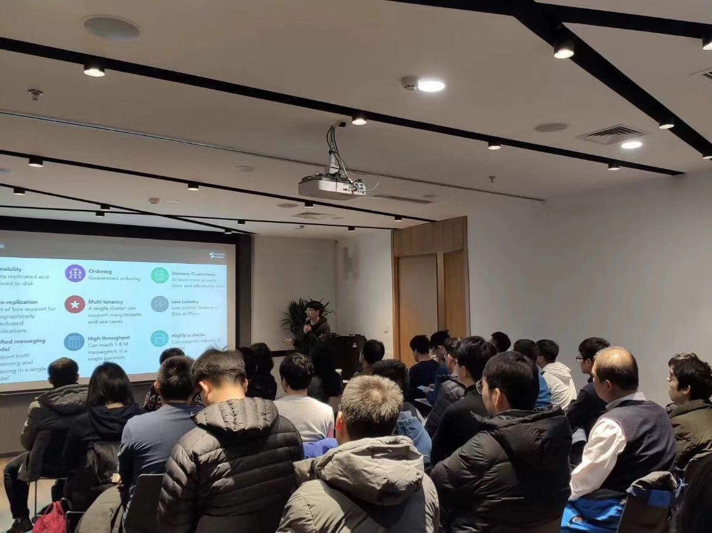
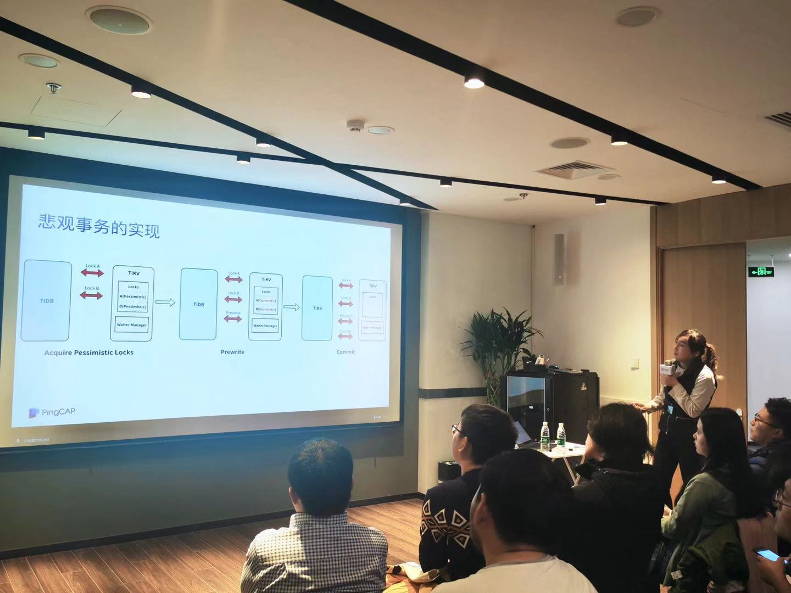

## Topic 1：Pulsar 事务简介

>讲师介绍：李鹏辉，Apache Pulsar Committer/PMC Member。

>讲师介绍：张勇，Apache Pulsar Contributor, StreamNative engineer。

+ [视频 | Infra Meetup No.119：Pulsar 事务简介](https://www.bilibili.com/video/av78145567?p=1)
+ [PPT 链接](https://github.com/pingcap/presentations/blob/master/Infra-Meetup/Infra-Meetup-119-%E5%BC%A0%E5%8B%87%26%E6%9D%8E%E9%B9%8F%E8%BE%89-Pulsar%20%E4%BA%8B%E5%8A%A1%E7%AE%80%E4%BB%8B.pdf)

本次分享李鹏辉和张勇介绍了开源项目 Apache Pulsar  (https://github.com/apache/pulsar) 和其中 Transaction 的设计实现与使用。包括：

1. Apache Pulsar 的架构和优势；

2. 目前在 Apache Pulsar 中 At-most once，At-lease once 和 Exactly once 消息语义的实现。并且详细讲述了现在通过 Idempotent Producer 实现的 Exactly once；

3. Transaction 的架构和 Transaction 在 Pulsar 中的实现，并且通过举例讲述了 Transaction 如何实现多个操作的原子性；

4. 讨论了在 Transaction 的设计中，如何处理超时以及多个 Transaction 的交互以及存储的问题。

## Topic 2：TiDB 悲观事务的设计与实现

>讲师介绍：吴雪莲，TiKV 研发工程师，分布式事务和下推计算负责人。曾就职于网易、盛大创新院、京东云，专注于对象存储的研发与设计，开源软件爱好者。

+ [视频 | Infra Meetup No.119：TiDB 悲观事务的设计与实现](https://www.bilibili.com/video/av78145567?p=2)
+ [PPT 链接](https://github.com/pingcap/presentations/blob/master/Infra-Meetup/Infra-Meetup-119-%E5%90%B4%E9%9B%AA%E8%8E%B2-TiDB%20%E6%82%B2%E8%A7%82%E9%94%81.pdf)

悲观锁是在多数金融场景不可替代的一个重要特性，TiDB 3.0 在基于 Percolator 事务模型的基础上实现了悲观事务，本次分享吴雪莲老师介绍了 TiDB 悲观锁的设计与实现，主要通过以下几个维度展开：

1. 什么是悲观锁，悲观锁与乐观锁的区别与联系；

2. TiDB 兼容 MySQL 协议，MySQL 中悲观锁的行为分析；

3. TiDB 悲观锁的设计与实现原理，如何处理等锁、检测死锁；

4. 作为事务新功能，TiDB 如何保障悲观锁的正确性；

5. TiDB 悲观锁使用与注意事项。

最后，大家还一起探讨了如何在分布式系统中优雅地支持悲观锁，以及如何去优化 TiDB 现有的死锁检测、等锁处理逻辑。
