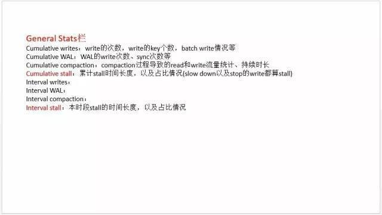

今天是 PingCAP 第12期 Meetup ，主题是张金鹏分享的《 rocksdb 日志分析和性能调优经验 》。

## 张金鹏  《 rocksdb 日志分析和性能调优经验 》

 

张金鹏 | PingCAP

首先和大家一起分享如何分析 rocksdb 的 LOG，包括观察 compaction 相关的统计信息。例如每个 level 导致的 compaction 个数，每个 compaction job 的平均持续时长，compaction 导致的 read 总量和 write 量，以及写放大等；也可以观察整个系统是否有 stall 情况，持续多长时间，时间占比是多少等；另外，还有跟踪某个具体的 compaction job 的 input files 组成，output files，以及 compacting 过程中 drop 掉的 key 个数等信息。

然后根据 rocksdb 的 LOG 以及观察到的系统负载情况，来对不同参数组进行测试。

最后对比不同参数组的一些效果，包括同样的数据量导致的 compaction 放大比例；整个系统的 stall 情况；以及是否存在长时间的 compaction 导致的长时间高 CPU 及高 IO，从而对 TiKV 服务本身造成负面影响等情况。

 

 

 

 

 

 

 

 

 

 

 

 

 

 

 

 

 

 

 

