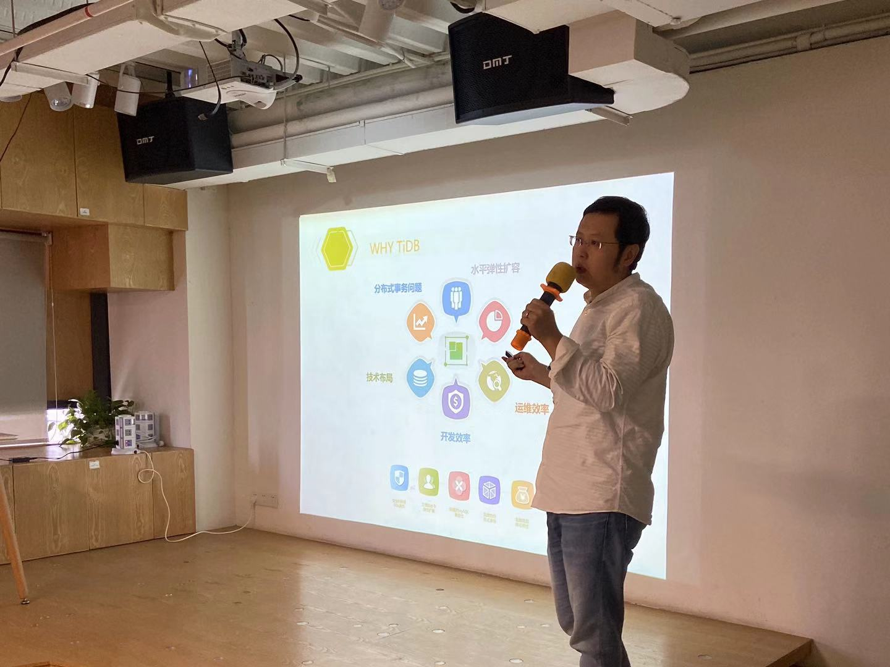
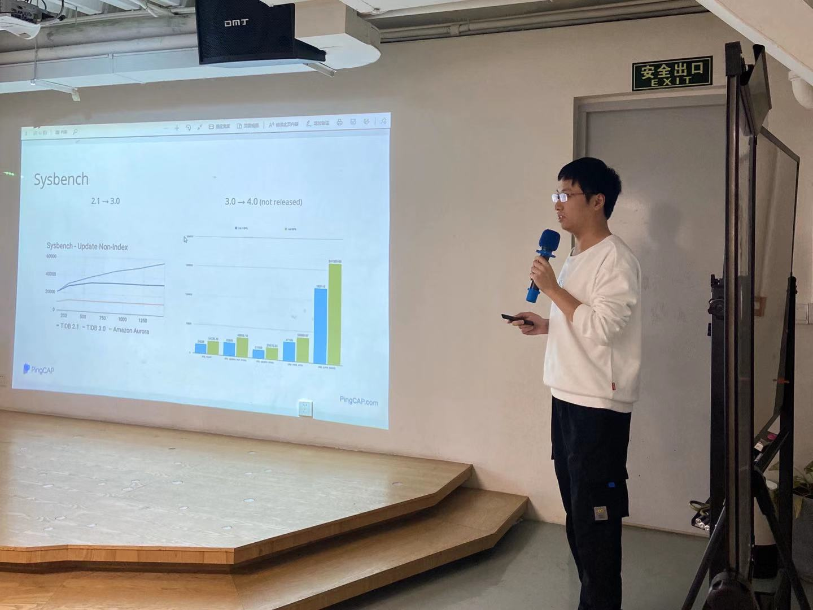

## Topic 1：丰巢支付平台的 TiDB 迁移之旅

>讲师介绍：刘光亮，丰巢中间件团队负责人，TiDB Contributor，丰巢 TiDB 推广落地负责人。

+ [视频 | Infra Meetup No.120：丰巢支付平台的 TiDB 迁移之旅](https://www.bilibili.com/video/av78869741?p=1)
+ [PPT 链接](https://github.com/pingcap/presentations/blob/master/Infra-Meetup/Infra-Meetup-120-%E5%88%98%E5%85%89%E4%BA%AE-%E4%B8%B0%E5%B7%A2%E6%94%AF%E4%BB%98%E5%B9%B3%E5%8F%B0%E7%9A%84%20TiDB%20%E8%BF%81%E7%A7%BB%E4%B9%8B%E6%97%85.pdf)

本次分享刘光亮老师从下面四个方面进行了介绍：

- 介绍了丰巢科技选型 TiDB 的初衷和目标；

- 重点讲解了丰巢支付平台迁移 TiDB 的总体设计方案、流量回放测试、数据双向同步、数据比对、灰度发布、数据库自动切换等技术方案；

- 分享了丰巢在 TiDB 社区建设上已经做了的事情，其中包括对于 TiDB 和 TiDB Operator 源码的贡献，并详细阐述了在为社区贡献 PR 过程中的心路历程；

- 最后向大家描述了未来丰巢对于 TiDB 使用的具体规划，未来丰巢会把 TiDB 的集群迁移到 K8s 上，未来丰巢对于从 MySQL 到 TiDB 的迁移时间花费会在两周内完成。

## Topic 2：高性能 Rust 开发实践——TiKV 优化之路

>讲师介绍施闻轩，TiKV 研发、TiKV Coprocessor SIG Tech Lead，主要负责 TiKV 性能优化、Coprocessor 功能开发与 Coprocessor SIG 社区技术指导。

+ [视频 | Infra Meetup No.120：高性能 Rust 开发实践——TiKV 优化之路](https://www.bilibili.com/video/av78869741?p=2)
+ [PPT 链接](https://github.com/pingcap/presentations/blob/master/Infra-Meetup/Infra-Meetup-120-%E6%96%BD%E9%97%BB%E8%BD%A9-TiKV%20%E9%AB%98%E6%80%A7%E8%83%BD%20Rust%20%E5%BC%80%E5%8F%91%E5%AE%9E%E8%B7%B5.pdf)

本次分享我司的施闻轩同学介绍了 TiKV 团队在开发高性能 Rust 程序的经验。TiKV 每个版本都能持续取得性能提升，这些性能提升来自于新特性的开发、改进了算法数据结构和进行了大量工程优化，这些都在 Talk 中逐一进行了介绍。工程优化方面详细介绍了诸如 Allocator、LTO、Target CPU、Reduce Copy、Static Dispatch、Reduce Branch 等优化方法。除此以外，还介绍了 TiKV 团队常用的性能分析和调优工具的使用场景和方法，如火焰图、Compiler Explorer、Callgrind、criterion 等。最后，作为 Coprocessor SIG 的 Tech Lead，施闻轩同学为到场的同学展示了 PingCAP 的社区架构，并教大家如何参与到 SIG 和 PCP 任务中来、为 TiDB 和 TiKV 代码做贡献。
