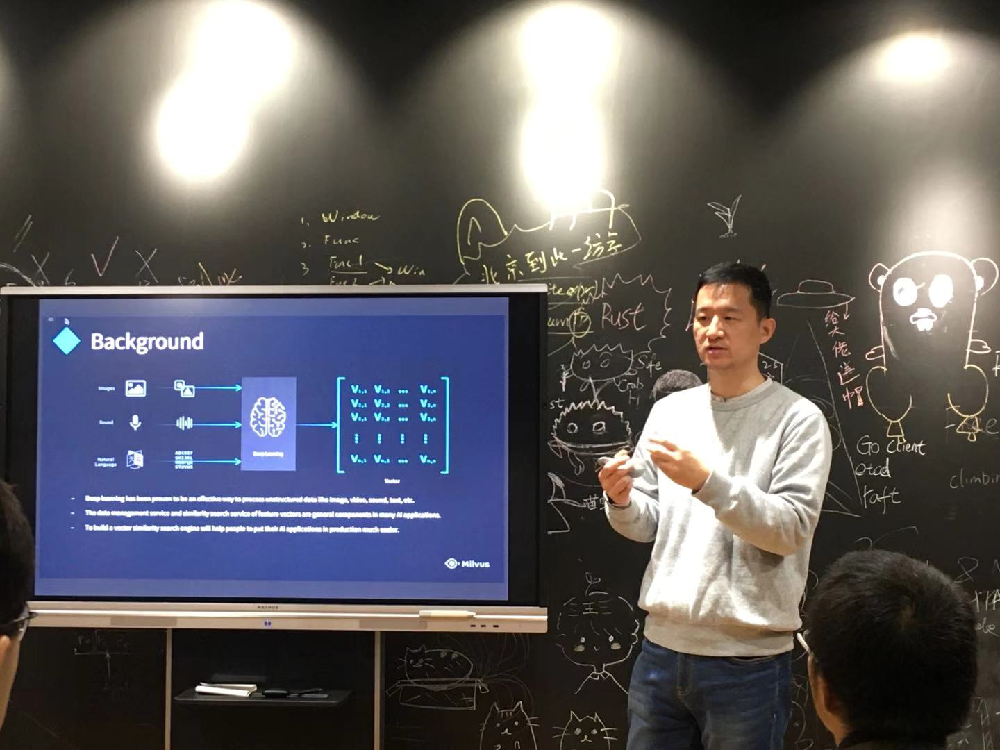
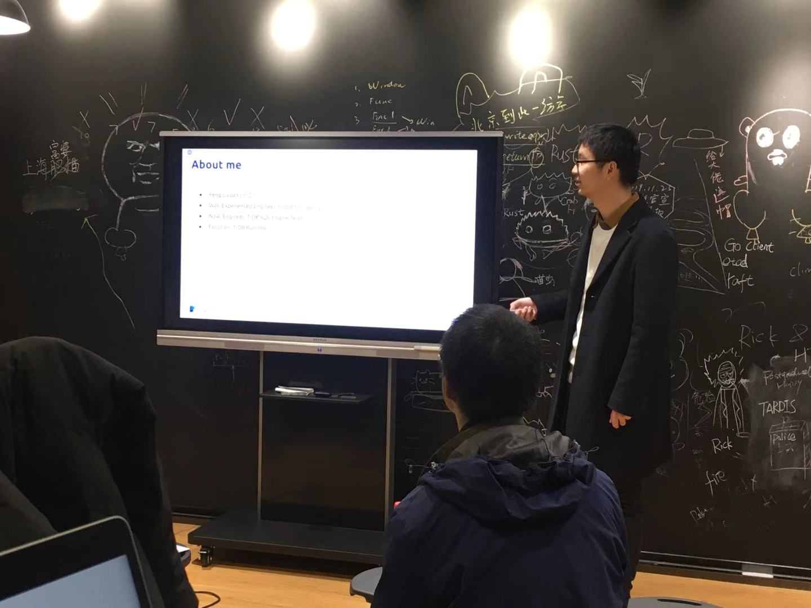

## Topic 1：开源向量相似度搜索引擎 Milvus 简介

>讲师介绍：顾钧，ZILLIZ 首席架构师，毕业于北京大学，15 年数据库相关工作经验。目前在 ZILLIZ 从事异构众核数据分析引擎的产品化工作。加入 ZILLIZ 之前，曾就职于 IBM、Morgan Stanley、华为等跨国公司。

+ [视频 | Infra Meetup No.121：开源向量相似度搜索引擎 Milvus 简介](https://www.bilibili.com/video/av80724228?p=1)
+ [PPT 链接](https://github.com/pingcap/presentations/blob/master/Infra-Meetup/Infra-Meetup-121-%E9%A1%BE%E9%92%A7-%E5%BC%80%E6%BA%90%E5%90%91%E9%87%8F%E7%9B%B8%E4%BC%BC%E5%BA%A6%E6%90%9C%E7%B4%A2%E5%BC%95%E6%93%8E%20Milvus%20%E7%AE%80%E4%BB%8B.pdf)

本次分享顾钧介绍了开源向量搜索引擎 Milvus （[https://github.com/milvus-io/milvus/](https://github.com/milvus-io/milvus/)）的设计背景，整体架构，包括： 

1. Milvus 的设计背景，向量数据的运算、管理与一般数值型数据的差异。

2. Milvus 向量搜索引擎的整体架构设计。

3. Milvus 提供的索引类型，及其技术、性能特点。

最后，顾钧与大家讨论了 Milvus 目前在非结构化数据分析处理（ CV， NLP 等）领域的典型使用场景。Milvus 极大的简化了深度学习类 AI 应用的落地复杂度和难度，使用户能以更低的成本通过 AI 技术为应用场景赋能。

## Topic 2：TiDB 向量化执行引擎近期成果

>讲师介绍：冯立元，PingCAP TiDB 研发工程师。

+ [视频 | Infra Meetup No.121：TiDB 向量化执行引擎近期成果](https://www.bilibili.com/video/av80724228?p=2)
+ [PPT 链接](https://github.com/pingcap/presentations/blob/master/Infra-Meetup/Infra-Meetup-121-%E5%86%AF%E7%AB%8B%E5%85%83-TiDB%20%E5%90%91%E9%87%8F%E5%8C%96%E6%89%A7%E8%A1%8C%E5%BC%95%E6%93%8E%E8%BF%91%E6%9C%9F%E6%88%90%E6%9E%9C.pdf)

本次 talk 主要介绍了 TiDB 向量化的成果和最近的工作。内容主要有：

- 火山模型的背景和火山模型的优点。

- 向量化执行器的是如何实现的以及和传统火山模型的对比优势。

- 如何构建向量化 hash join 和社区正在参与的事项：

  - 向量化 Hash Join。

  - 向量化 Stream Aggregation。

  - 向量化表达式计算。

- 未来社区可以参与的工作：

  - Stream Aggregation 时，可以用二分查找加速分组 tidb/issue/14215。

  - 向量化 Merge Join tidb/issue/14216。

  - 向量化 Aggregation Functions tidb/issue/14217。