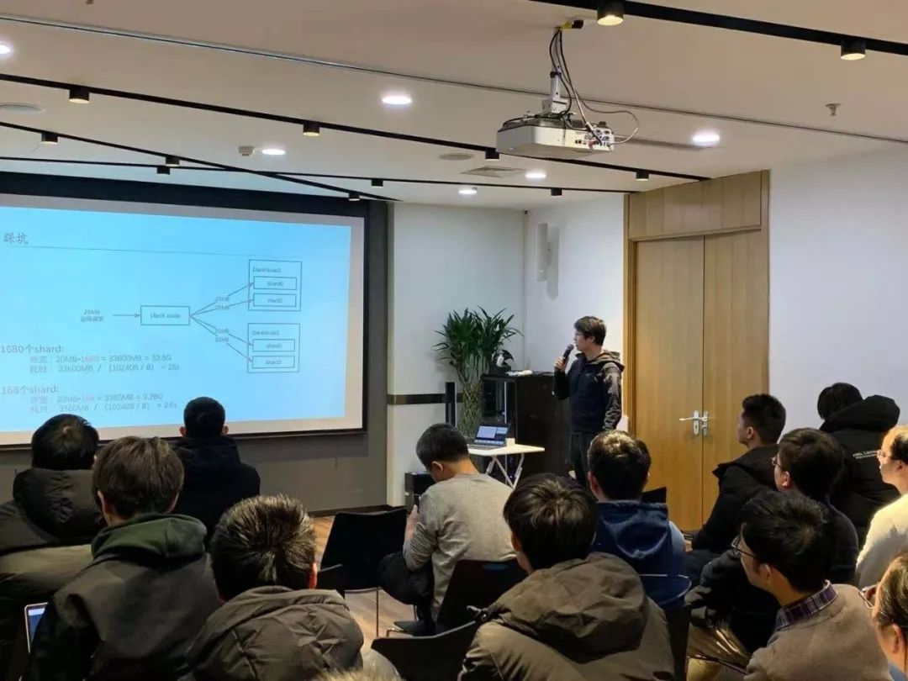
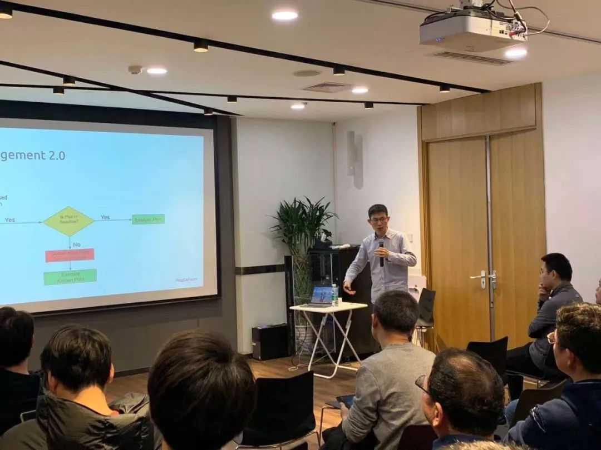

## Topic 1：基于 Hadoop 快速构建 Elasticsearch 索引

>讲师介绍：钟华，滴滴资深软件开发工程师。

+ [视频 | PingCAP Infra Meetup No.122：基于 Hadoop 的 ES 索引 ](https://www.bilibili.com/video/av81893335?p=1)
+ [PPT 链接](https://github.com/pingcap/presentations/blob/master/Infra-Meetup/Infra-Meetup-122-%E9%92%9F%E5%8D%8E-%E5%9F%BA%E4%BA%8E%20Hadoop%20%E5%BF%AB%E9%80%9F%E6%9E%84%E5%BB%BA%20Elasticsearch%20%E7%B4%A2%E5%BC%95.pdf)

本次分享钟华老师介绍了基于 Hadoop 快速构建 Elasticsearch 索引的核心设计及挑战，包括：

1. 将 Hive 表数据转化成 Elasticsearch 底层的 Lucene 文件的基本思路和实现方式。
2. Lucene 文件合并，以及 Lucene 文件加入到 Elasticsearch 索引中的实现方式。
3. 如何解决导入过程中的 Mapping 冲突问题。

最后与大家讨论了如何获得和 DataX 相同的使用体验，即在不关闭索引的前提下，将 Lucene 文件加入到索引中。接下来我们会开发数据导入相关的辅助工具，降低业务接入的复杂度，从而提高整体的数据导入效率。

## Topic 2：初探 TiDB 4.0

>讲师介绍：张金鹏，TiKV engine team tech-leader。

+ [视频 | PingCAP Infra Meetup No.122：初探 TiDB 4.0](https://www.bilibili.com/video/av81893335?p=2)
+ [PPT 链接](https://github.com/pingcap/presentations/blob/master/Infra-Meetup/Infra-Meetup-122-%E5%BC%A0%E9%87%91%E9%B9%8F-%E5%88%9D%E6%8E%A2%20TiDB%204.0.pdf)

本次 talk 我们回顾了 3.0 的一些 feature 在实际场景中的效果，比如 Titan 在大 value 情况下对于延迟的明显降低，以及 hibernate region 能在大数据量的情况下明显降低了 CPU 开销。

同时我们带大家浏览了 4.0 的多个新特性，包括：

1. 通过 key visualizer 直观的看数据的热点分布情况。

2. 表达式索引的支持。

3. 通过 SQL plan management 自动纠正错误的索引。

4. PD 弹性调度，可以针对不同的表进行单独的调度。

5. 通过 follower replication 降低跨数据中心的数据流量。

6. 跳过 SQL 层，基于 TiKV 的快速 backup 和 restore 功能。