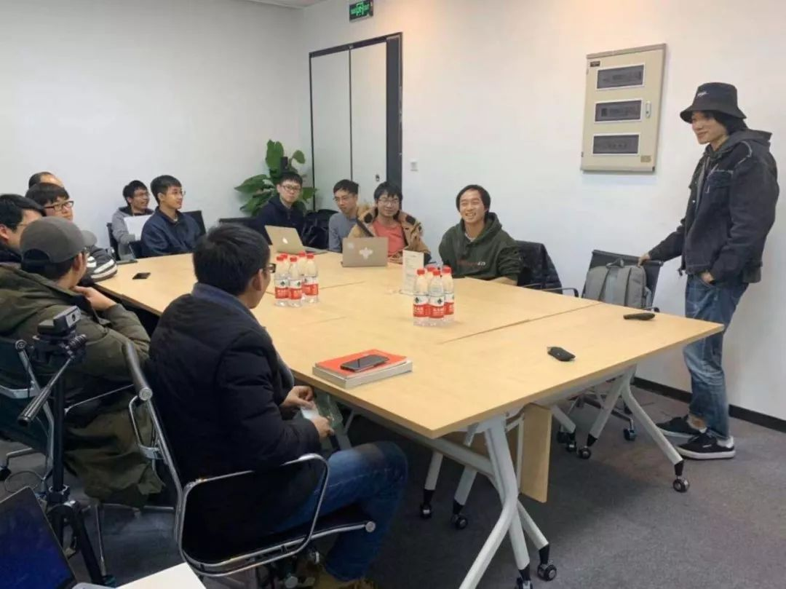
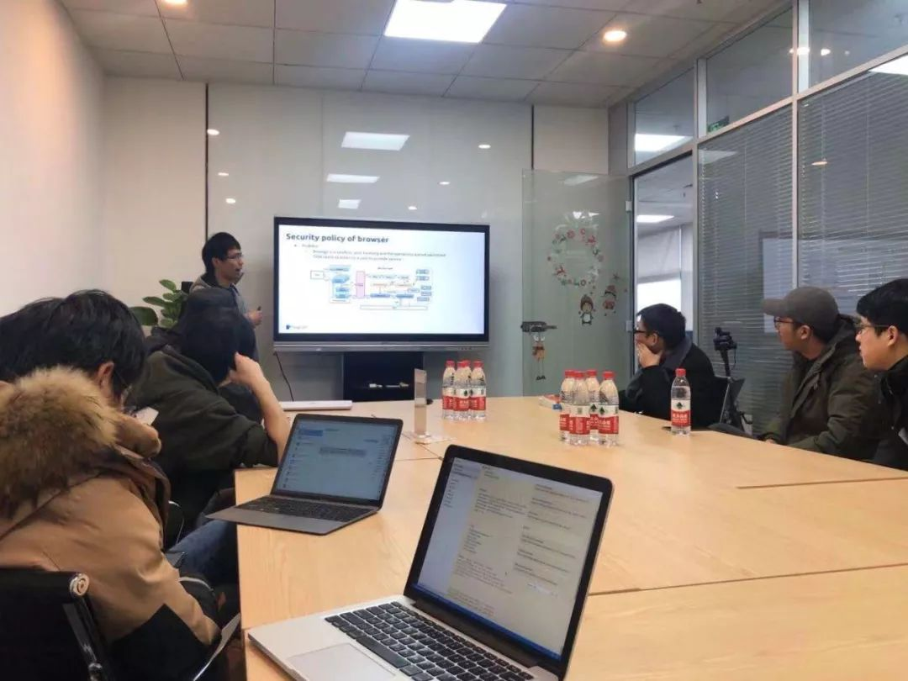

## Topic 1：WebAssembly — What & How

>讲师介绍：于航，PayPal Senior Software Engineer。

+ [视频 | PingCAP Infra Meetup No.123：WebAssembly — What & How ](https://www.bilibili.com/video/BV1fJ411L7QH?p=1)
+ [PPT 链接](https://github.com/pingcap/presentations/blob/master/Infra-Meetup/Infra-Meetup-123-%E4%BA%8E%E8%88%AA-WebAssembly%20%E2%80%94%20What%20%26%20How.pdf)

本次于航老师分享主要介绍了 WebAssembly 的发展历史、技术实践与未来展望，包括：

1. WebAssembly 技术的出现背景，Asm.js 与 PANCL 的基本介绍。

2. 基于 Emscripten 构建 WebAssembly 应用的基本流程。

3. 现阶段 WebAssembly 生产实践及周边基础工具链/语言的发展情况。

4. WASI 的基本概念介绍与实践。

最后讨论了 WebAssembly 现有的落地及实践场景，现阶段实践中存在的问题，以及未来 WebAssembly 技术可能的发展方向。

## Topic 2：初探 TiDB 4.0

>讲师介绍：周帅，PingCAP 研发工程师。

+ [视频 | PingCAP Infra Meetup No.123：Put TiDB in WebAssembly](https://www.bilibili.com/video/BV1fJ411L7QH?p=2)
+ [PPT 链接](https://github.com/pingcap/presentations/blob/master/Infra-Meetup/Infra-Meetup-123-%E5%91%A8%E5%B8%85-How%20We%20Run%20TiDB%20In%20Browser%20and%20Anywhere.pdf)

本次分享介绍了 [tidb-wasm](https://github.com/pingcap/tidb-wasm) 的设计与实现，包括：

1. 将 TiDB 运行在浏览器的 WebAssembly 环境中需要对 TiDB 自身做的改造。

2. 将 TiDB 运行在非浏览器的 WebAssembly 环境中需要对 Golang 做的改动。

3. 目前基于 WebAssembly，TiDB 可以运行的所有场景，以及未来可以进行的扩展。

最后大家一起讨论了 WebAssembly 的优势，以及在安全性上和 Docker 的一些对比，和未来可以扩展的一些应用场景。