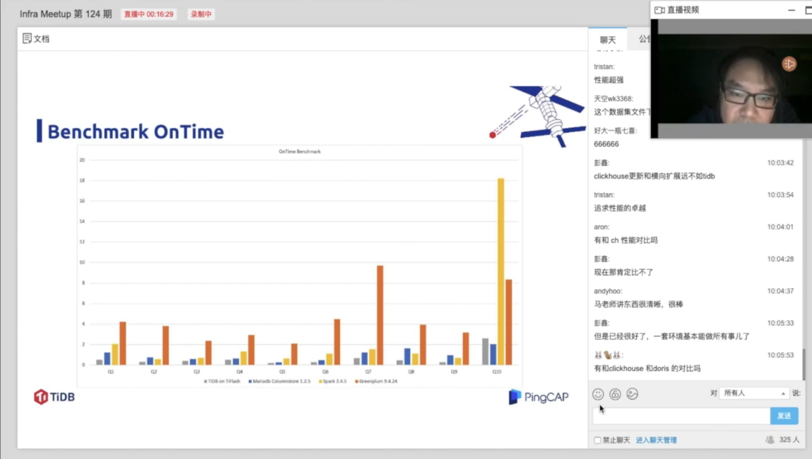

## TiDB + TiFlash：行列混存数据库，究竟有多快？

>讲师介绍：马晓宇，PingCAP AP 型产品负责人。

+ [视频 | PingCAP Infra Meetup No.124：TiDB + TiFlash：行列混存数据库，究竟有多快？ ](https://www.bilibili.com/video/BV1L7411A7DJ)
+ [PPT 链接](https://github.com/pingcap/presentations/blob/master/Infra-Meetup/Infra-Meetup-124-maxiaoyu-TiFlash.pdf)

TiFlash 是即将随着 TiDB  3.1 版本发布的列存引擎（预计 3月发布），大幅提升了 TiDB 在实时分析场景下的性能。同时和 TiDB 体系无缝结合，可实时更新，弹性扩展，保持 TiDB 的 ACID 事务特性和快照隔离级别，可用于严肃场景的实时分析。本次分享将介绍 TiFlash 的架构原理和最新测试结果。

### 关于 TiDB + TiFlash 的 Q&A 合集：

**Q：如果想在已经存在的集群增加 TiFlash，怎么去估算资源？**

A：可以衡量哪些表可能需要加速，这些表单副本大小大致就是 TiFlash 两副本所需的空间，再算上计划的余量就行。计算资源需要看查询的具体情况而定，但是一般来说 16-32C 32-64G 就可以。

**Q：可以单独给 TiFlash 设置 GC 的时间么，这样在 TiFlash 上可以保留较长时间的数据历史，是不是可以作为一个数据库备份。**

A：暂时没有独立 GC，不过不难做，但是 TiFlash 暂时本身没有容错，KV 删掉了 TiFlash 的老数据坏了会无法恢复。独立容错今年计划会完成，这样可以支持老数据备份和独立写入。

**Q：在 SQL 调优和机器性能调优方面是否有支持呢？**

A：SQL 调优支持原本 TiDB 的各类工具和命令，TiFlash 本身不独立提供 SQL 入口。

**Q：对于一致性有个问题，比如来一个事务，改了跨 Region 的数据，某些 TiFlash Region 已经同步了事务对 TiKV 数据的更改，但有的 TiFlash Region 没收到，这种怎么保证的？**

A：通过 Learner Read，每个 Region 会校准 Leader 副本的进度。

**Q：目前已经支持 SQL 自动解析后到 TiKV 或 TiFlash 查询么？**

A：TiDB 3.1 版本将会支持，预计 3 月初发布。

**Q：支持快照读，要写 undo files 吗？**

A：通过 MVCC 机制来支持快照读，可以通过 这篇文章 来了解。

**Q：TiFlash 的 segment 是怎么划分的呢？切分的边界根据什么规则定呢?**

A：按照主键来划分，大概每个 segment 150 万行；segment 会根据数据分布进行 split/merge 等操作。