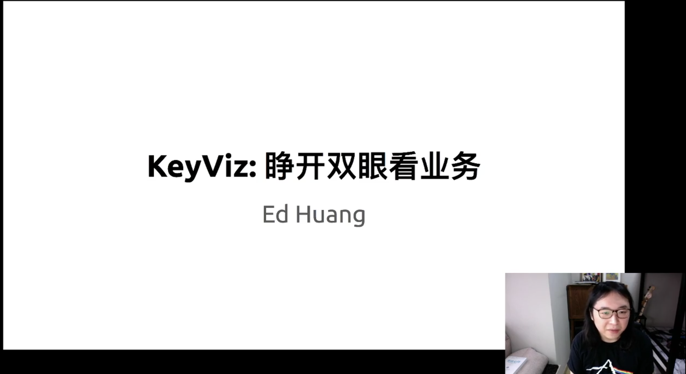

## KeyViz 及系统可观测性

>讲师介绍：黄东旭，PingCAP 联合创始人兼 CTO

+ [视频 | PingCAP Infra Meetup No.125：在 KeyViz 工具价值之外，聊聊分布式系统可观测性](https://www.bilibili.com/video/BV1vE411478G)
+ [PPT 链接](https://github.com/pingcap/presentations/blob/master/Infra-Meetup/Infra-Meetup-125-%E9%BB%84%E4%B8%9C%E6%97%AD-KeyViz-%E7%9D%81%E5%BC%80%E5%8F%8C%E7%9C%BC%E7%9C%8B%E4%B8%9A%E5%8A%A1.pdf)

我司联合创始人兼 CTO 黄东旭在 Infra Meetup 直播间和大家畅聊了 2 小时，重点分享了 TiDB 4.0 的新特性之一：KeyViz。 通过 KeyViz，系统运行的状态将呈现在用户眼前，最重要的是，KeyViz 直观描绘了业务的形态，用户能够全面地、直接地看到每个 Workload “长什么样子”，而不是通过 QPS、TPS 等指标和个人经验去摸索问题所在。

近年来，系统的可观测性被大家提升到了更高的位置上，TiDB 也在为此作出更多前沿的探索，未来 TiDB Dashboad 中还会包含更多对用户友好的功能，方便用户更全面观测系统运行健康状态。此外，黄东旭还“剧透”了诸多 TiDB 秘密武器：弹性调度（自动节点扩充、自主热点隔离）、TiDB Cloud（DBaaS 服务）等等。