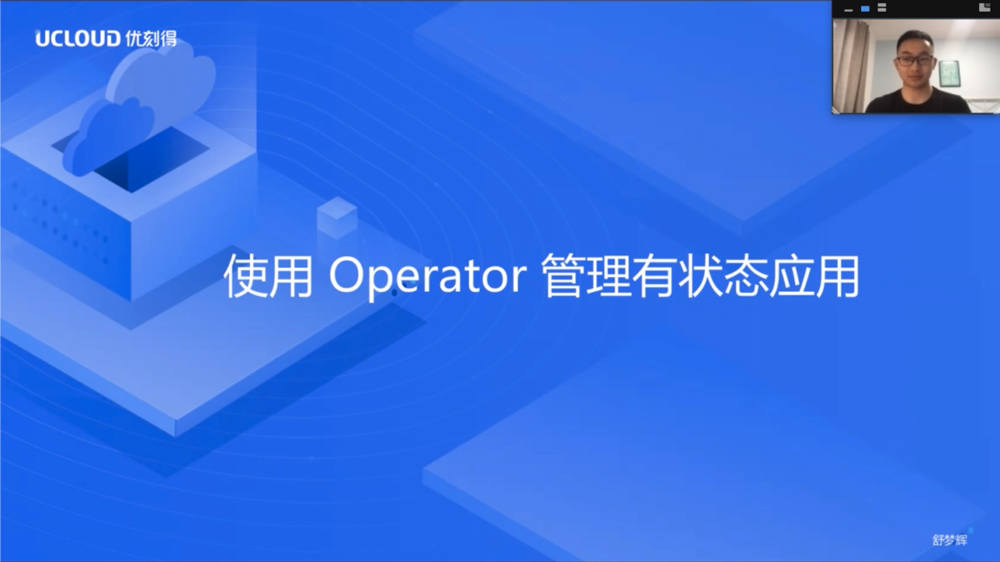
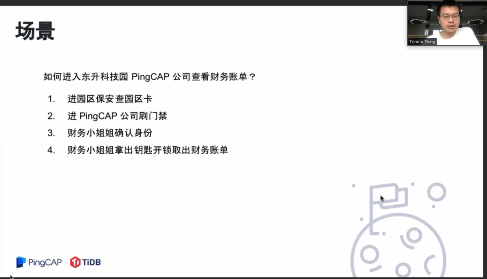

## Topic 1：在 Kubernetes 中如何管理有状态应用

>讲师介绍：舒梦辉，UCloud 容器管理平台后台研发工程师。

+ [视频 | PingCAP Infra Meetup No.126：在 K8s 中管理有状态应用](https://www.bilibili.com/video/BV1fZ4y1p7Zu)
+ [PPT 链接](https://github.com/pingcap/presentations/blob/master/Infra-Meetup/Infra-Meetup-126-%E8%88%92%E6%A2%A6%E8%BE%89-%E5%9C%A8%20Kubernetes%20%E4%B8%AD%E5%A6%82%E4%BD%95%E7%AE%A1%E7%90%86%E6%9C%89%E7%8A%B6%E6%80%81%E5%BA%94%E7%94%A8.pdf)

本次分享了在 Kubernetes 中如何管理有状态应用，包括：

1. 管理有状态应用的难点；

2. 使用 Statefulset 管理有状态应用的局限；

3. Operator 的概念、如何使用以及 Operator 的架构原理分析；

4. 如何借助开源脚手架快速实现 Operator。

最后讨论了 Operator 给用户带来的核心价值，以及使用 Operator 上的一些问题。

## Topic 2：TiDB 4.0 中引入的安全特性

>讲师介绍：邓栓，PingCAP 核心工程师。

+ [视频 | PingCAP Infra Meetup No.126：TiDB 4.0 安全新特性](https://www.bilibili.com/video/BV1fZ4y1p7Zu?p=2)
+ [PPT 链接](https://github.com/pingcap/presentations/blob/master/Infra-Meetup/Infra-Meetup-126-%E9%82%93%E6%A0%93-TiDB%204.0%20%E4%B8%AD%E5%BC%95%E5%85%A5%E7%9A%84%E5%AE%89%E5%85%A8%E7%89%B9%E6%80%A7.pdf)

本次分享邓栓老师介绍了 TiDB 4.0 中引入的安全特性：

1. 传输层 TLS 加密，TiDB 集群中双向 TLS 认证 (mTLS）以及 TiDB SQL 层的 TLS 鉴权；

2. 存储层静态加密（TDE），TiKV 中是如何实现与云厂商 KMS 服务集成；

3. 权限控制 RBAC。

最后结合 TiDB 4.0 中安全特性，介绍了生产环境中数据安全的最佳实践原则。