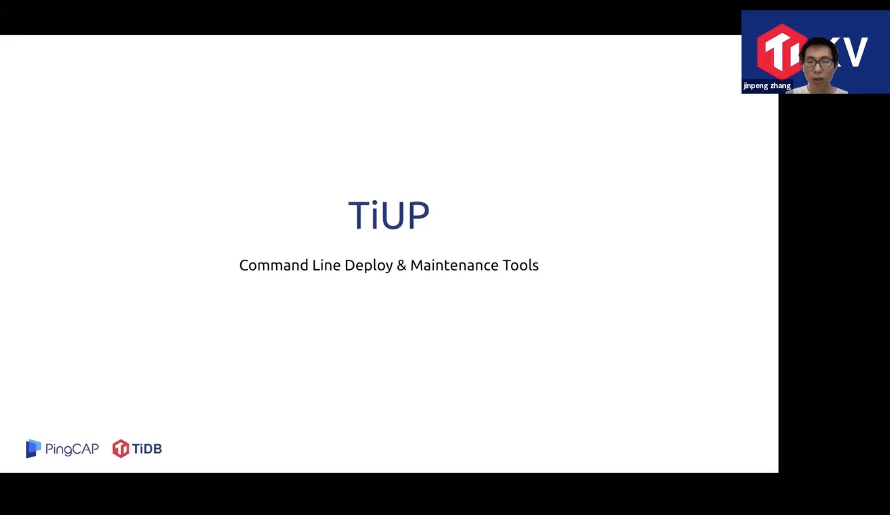

## TiDB 4.0 新特性讲解

>讲师介绍：张金鹏，PingCAP TiKV Storage Team Leader

+ [视频 | PingCAP Infra Meetup No.127：TiDB 4.0 新特性讲解](https://www.bilibili.com/video/BV1vf4y117Nk)
+ [PPT 链接](https://github.com/pingcap/presentations/blob/master/Infra-Meetup/Infra-Meetup-127-%E5%BC%A0%E9%87%91%E9%B9%8F-Deep%20into%20TiDB%204.0%20.pdf)

本次 talk 带大家了解了 TiDB 4.0 的一些改进和新特性，以及背后的技术原理，包括：

1. TiFlash 读写流程，怎样做到实时一致读，完成 Real-Time HTAP 的拼图；

2. Serverless 背后的弹性调度，弹性伸缩能力；

3. 在易用性方面做的改进，如 TiDB Dashboard 和 TiUP；

4. 以及大家能看得见摸得着的一些新 Features，如防止生成错误执行计划的 SPM 2.0，大事务的支持，悲观锁的加强，加密通讯加密存储，简化打散热点的 Auto Random Key，自定义数据放置规则的 Cascade Placement Rule，Drop Table 之后闪回的 Flashback 功能，减少大小查询相互干扰的 Adaptive Thread Pool 等；

5. 生态工具这方面我们介绍了分布式快速备份工具 BR 和数据订阅组件 CDC。
