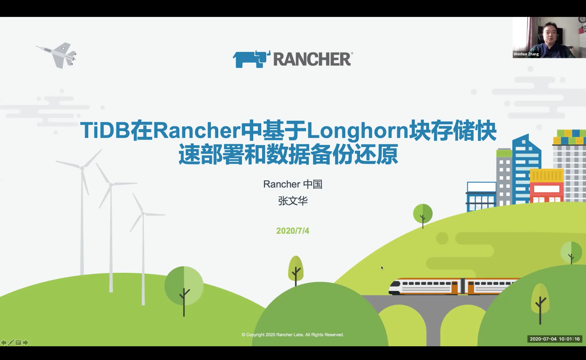
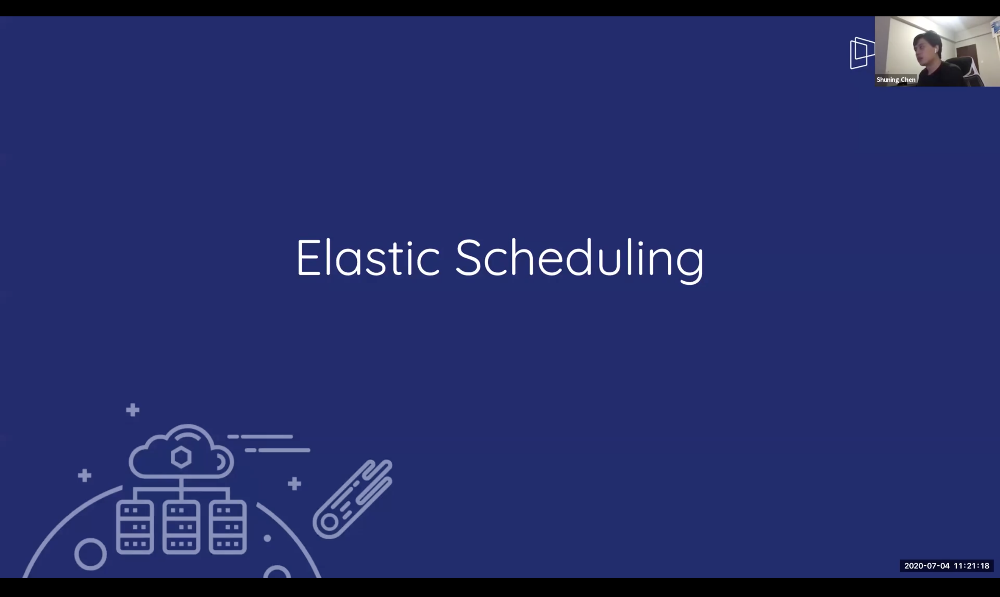

## TiDB 在 Rancher 中基于 Longhorn 块存储快速部署和使用

>讲师介绍：张文华，Rancher 中国解决方案架构师

+ [视频 | PingCAP Infra Meetup No.128：TiDB 在 Rancher 中基于 Longhorn 块存储快速部署和使用](https://www.bilibili.com/video/BV1Yz4y1X7Uw)
+ [PPT 链接](https://github.com/pingcap/presentations/blob/master/Infra-Meetup/Infra-Meetup-128-%E5%BC%A0%E6%96%87%E5%8D%8E-TiDB%20%E5%9C%A8%20Rancher%20%E4%B8%AD%E5%9F%BA%E4%BA%8E%20Longhorn%20%E5%9D%97%E5%AD%98%E5%82%A8%E5%BF%AB%E9%80%9F%E9%83%A8%E7%BD%B2%E5%92%8C%E5%BA%94%E7%94%A8.pdf)

本次分享介绍了 TiDB 在 Rancher 中基于 Longhorn 块存储快速部署和应用，内容包括以下几个方面：

1. TiDB+Rancher+Longhorn 结合后的使用效果带来了哪些好处；

2. Longhorn V1.0 功能概述和基本原理分；

3. TiDB Cluster 在 Rancher 中快速部署；

4. TiKV、PD 模块数据卷的快照及还原流程。

最后做了功能演示，演示了数据的备份方式、数据卷怎么快速做快照和快照的远程备份。还演示了数据卷的恢复流程，包括用快照恢复卷和通过远程备份的数据进行灾难恢复或跨集群迁移数据。

## 云原生下的 TiDB 与 Serverless

>讲师介绍：陈书宁，PingCAP Scheduling Team Acting Manager

+ [视频 | PingCAP Infra Meetup No.128：云原生下的 TiDB 与 Serverless](https://www.bilibili.com/video/BV18D4y1S7Ma)
+ [PPT 链接](https://github.com/pingcap/presentations/blob/master/Infra-Meetup/Infra-Meetup-128-%E9%99%88%E4%B9%A6%E5%AE%81-Cloud%20Native%20TiDB%20and%20Serveless.pdf)

本次分享介绍了 TiDB 是如何成为 Cloud Native 的数据库的，内容包括：

1. TiDB Operator 如何管理 TiDB 集群；

2. 介绍 Cloud TiDB 为减少客户上船负担；

3. 介绍 TiDB 在 Serveless 这块的一些工作。

最后讨论了一下 Cloud-Native TiDB 在 Serveless 的一些应用场景和规划。TiDB 5.0 也会为进一步降低用户上船的成本，提高稳定性。