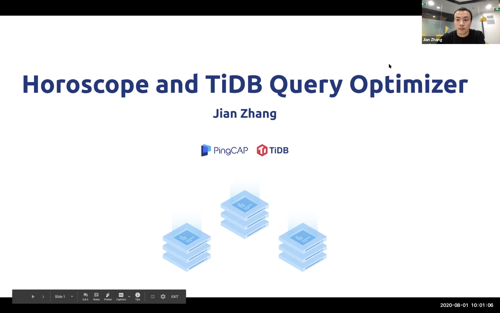

## Horoscope and TiDB Query Optimizer

>讲师介绍：张建，TiDB Product & Tech Manager

+ [视频 | PingCAP Infra Meetup No.129：Horoscope and TiDB Query Optimizer ](https://www.bilibili.com/video/BV1uf4y197GK)
+ [PPT 链接](https://github.com/pingcap/presentations/blob/master/Infra-Meetup/Infra-Meetup-129-%E5%BC%A0%E5%BB%BA-Horoscope%20and%20TiDB%20Query%20Optimizer.pdf)

本次 Meetup 介绍了 TiDB 的优化器测试工具 horoscope 和优化器改进上的一些进展，具体来说包含如下内容：

+ 优化器内部原理简介。

+ horoscope 测试优化器 effectiveness 的基本方法。

+ 通过使用 horoscope，如何阅读 horoscope 的测试报告。

+ horoscope 是如何生成测试更多的 query 和 case 。

+ horoscope 通过模拟批量更新来测试统计信息滞后时候优化器的 effectiveness。

+ 如何自动化的检测 TiDB 不同版本之间的执行计划的变化，提前发现升级集群的潜在问题。

+ TiDB 优化器改进之降低越界值估算误差。

+ TiDB 优化器改进之 extended statistics，允许用户在不创建索引的情况下收集多列的联合统计信息。

+ TiDB 优化器改进之 TopN、CM-Sketch 和 Histogram 优化，降低 CM-Sketch 哈希冲突和直方图的估算误差。