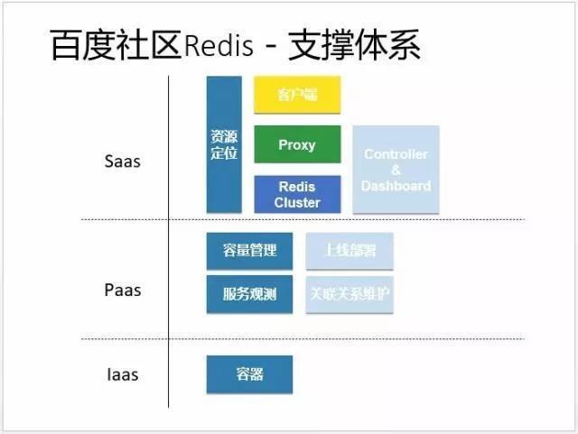
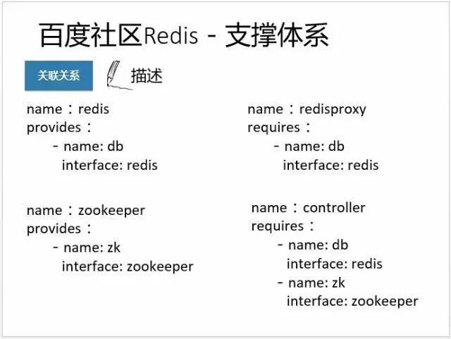
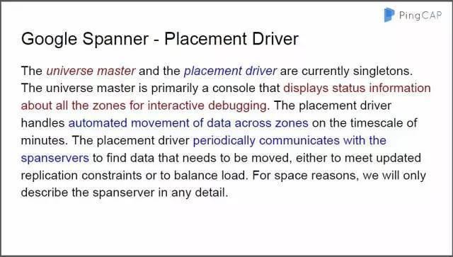

今天是 PingCAP 第 13 期 Meetup ，主题是百度资深研发工程师、百度 BAC 存储负责人闫宇分享的《百度 redis3 生产环境实践》以及 PingCAP 联合创始人崔秋分享的《TiKV Auto Balance 》。

## Topic 1：《百度 redis3 生产环境实践》

 

>**讲师：**闫宇，百度资深研发工程师，百度 BAC 存储负责人

*（百度 BAC 的 redis3 服务目前机器规模达到1400台左右，总数据量接近100T，日 pv 超过1500亿，用户涵盖了百度贴吧、百度糯米、手机百度等百度内部几百个业务线。）*

**内容方向：**

1）介绍百度 BAC 的 redis3 服务的整体架构；

2）交流在 redis3 实践中的一些经验。

以下为本次分享的干货PPT：

 

 

 

 

 

 

 

 

 

 

 

 

 

 

 

 

 

 

 

 

 

 

## Topic 2：《TiKV Auto Balance》

 

>**讲师：**崔秋，PingCAP 联合创始人

**内容方向：**

1）PD - God View of TiKV；
2）TiKV 如何成为真正意义上的分布式存储引擎。

以下为本次分享的干货PPT：

 

 

 

 

 

 

 

 

 

 

 

 

 

 

 

 

最后，附赠一张今日爆满全场听讲图

 

