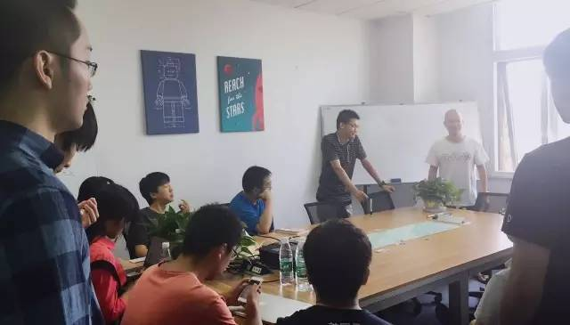
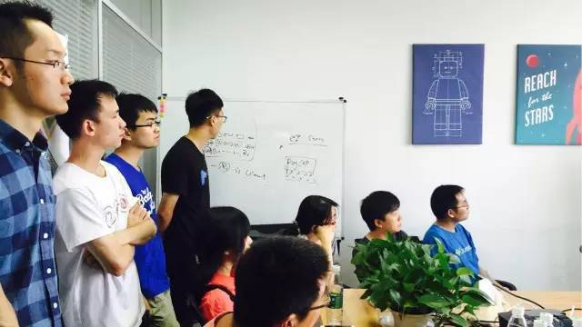
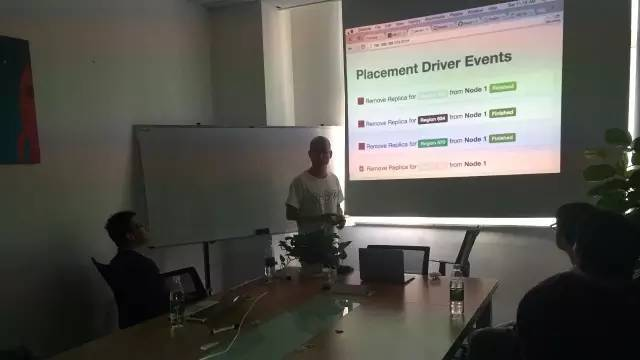
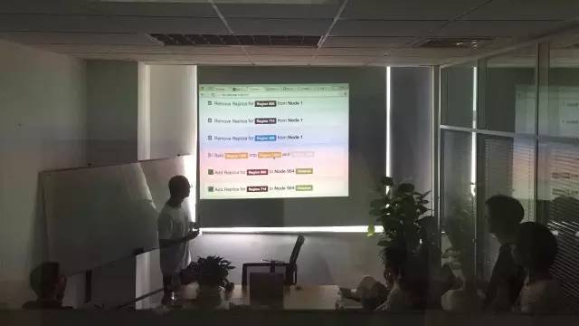

今天是 PingCAP 第14期 Meetup ，主题是酷克数据联合创始人马涛分享的《HashData 数据仓库的动态缩容扩容实现》以及 PingCAP 联合创始人兼 CEO 刘奇针对近日发布的 TiDB Beta 版进行的现场 Demo 演示。

## Part 1：《 HashData 数据仓库的动态缩容扩容实现》

 
>讲师：马涛，酷克数据联合创始人，数据库领域从业近10年，最初 Pivotal HAWQ 项目成员，06年至11年就职人大金仓做内核开发。目前主要负责 OLAP 系统内核和外围云化工作。

通过对比 Greenplum，Dynamo 和 HashData 的当前实现，为大家简单介绍数据处理系统动态缩容扩容的实现。阐述数据系统缩容和扩容的需求集合和设计方案，深入介绍 HashData 选择的设计、目前实现和后续改进。

 

## Part 2：《 TiDB Beta 版现场 Demo 演示》

 

 
>讲师：刘奇，PingCAP 联合创始人兼 CEO。

针对6月30日发布的 TiDB Beta 版，刘奇在现场进行演示，与大家共同见证了 TiDB 界面的首次亮相。直接通过标准的 MySQL 客户端连接，后端三台普通 x86 服务器集群，演示了常用的 SQL 插入和查询，并演示了在大压力数据写入的场景下，TiDB 自动扩容的全过程，期间无需人为干预，TiDB 自动完成数据迁移和扩容及流量的负载均衡，业务层完全透明。小伙伴们都惊呆了。

**TiDB Beta 版已如约亮相，说好的 “三五好友，吃吃喝喝”，说来就来 :)**

 

 

