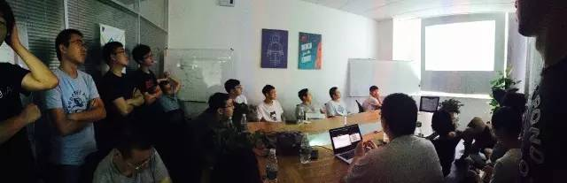
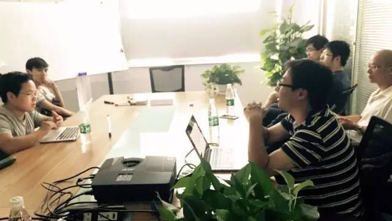
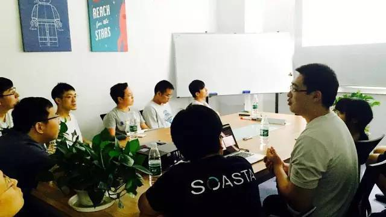

今天是 PingCAP 第 16 期 Meetup，主题是来自京东的田琪分享的《Cool Extensions of Raft for NewSQL》，以及来自百度的孟圣智分享的《基于 Ceph 构建文件共享服务的实践》 。

## Topic 1：Cool Extensions of Raft for NewSQL

>讲师介绍：田琪，京东数据库系统部负责人，开源 docker 镜像存储系统 speedy 作者，TiDB committer, etcd contributor

**Topic summary:**

主要分享了 Raft 协议在 etcd 中的实现，与 etcd 在 Raft 协议方面近期更新地比较重要的特性，以及引进这些特性的缘由。

*   the functionality of leader transfer

*   the future improvement of leader transfer

*   the functionality of quorum checking

*   implement leader lease based on quorum checking

*   some issues about leader lease

*   how to implement efficient read-only query

*   some other Raft internal details

## Topic 2：基于 Ceph 构建文件共享服务的实践

>讲师介绍：孟圣智，百度资深研发工程师，在存储领域有多年经验，Ceph contributor，Ceph-Dokan 项目作者，曾在国内最早落地 OpenStack Manila 项目，现在在百度负责 Memcache、Redis 类存储的研发和维护。

**Topic summary:**

*   Ceph 的基本架构

*   CephFS 的实现方式

*   CephFS 的多客户端方案

*   OpenStack 中使用 Ceph 的经验

*   基于 CephFS 实现文件共享服务的实践

