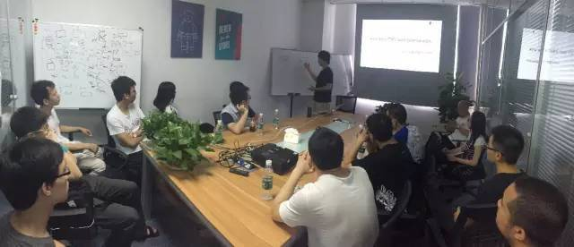

今天是 PingCAP 第 17 期 Meetup，主题是崔秋分享的《How does TiKV auto-balance work?》。

## Topic：How does TiKV auto-balance work?

崔秋 | PingCAP

TiDB 最近发布了 Beta 版本，相比传统的关系型数据库，TiDB 具有在线弹性伸缩，高可用和强一致性，一致性的分布式事务和 MySQL 协议兼容性等特性，特别适用于大规模高并发的海量数据场景。

本次交流主要介绍了 TiKV 的 Balance Scheduler 框架和算法实现演进，对于大家主要关注的 TiKV 集群的在线弹性扩容实现细节和 TiKV Balance 中在线服务高可用的问题，进行了深度的探讨。

在 TiKV 里面，数据是按照 Range 进行存放的，称为一个 Region。PD(Placement Driver) 负责整个 TiKV 集群的管理和调度。

在 TiKV 里面，数据移动的基本单元是 Region，所以 PD 的 auto balance 也是针对 Region 进行处理。对于一个 Region 来说，它会不会被 Balance，有两种方式：

**1）Heartbeart**

Region 会定期地上报当前的状态信息给 PD，如果 PD 发现该 Region 副本数不足或者超过阀值，则会通知该 Region 进行 Membership Change 处理。

**2）Balance Loop**

PD 会每隔一段时间检测整个系统是否需要调度。如果 PD 发现某个 Store 能用的空间不多，或者某个 Store Leader Region 数量太多，load 比较高，就会在该 Store 里面选择一个 Region，将其在该 Store 的副本迁移到另一个 Store 上面。

