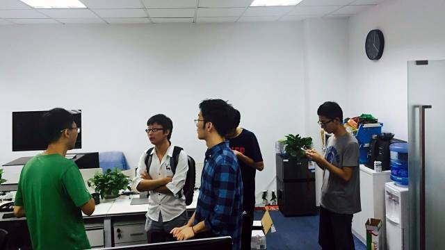

今天是 PingCAP 第 18 期 Meetup，主题是小米云平台工程师常冰琳分享的《Kudu 的设计思想和具体实现》以及张阳分享的《Kubernetes in PingCAP》。

### Topic 1：Kudu 的设计思想和具体实现

>讲师介绍：常冰琳，小米云平台工程师，长期专注于 Hadoop 生态的分布式计算框架，Kudu PMC&Commiter, Hadoop Nativetask 项目发起者(已合入 Hadoop)。目前在小米负责 SQL 类数据分析平台，利用 Impala 和 Kudu 搭建实时数据分析云服务。

**Content：**  

本次分享将简单介绍 Kudu 的设计思想和具体实现，以及小米作为 Kudu 最早用户的一些实践经验。

- 设计目标

- 数据模型，分区和副本设计

- Tablet 存储设计

- 其他底层细节

- 小米实践

### Topic 2：Kubernetes in PingCAP

**Content：**

本次分享，主要与大家沟通了 Kubernetes 在 TiKV 及 TiDB 中的一些应用场景，包括部署、运维以及与 Jenkins CI 的集成等。同时，对大家集中提问的 stateful 的 TiKV 在 rolling update、recovery 等情况下的“状态”维护上的一些问题，进行了探讨，基于此问题，大家在分享结束后也积极交流了各自对于 Kubernetes 本身的一些见解。

两个小时的分享时间很快就过去了，还没尽兴的小伙伴们便又开始了跟讲师和 PingCAP 团队单聊的节奏。于是，这些“自动配对，小组交流”的画面便出现在了 PingCAP 公司内的各个角落。 

接下来，我们也会从以往 Meetup 议题中筛选出现场关注度较高的技术点，邀请讲师以深度文章的形式分享出来。如果大家有任何相关技术问题，也欢迎通过微信留言与我们交流探讨。

