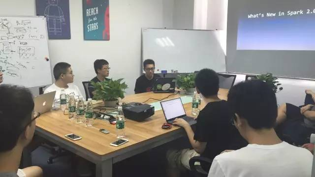
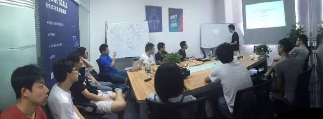

今天是 PingCAP 第 19 期 Meetup，主题是百度基础架构部工程师方君分享的《What's New in Spark 2.0 》以及韩飞分享的《An Overview of Cost Based Optimization and Join Reorder》。

## Topic 1：What's New in Spark 2.0

>讲师介绍：方君，百度基础架构部工程师，专注于分布式计算与流式计算领域，目前在百度负责 Spark 计算平台和计算表示层的相关工作。

**Content:**

1. DataSet API
2. Performance Optimization
3. Structure Streaming

## Topic 2：An Overview ofCost Based Optimization and Join Reorder

韩飞 | PingCAP

**Content:**

自从 System R 优化框架面世，基于 interesting order 的动态规划算法一直是大部分优化器采用的基础算法。本次分享介绍了优化器在没有 histogram 信息下的代价估计算法，以及举例说明 TiDB 中的动态规划算法实现。

最近有好多小伙伴在微信后台留言，想加入到我们的 Meetup 中来。在这里统一答复大家：我们的 Meetup 是每周六上午十点，在 PingCAP 公司内开讲哦。有兴趣的小伙伴届时带着你们对技术满满的热情来参加就好啦  :)

