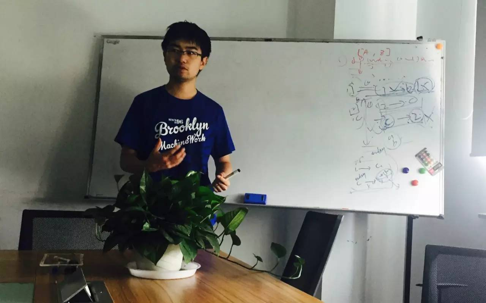
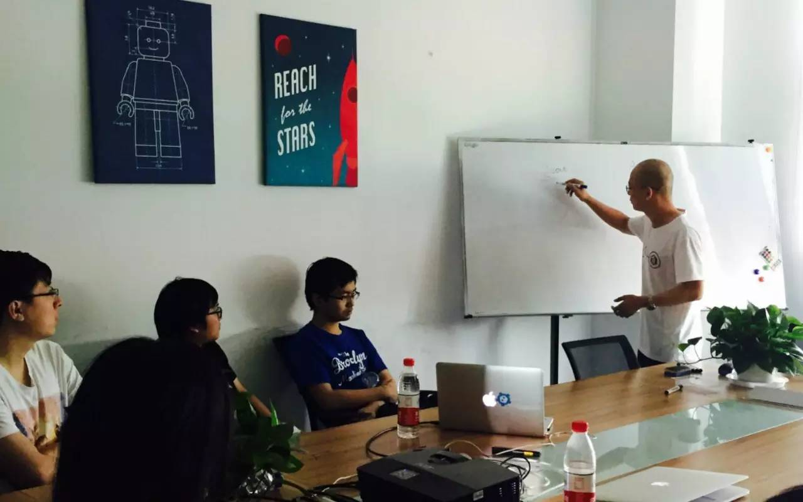

## PingCAP 第9期 NewSQL Meetup

*2016-05-21* *韩飞&刘奇* [PingCAP](##)
PingCAP

**PingCAP** 
微信号

pingcap2015

功能介绍

PingCAP 专注于新型分布式数据库的研发，是知名开源数据库 TiDB (GitHub 总计10000+ stars ) 背后的团队，总部设在北京，是国内第一家开源的新型分布式关系型数据库公司、国内领先的大数据技术和解决方案提供商。

** **

NewSQL Meetup

今天是 PingCAP 第9期 NewSQL Meetup ，分享主题是韩飞的《 SQL 子查询优化》和刘奇的《 TiKV MVCC 和 GC 实现》。

▌韩飞 《 SQL 子查询优化》

分享 SQL subqueries 的变换和优化问题。

关联子查询的优化是 SQL 优化中很重要的一部分，一般的执行方式方式是 correlated execution，但是可以通过引入 Apply 算子形式化证明所有的子查询都可以改写成 Join 的不同形式。在分布式场景下，Join 可以比 correlated execution 有更多的优化空间。

▌刘奇

《 TiKV MVCC 和 GC 实现》

详细分析了 TiKV 的 MVCC 机制, 事务模型，并进一步介绍了 percolator 事务模型的特点，以及对 GC 的影响。另外讲解了 TiKV 对 percolator 事务模型的改进, 以及 TiKV 的 GC 算法，和如何支持长时间的数据库备份和分析操作。

PingCAP Meetup

