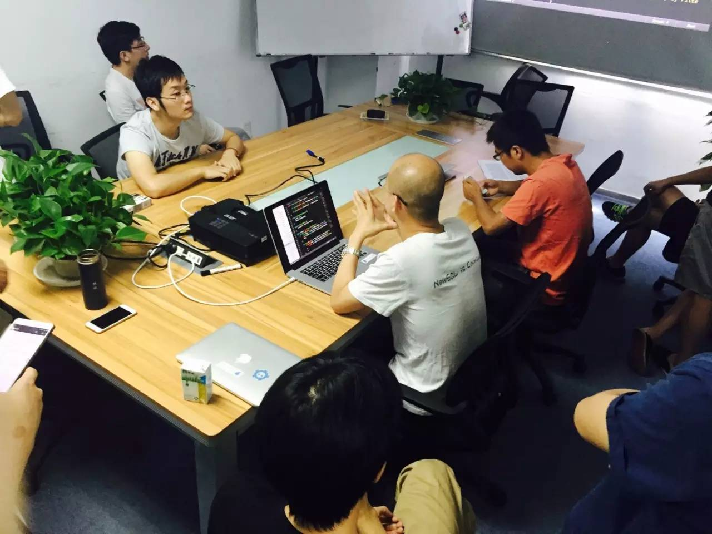
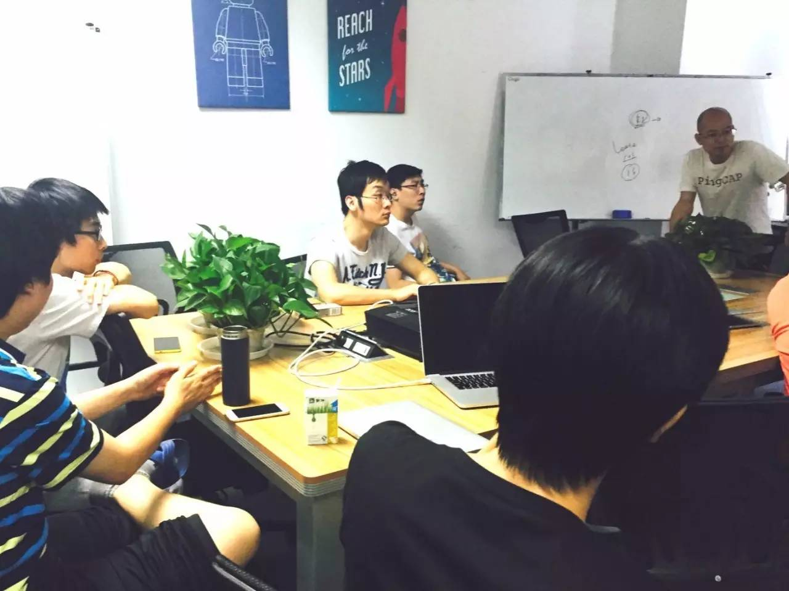
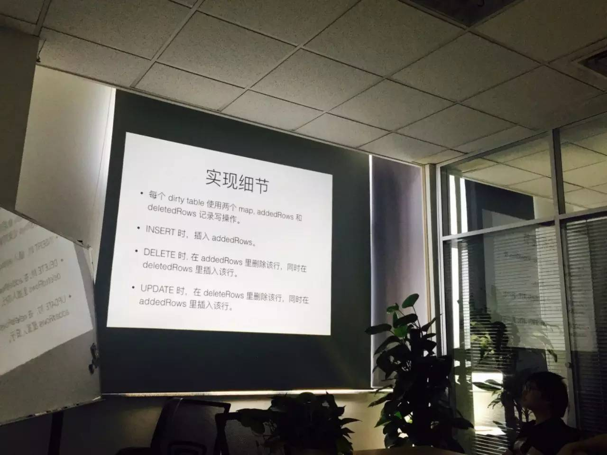
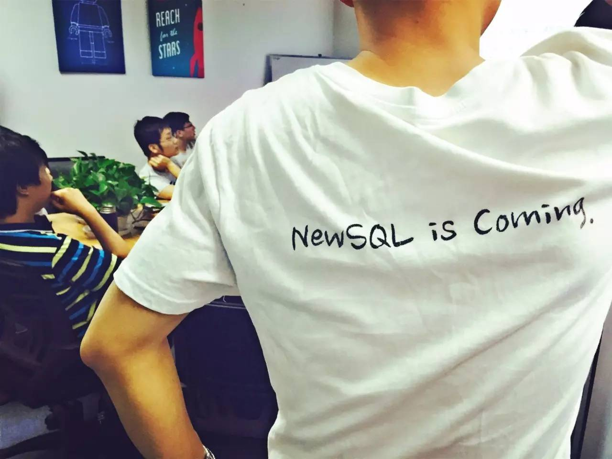

## PingCAP 第10期 NewSQL Meetup

*2016-05-28* *刘奇&周昱行* [PingCAP](##)
PingCAP

**PingCAP** 
微信号

pingcap2015

功能介绍

PingCAP 专注于新型分布式数据库的研发，是知名开源数据库 TiDB (GitHub 总计10000+ stars ) 背后的团队，总部设在北京，是国内第一家开源的新型分布式关系型数据库公司、国内领先的大数据技术和解决方案提供商。

** **

NewSQL Meetup

今天是 PingCAP 第10期 Meetup ，跟京东小伙伴就

Raft group 中出现网络隔离时的 stale read 的问题做了充分讨论交流。之后进行的

分享主题是《 TiKV 的网络模拟测试》和《 TiDB 的条件下推优化》。

▌随机讨论

Raft group 中出现网络隔离时，会有stale read 的问题。目前我们考虑采用 region leader 的方案，保证在出现网络隔离的情况下，也能保证读的正确性。大家对其中的实现细节，以及各种方案的优缺点进行了讨论。

▌刘奇

《 TiKV 的网络模拟测试》

TiKV 如何做分布式系统测试。目前已经构建了一套测试框架，提供设置网络延迟、网络隔离、节点掉线等功能，用于构建测试用例。

▌周昱行

《 TiDB 的条件下推优化》

使用基于 Row 的 Merge 算法，解决存在脏数据时，使用 TiDB 下推 API 优化的问题。

TiDB 的下推 API 相比基础的 API 对读性能有着几个数量级的提升，任何无法使用下推 API 的操作的请求，性能都慢到完全无法接受的程度。

但是之前的实现并不能保证所有读请求都可以走下推 API, 当事务有写操作以后，无法使用下推 API。无法使用的原因是，事务提交之前，事务内写入的数据是对事务自身是可见的，下推 API 只能读到已提交的数据，返回的结果是错误的。

一个很常见的场景是在一个事务内 UPDATE 多个 Row，会退化到使用基础 KV API。

本周 TiDB 的一个更新，通过设计实现了一种基于 Row 的 Merge 算法，解决了这个问题。

小花絮： 赠送 PingCAP 家褶皱版美背 T 恤买家秀

一只

。大家周末愉快：P

PingCAP Meetup

