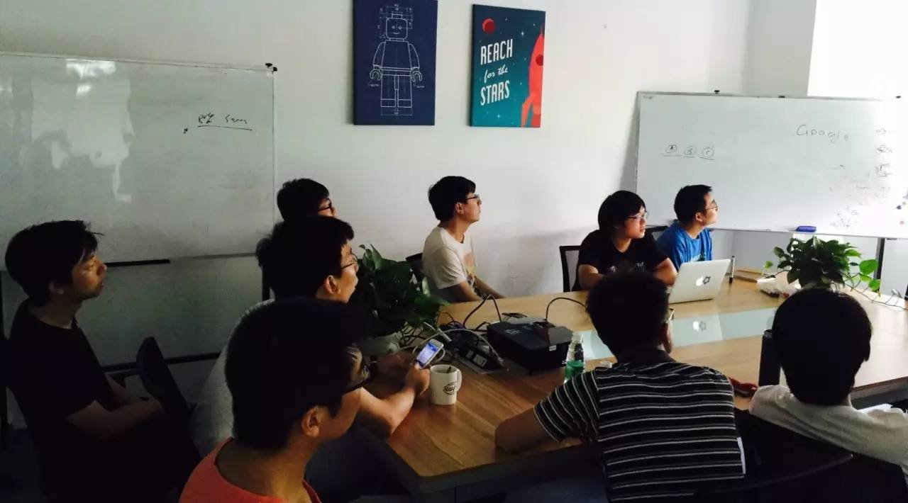
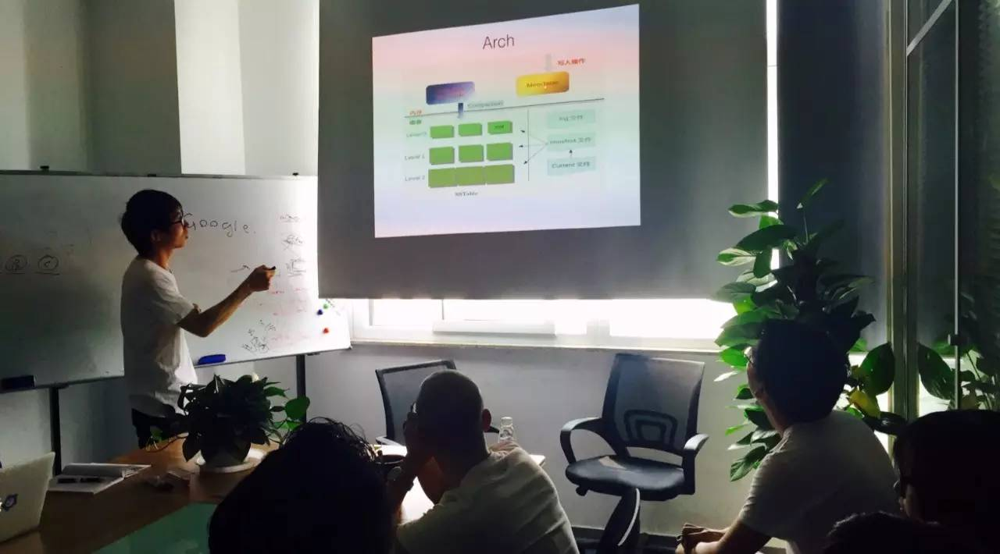

## PingCAP 第11期 NewSQL Meetup

*2016-06-04* *黄梦龙&张金鹏* [PingCAP](##)
PingCAP

**PingCAP** 
微信号

pingcap2015

功能介绍

PingCAP 专注于新型分布式数据库的研发，是知名开源数据库 TiDB (GitHub 总计10000+ stars ) 背后的团队，总部设在北京，是国内第一家开源的新型分布式关系型数据库公司、国内领先的大数据技术和解决方案提供商。

** **

NewSQL Meetup

今天是 PingCAP 第11期 Meetup ，

主题是黄梦龙分享的《 TiKV 的结构化存储模型优化》和张金鹏分享的《深入解析 LevelDB 》。

▌黄梦龙

《 TiKV 的结构化存储模型优化》

目前 TiKV 的存储模型是简单的纯 Key-Value，在存储 SQL 结构化数据的过程中会产生比较严重的读写放大问题。我们计划为 TiKV 添加类似于 Hbase 的 ColumnFamily 机制，以使得 TiKV 与 TiDB 成为更加完美的搭档。大家对其中的实现细节，以及各种方案的优缺点进行了探讨。

▌张金鹏

《深入解析 LevelDB 》

首先介绍了 LevelDB 的整体架构，以及 LSM Tree 这一数据库中非常经典的结构。之后对 LevelDB 的写和读的流程进行分析，同时介绍 LevelDB 的 snapshot 功能的实现原理，以及 iterator 内部实现，和 iterator 存在的潜在问题。最后介绍 LevelDB 的 compaction 过程，以及存在的问题。

PingCAP Meetup

