## PingCAP 第12期 NewSQL Meetup

*2016-06-18* *张金鹏* [PingCAP](##)
PingCAP

**PingCAP** 
微信号

pingcap2015

功能介绍

PingCAP 专注于新型分布式数据库的研发，是知名开源数据库 TiDB (GitHub 总计10000+ stars ) 背后的团队，总部设在北京，是国内第一家开源的新型分布式关系型数据库公司、国内领先的大数据技术和解决方案提供商。

** **

NewSQL Meetup

今天是 PingCAP 第12期 Meetup ，主题是

张金鹏分享的《 rocksdb 日志分析和性能调优经验 》。

▌张金鹏

《 rocksdb 日志分析和性能调优经验 》

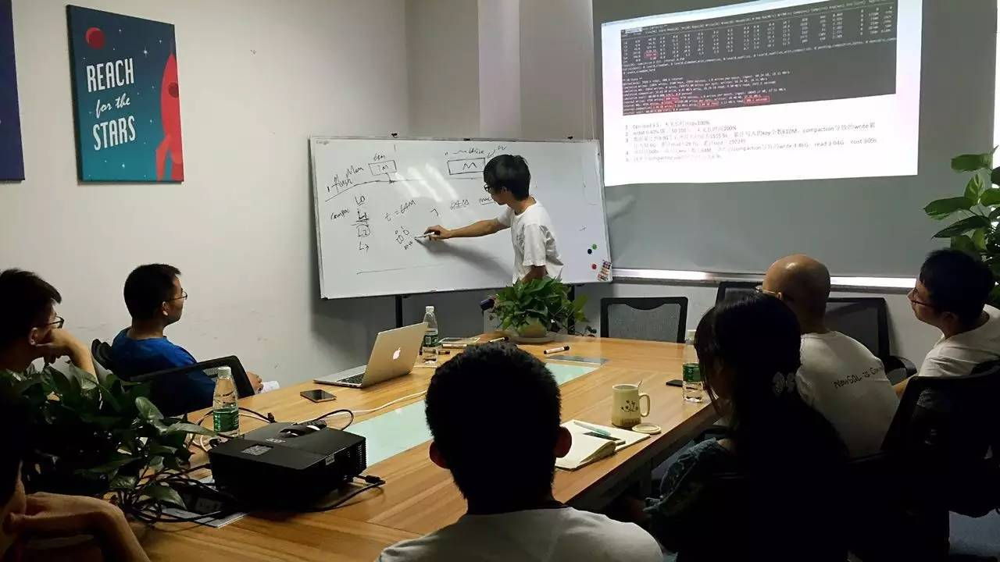

首先和大家一起分享如何分析 rocksdb 的 LOG，包括观察 compaction 相关的统计信息。

例如每个 level 导致的 compaction 个数，每个 compaction job 的平均持续时长，compaction 导致的 read 总量和 write 量，以及写放大等；也可以观察整个系统是否有 stall 情况，持续多长时间，时间占比是多少等；另外，还有跟踪某个具体的 compaction job 的 input files 组成，output files，以及 compacting 过程中 drop 掉的 key 个数等信息。

然后根据 rocksdb 的 LOG 以及观察到的系统负载情况，来对不同参数组进行测试。

最后对比不同参数组的一些效果，包括同样的数据量导致的 compaction 放大比例；整个系统的 stall 情况；以及是否存在长时间的 compaction 导致的长时间高 CPU 及高 IO，从而对 TiKV 服务本身造成负面影响等情况。

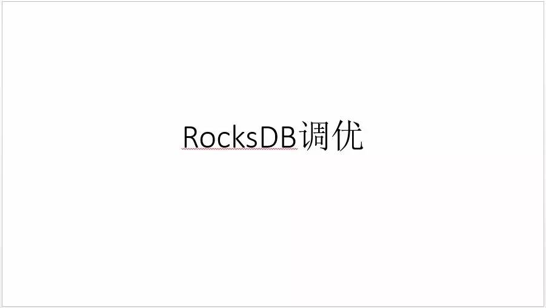

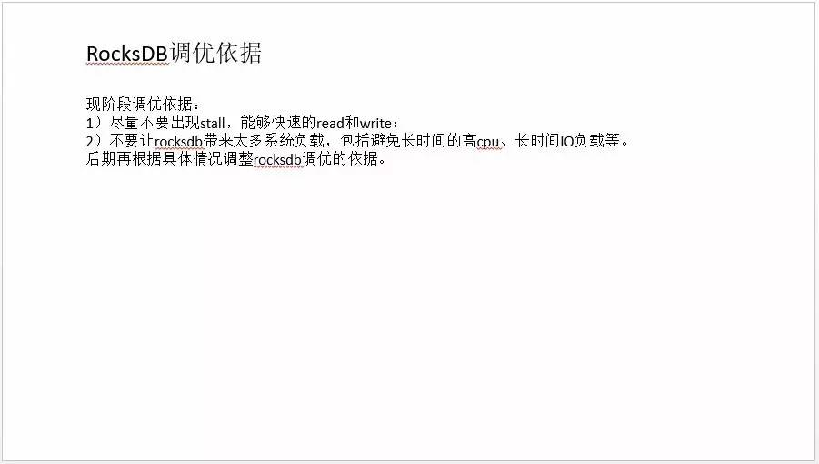

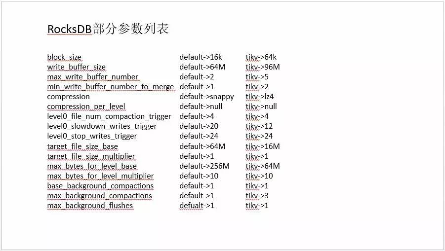

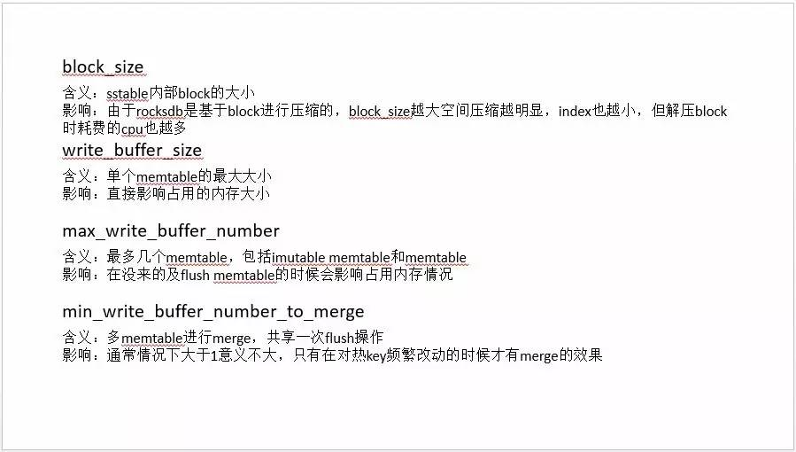

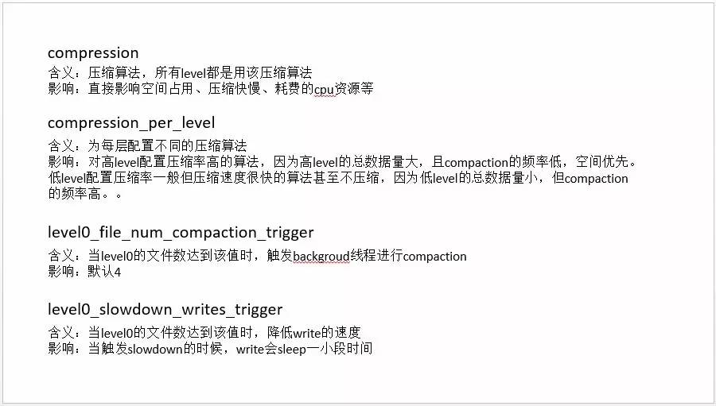

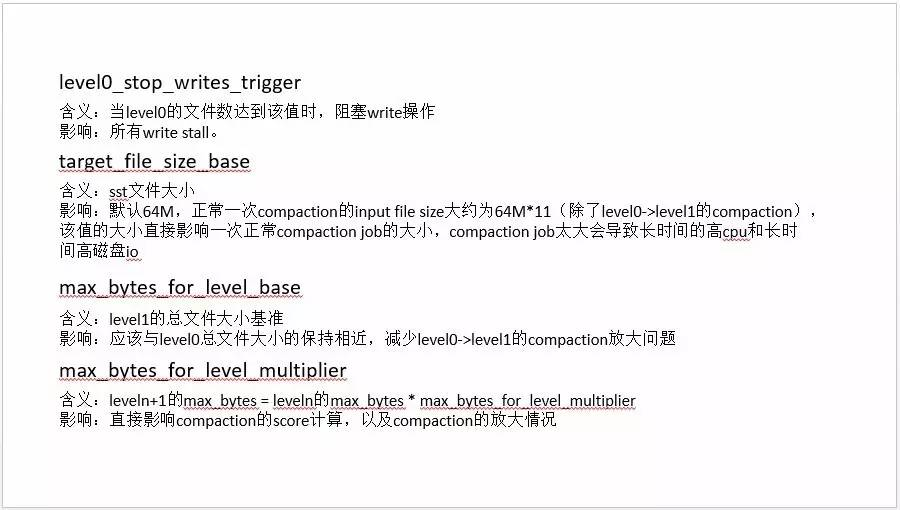

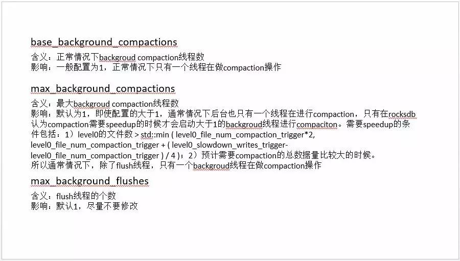

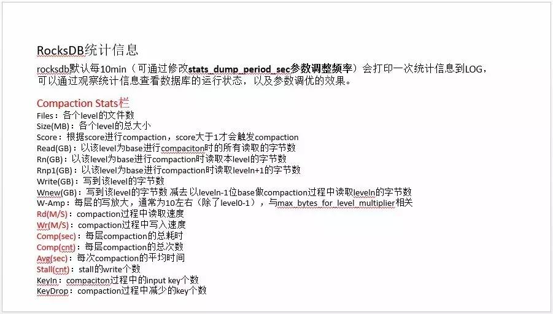

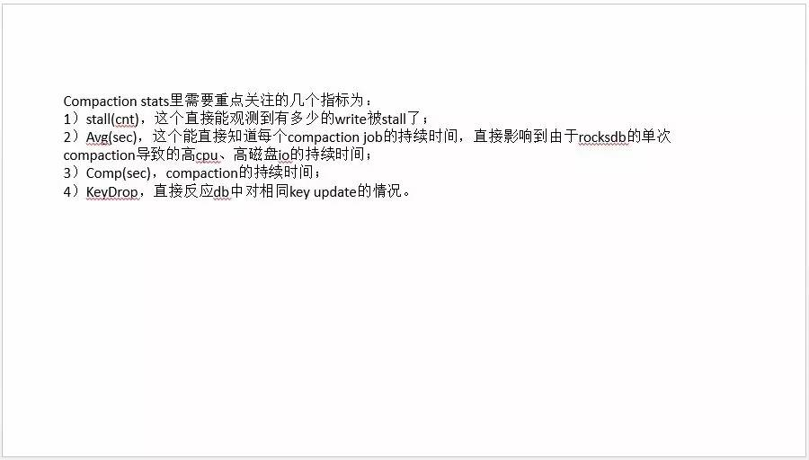

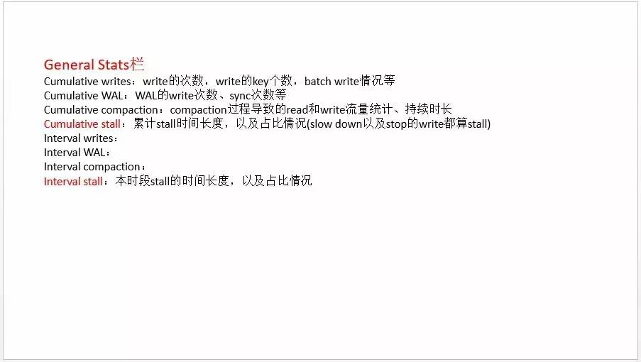

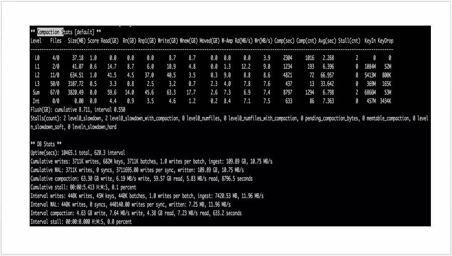

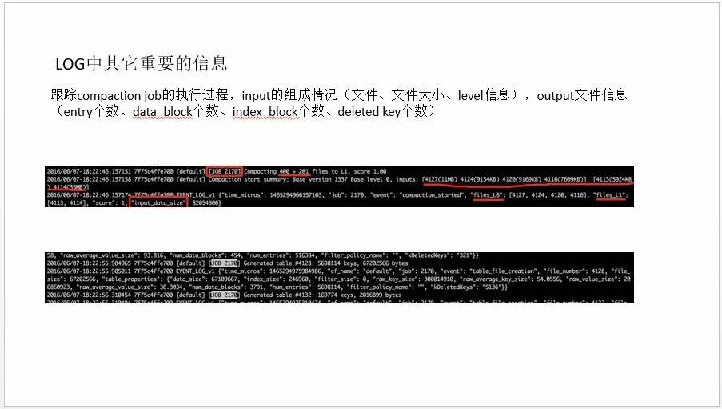

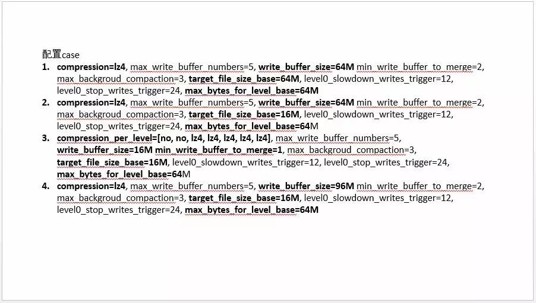

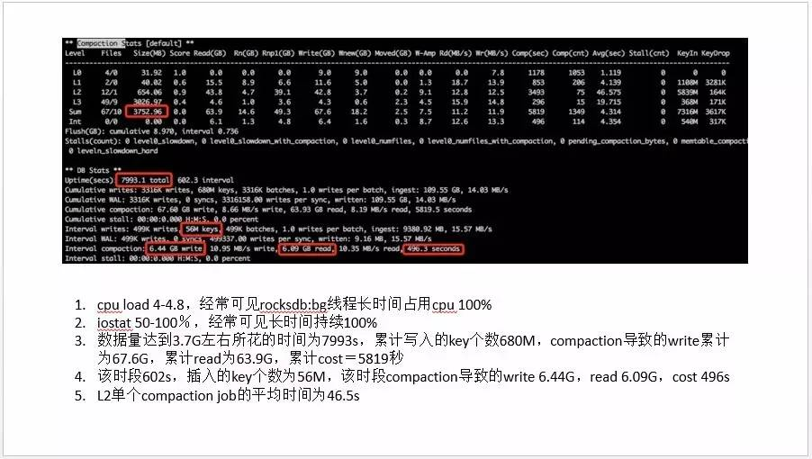

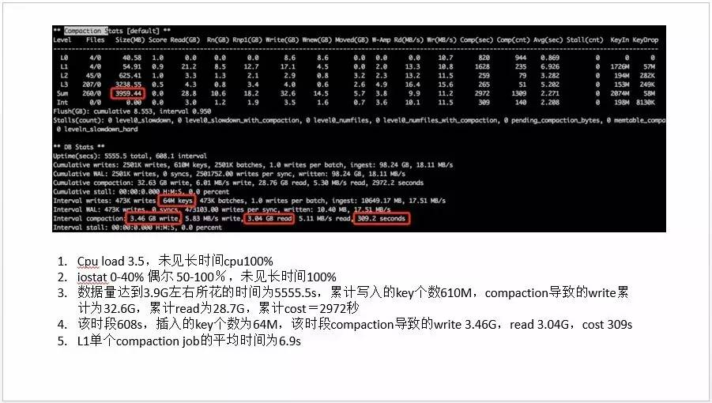

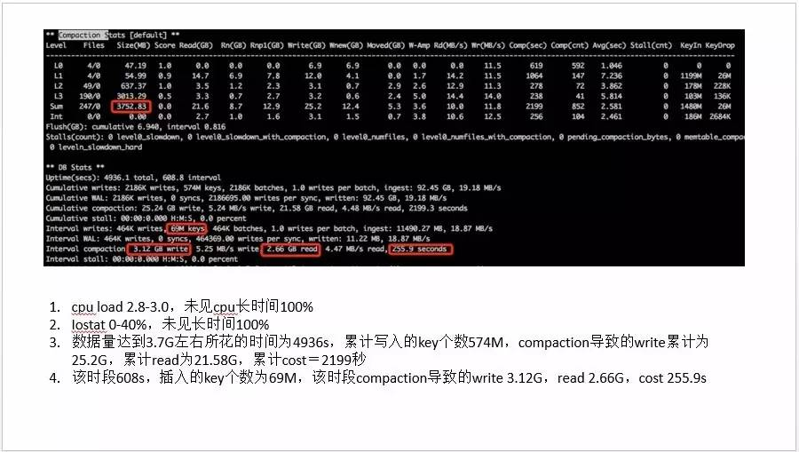

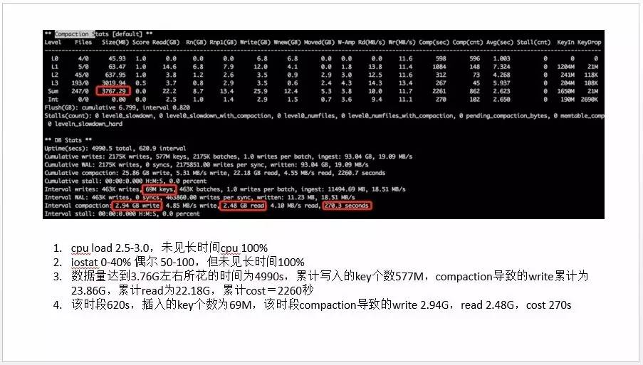

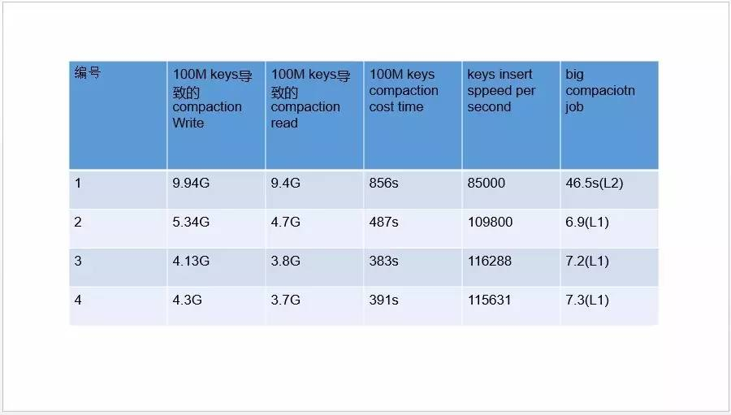

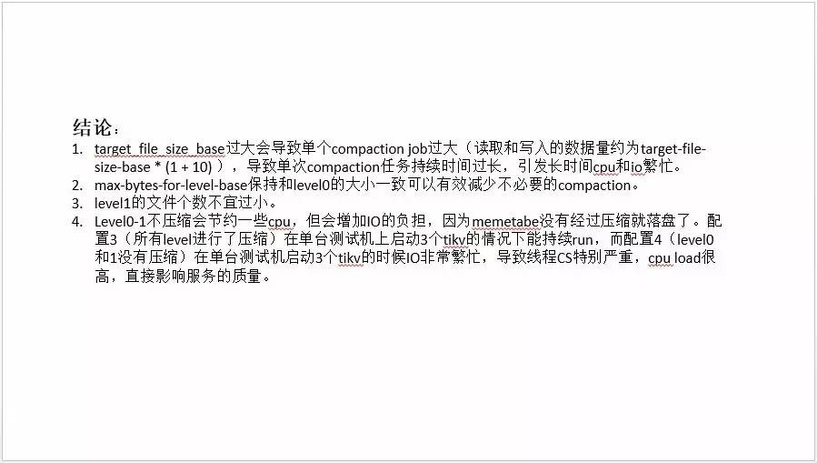

PingCAP Meetup
