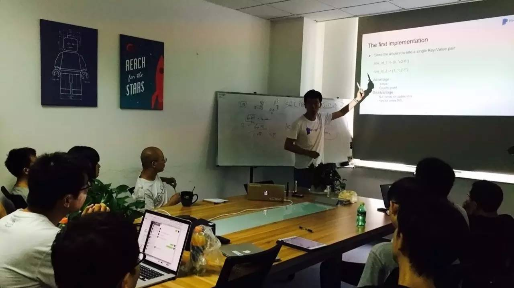
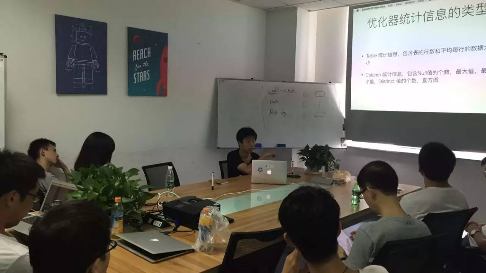

## PingCAP 第15期 NewSQL Meetup

*2016-07-09* *申砾&周昱行* [PingCAP](##)
PingCAP

**PingCAP** 
微信号

pingcap2015

功能介绍

PingCAP 专注于新型分布式数据库的研发，是知名开源数据库 TiDB (GitHub 总计10000+ stars ) 背后的团队，总部设在北京，是国内第一家开源的新型分布式关系型数据库公司、国内领先的大数据技术和解决方案提供商。

** **

NewSQL Meetup

今天是 PingCAP 第15期 Meetup ，主题是申砾分享

的《TiDB 存储模型变更》以及周昱行

分享的《TiDB 优化器统计信息的采集》

。

▌

****
Part 1

****
：《TiDB 存储模型变更》

TiDB 在 Key-Value 存储模型之上，将一行数据拆分成多个 Key-Value pair。这样做有利于列较多并且 update 较为频繁的业务场景，同时对 Online Schema 变更较为友好。但是这种存储模型对于需要读取/写入大量 row 的业务场景并不适用。为此我们修改了 TiDB 的存储模型，将一行内需要频繁修改和很少修改的数据存储在不同的 column family 中，以更好地适应不同热度的数据,以及生存期差别比较大的数据。同时，非常有效地适配了读写放大以及空间放大的问题。

****

▌Part 2：

****
《TiDB 优化器统计信息的采集》

****

****

统计信息是实现基于代价的优化（CBO）的必要条件，本期为大家介绍 TiDB 收集统计信息使用的采样算法和直方图生成算法。

****

PingCAP Meetup

