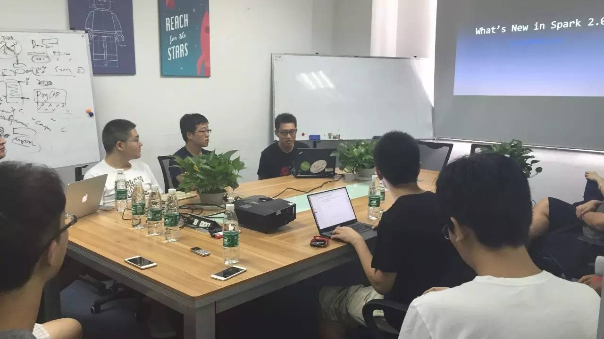
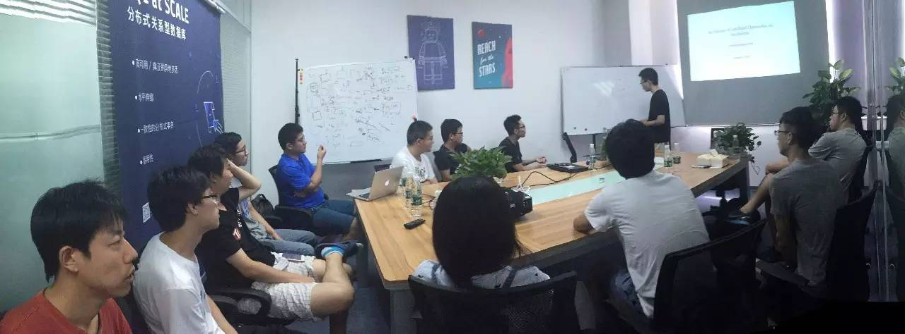

## PingCAP 第 19 期 NewSQL Meetup

*2016-08-06* *方君&韩飞* [PingCAP](##)
PingCAP

**PingCAP** 
微信号

pingcap2015

功能介绍

PingCAP 专注于新型分布式数据库的研发，是知名开源数据库 TiDB (GitHub 总计10000+ stars ) 背后的团队，总部设在北京，是国内第一家开源的新型分布式关系型数据库公司、国内领先的大数据技术和解决方案提供商。

** **

NewSQL Meetup

今天是 PingCAP 第 19 期 Meetup，主题是百度基础架构部工程师方君分享的《

What's New in Spark 2.0

》以及韩飞分享
的《An Overview of Cost Based Optimization and Join Reorder》。

****

▌ ****

Topic 1

****
****

：What's New in Spark 2.0

****
Lecture：

方君，百度基础架构部工程师，专注于分布式计算与流式计算领域，目前在百度负责 Spark 计算平台和计算表示层的相关工作。

****

Content:

1. DataSet API
2. Performance Optimization
3. Structure Streaming

****

▌ ****

Topic 2

****
****

：An Overview of

****
****

Cost Based Optimization and Join Reorder

****
Content:

自从 System R 优化框架面世，基于 interesting order 的动态规划算法一直是大部分优化器采用的基础算法。本次分享介绍了优化器在没有 histogram 信息下的代价估计算法，以及举例说明 TiDB 中的动态规划算法实现。

最近有好多小伙伴在微信后台留言，想加入到我们的 Meetup 中来。在这里统一答复大家：我们的 Meetup 是每周六上午十点，在 PingCAP 公司内开讲哦。有兴趣的小伙伴届时带着你们对技术满满的热情来参加就好啦  :)

PingCAP Meetup

