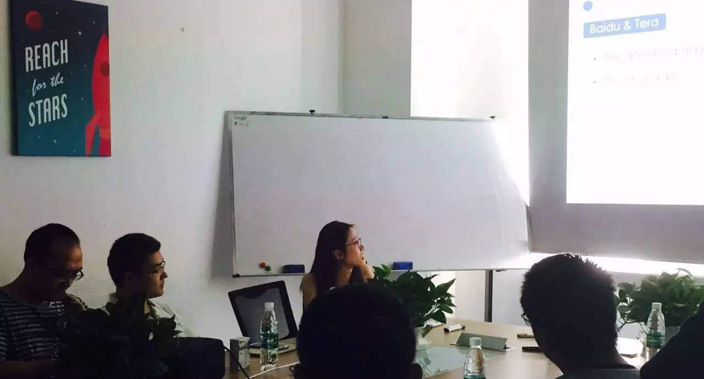
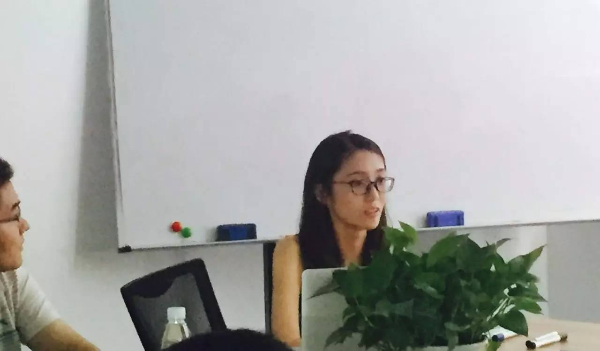
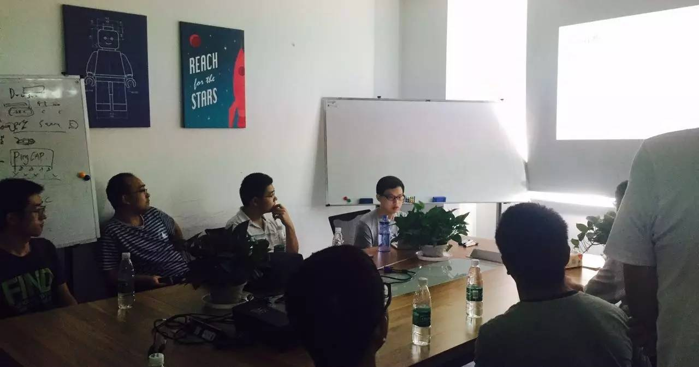

## PingCAP 第 20 期 NewSQL Meetup

*2016-08-20* *雷丽媛&温文鎏* [PingCAP](##)
PingCAP

**PingCAP** 
微信号

pingcap2015

功能介绍

PingCAP 专注于新型分布式数据库的研发，是知名开源数据库 TiDB (GitHub 总计10000+ stars ) 背后的团队，总部设在北京，是国内第一家开源的新型分布式关系型数据库公司、国内领先的大数据技术和解决方案提供商。

** **

NewSQL Meetup

今天是 PingCAP 第 20 期 Meetup，主题是百度网页搜索部工程师雷丽媛分享的《搜索引擎背后的万亿量级存储系统 Tera 》以及温文鎏分享的《Cloudtable：分布式强一致的 KV 存储系统》。

****

****

【

****
****

To

****
****

pic 1

****
****

】

****
****

搜索引擎背后的万亿量级存储系统 Tera

近景福利：

今日的美女讲师 :)

****

Lecture：

雷丽媛，百度网页搜索部工程师。专注于分布式存储领域，目前负责百度结构化数据存储和分布式文件系统的相关工作。

****

Content：

介绍支撑搜索引擎核心的海量存储——Tera 的设计与实现

****

****

【 ****

****

Topic 2

】
****
****

Cloudtable：分布式强一致的 KV 存储系统

****

Content：

如何搭建一个适用于互联网公司业务的大容量分布式强一致性 KV 存储系统?

通过结合分布式一致性协议 Raft，嵌入式存储引擎 RocksDB，HBASE 的架构和接口，YY 云存储团队在过去的两年开发了 Cloudtable 存储系统，它是一个分布式强一致性的 KV 存储系统。今天，前 YY 云存储工程师温文鎏分享了他们在构建 Cloudtbable 系统的实践和经验。

PingCAP Meetup

