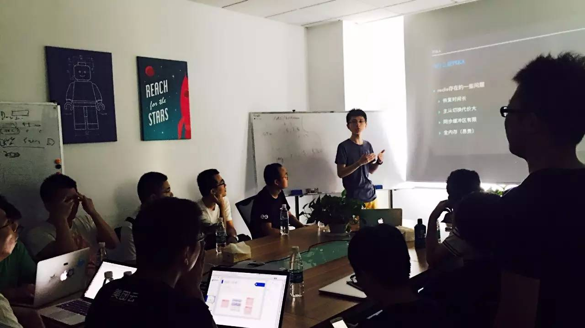
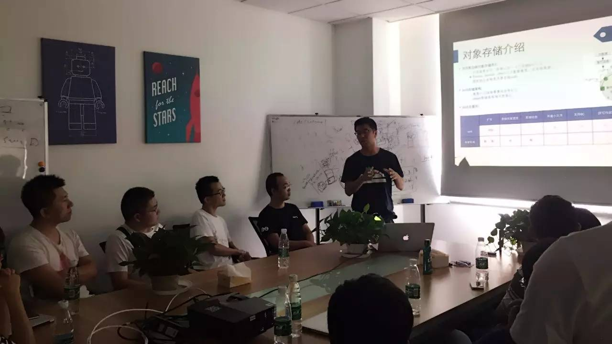

## PingCAP 第 22 期 NewSQL Meetup

*2016-09-03* *宋昭&张帅* [PingCAP](##)
PingCAP

**PingCAP** 
微信号

pingcap2015

功能介绍

PingCAP 专注于新型分布式数据库的研发，是知名开源数据库 TiDB (GitHub 总计10000+ stars ) 背后的团队，总部设在北京，是国内第一家开源的新型分布式关系型数据库公司、国内领先的大数据技术和解决方案提供商。

** **

NewSQL Meetup

今天是 PingCAP 第 22 期 Meetup，主题是

360 基础架构组研发工程师

宋昭

分享的《360 开发的大容量 redis -pika》以及
美团云工程师

张帅

分享的《分布式对象存储系统设计介绍》。

****

▌ ****

T

****
****

opic 1：36

****
****

0 开发的大容量 redis -pika

Lecture：

宋昭，360 基础架构组研发工程师。专注于分布式存储领域，目前负责 360 开源项目 pika 相关的设计和开发工作。

Content：

目前 pika 在 360 内部大量使用，有 300 多实例，主要解决大容量的 redis（400G,800G）场景；在外部，被微博、美团、万达电商、garena、apus 等使用于线上核心系统中。本次分享主要介绍 pika 的系统设计和实现。

****

****

****

****

****

▌ ****

T

****
****

opic 2：

****
****

****

****

分布式对象存储系统设计介绍

Lecture：

张帅，美团云工程师。对分布式数据库及分布式存储系统有浓厚的兴趣。

Content：

分享关于大规模分布式对象存储的一些想法和思考。

PingCAP Meetup

