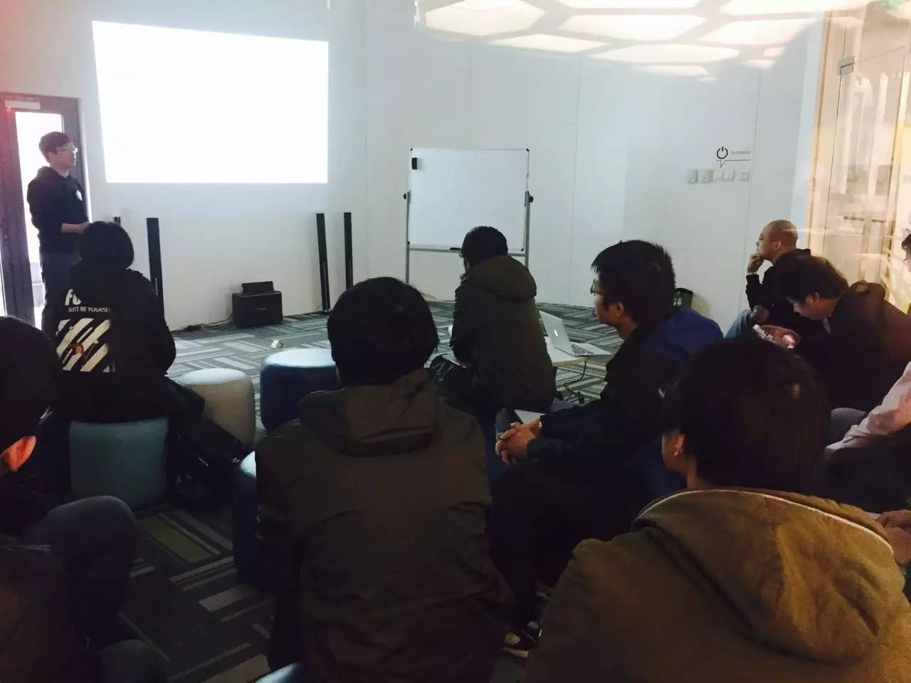
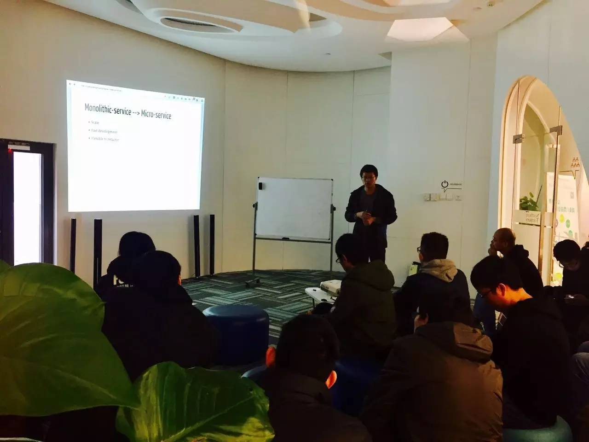

## PingCAP 第 31 期 NewSQL Meetup

*2016-11-26* *黄华超&邓栓* [PingCAP](##)
PingCAP

**PingCAP** 
微信号

pingcap2015

功能介绍

PingCAP 专注于新型分布式数据库的研发，是知名开源数据库 TiDB (GitHub 总计10000+ stars ) 背后的团队，总部设在北京，是国内第一家开源的新型分布式关系型数据库公司、国内领先的大数据技术和解决方案提供商。

** **

NewSQL Meetup

今天是 Ping

CAP 第 31 期 Meetup，

主题是黄华超分

享的《PD 的实现和演进》以及邓栓分享的《从容器和微服务的发展看基础架构变迁》。

****

****

▌Topic 1：

****
****

PD 的实现和演进

Lecturer：

黄华超，PingCAP 工程师，曾就职于微信、好赞科技，从事分布式存储相关工作，现负责 PingCAP PD 研发工作。

Content：

本次分享首先介绍了 PD 在 TiDB 集群的作用，以及集群是如何动态扩容缩容的。然后分别讲解了 PD 的各个功能是如何实现的，其中，着重分享了集群调度的相关设计和思考，以及新的标签调度功能。

****

****

▌Topic 2

****

****

：从容器和微服务的发展看基础架构变迁

Lecturer：

邓栓（Tennix），Rust 中文社区管理员，PingCAP SRE 工程师，负责 TiDB 与 Kubernetes 一体化整合部署方案。

Content：

近些年来容器和微服务的概念变得特别火热，越来越多的互联网公司开始尝试将以前的单体服务迁移到微服务，并且在实践中使用容器来部署服务，容器和微服务也催生了 DevOps，CaaS，Immutable infrastructure，Service orchestration 等概念。今天主要从容器和微服务角度谈了新技术应用和实践给开发者带来了哪些便利和挑战，基础架构发生了哪些改变，并尝试探讨了未来的应用服务会是什么样的架构。

****

特别鸣谢：场地赞助-泰利驿站

PingCAP Meetup

