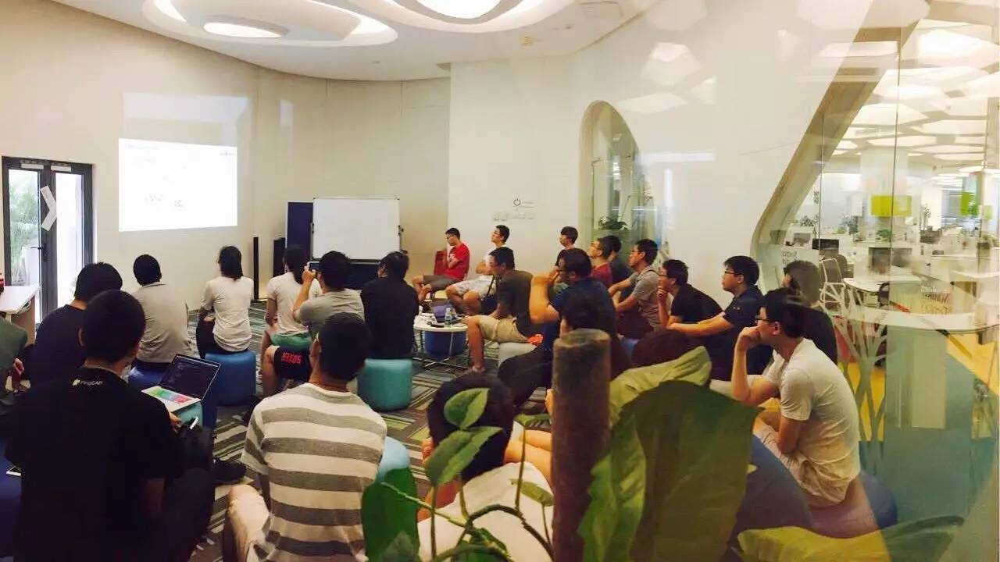
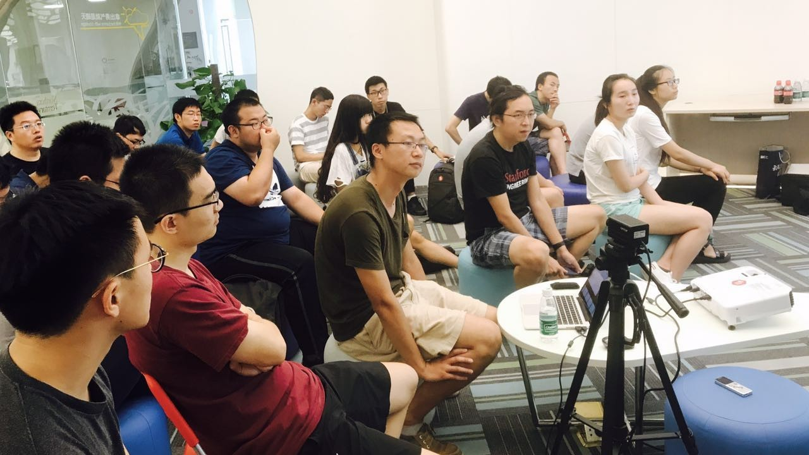
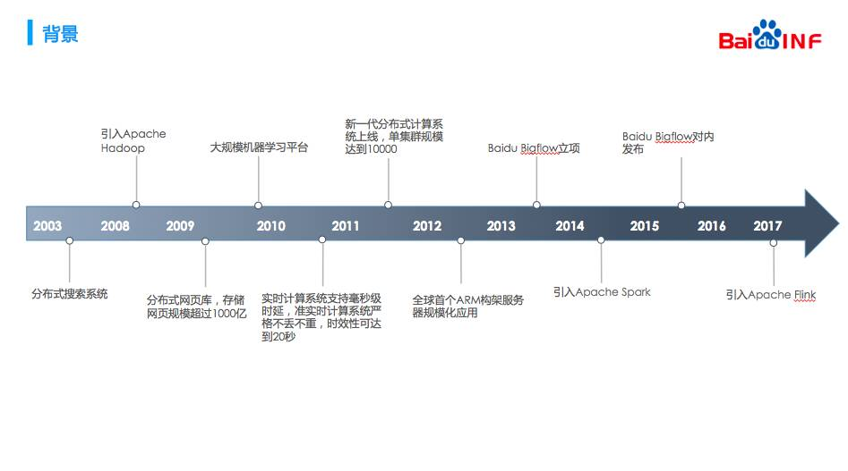
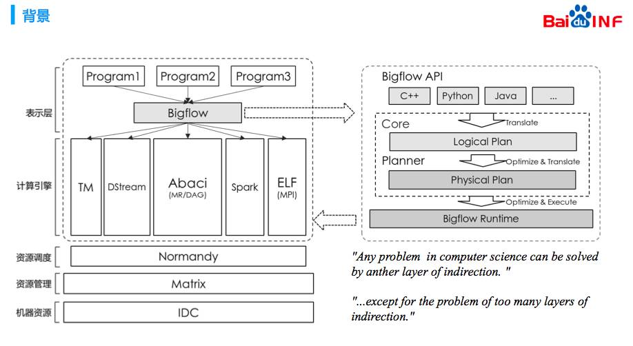
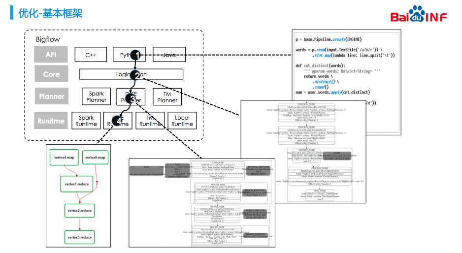
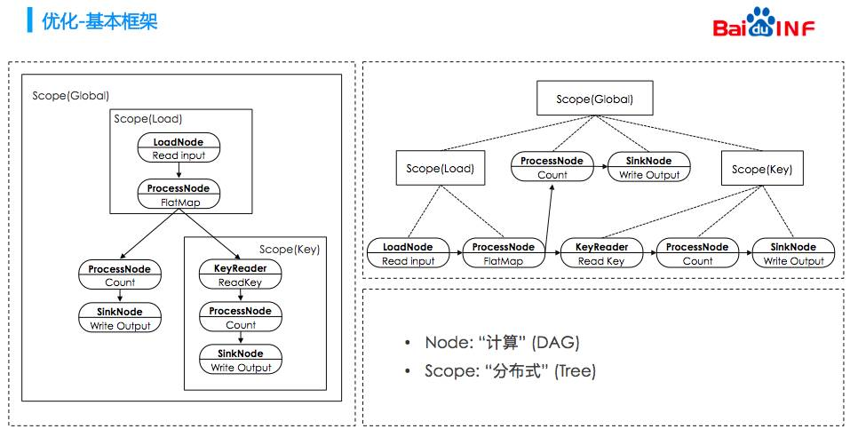
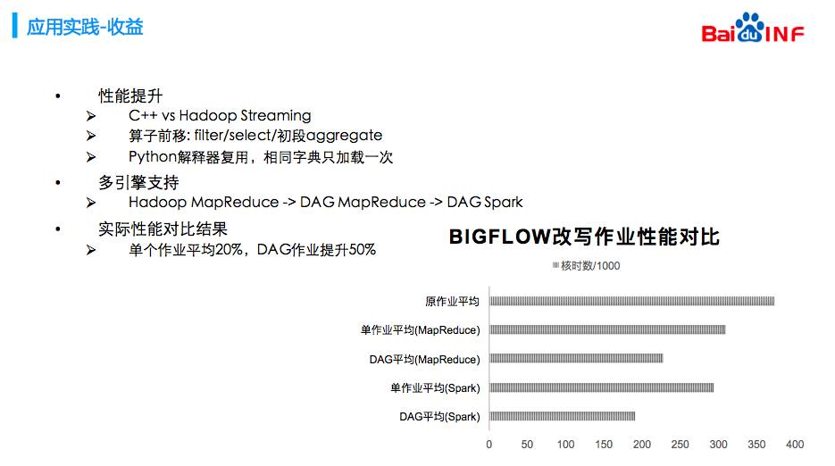
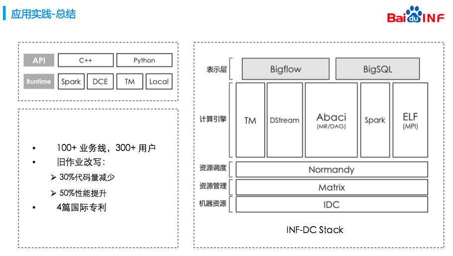

## 【Infra Meetup NO.51】百度统一分布式计算框架 Bigflow (内附 PPT 下载链接)

*2017-07-01* *王聪* [PingCAP](##)
PingCAP

**PingCAP** 
微信号

pingcap2015

功能介绍

PingCAP 专注于新型分布式数据库的研发，是知名开源数据库 TiDB (GitHub 总计10000+ stars ) 背后的团队，总部设在北京，是国内第一家开源的新型分布式关系型数据库公司、国内领先的大数据技术和解决方案提供商。

** **

今天的 Meetup，我们邀请到了滴滴地图事业部专家工程师王聪老师，为大家分享《百度统一分布式计算框架 Bigflow 》。

王聪，滴滴地图事业部专家工程师，前百度基础架构部工程师，主要工作方向为分布式计算与流式计算，在百度负责计算表示层 Bigflow 与流式计算引擎 Flink。

活动现场听得很专注的小伙伴们，桑拿天也阻止不了大家的学习热情。

王聪老师首先展示了分布式计算在百度的发展例程，他介绍百度在 2003 年建立了自己的分布式搜索系统。08 年引入 hadoop，09 年底搭建了大规模的机器学习平台，当时用的是 MPI。10 年百度自研了两套流式计算引擎，主要用来完成点击流与展现流的 join。

基于多引擎并存、跨引擎成本高、升级困难

这几个痛点，最终开发了一款

叫做 Bigflow 的计算框架，Bigflow 希望用户使用我们提供的 API 写代码，Bigflow 将作业进行计划的优化和翻译，并提交到计算引擎之上。对于这样的思路，有一种说法“计算机领域的任何问题，都可以通过增加一个额外的中间层来解决”。在这里 Bigflow 就是架在用户与引擎之间的中间层。

**以下是新鲜出炉的 PPT 节选，尽情享用~**

点击阅读原文，可下载完整版 PPT ✌️

PingCAP Infra Meetup

