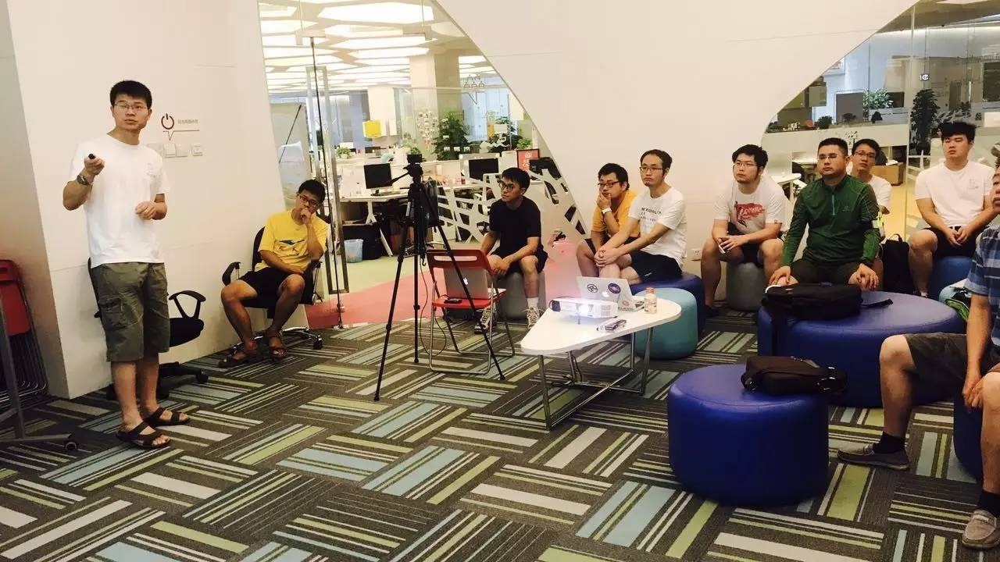
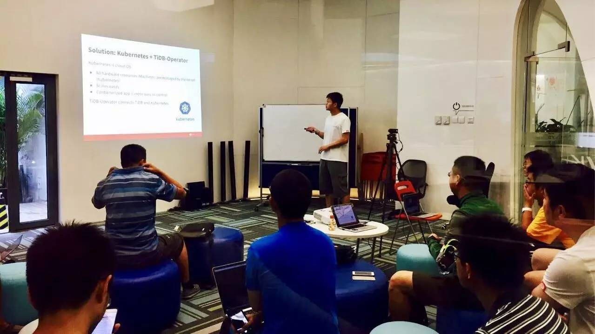
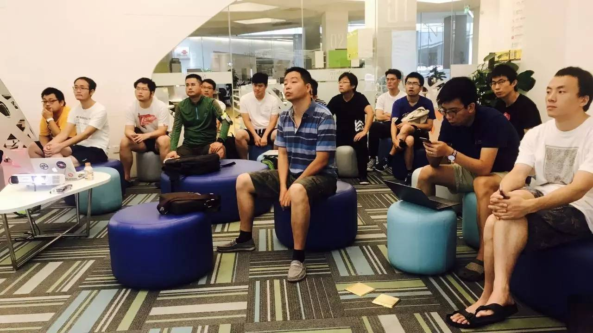
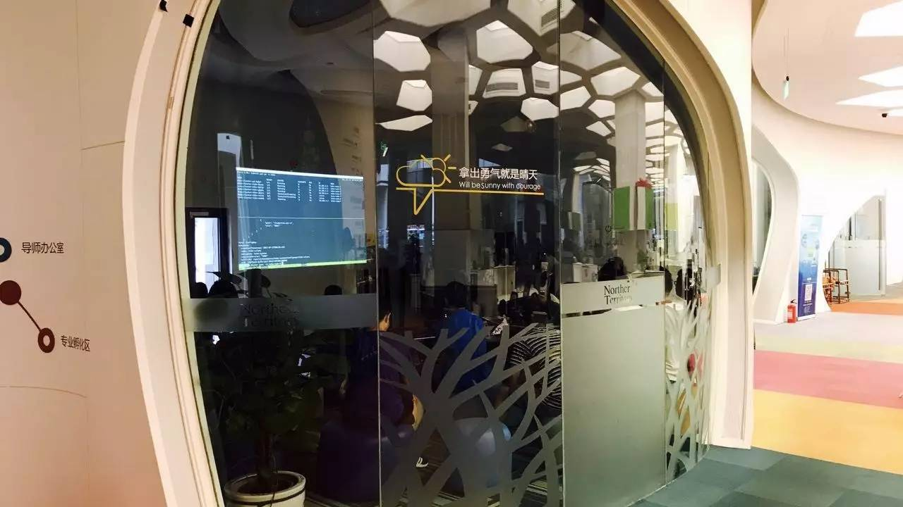
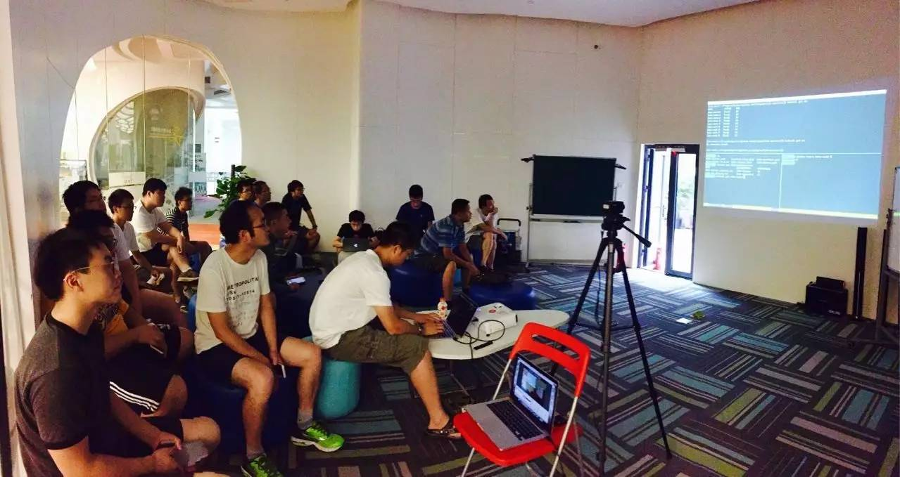
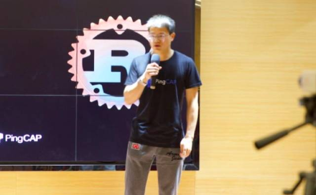

## 【Infra Meetup NO.52】TiDB 自动化运维管理 —— TiDB-Operator》

*2017-07-22* *邓栓* [PingCAP](##)
PingCAP

**PingCAP** 
微信号

pingcap2015

功能介绍

PingCAP 专注于新型分布式数据库的研发，是知名开源数据库 TiDB (GitHub 总计10000+ stars ) 背后的团队，总部设在北京，是国内第一家开源的新型分布式关系型数据库公司、国内领先的大数据技术和解决方案提供商。

** **

今天的 Meetup，由我司技术大拿邓栓同学为大家分享《TiDB 自动化运维管理 —— TiDB-Operator》。

今日的帝都带着一丝凉爽，如此好天气怎能辜负。小伙伴们一清早就来到互动现场，一起来吃“营养早午餐”。

我司技术大拿邓栓同学激情满满的开始为大家做主题分享，主要从

TiDB-Operator 的功能介绍、

整体架构

、实现细节这几个纬度切入。

邓栓同学开场介绍到：分布式系统由于自身的复杂性，其管理和运维通常是非常困难的事情，借助 TiDB-Operator 我们能够轻松地将 TiDB 集群部署到 Kubernetes 集群之上，并做到自动化运维管理，极大地降低了人力运维成本，

现场小伙伴们听呆了～

咦？what'wrong ? 黑灯瞎火嘛呢？小编一脸懵圈，好奇害死猫，我还是决定去瞅瞅。

soga~ 小伙伴们在一起很专注的看

demo 演示，小编真是想多了～

活动最后，邓栓同学

通过 demo 演示了 TiDB-operator bootstrap 一套完整的 TiDB 集群，然后在集群上面执行一个简单的操作就可以轻松实现扩容缩容，并且模拟物理节点挂掉时 TiDB-operator 对集群做自动恢复等各种自动化运维操作流程。

以上就是小编为你带来的前方报道～ enjoy 😁

PingCAP SRE

工程师

，Kubernetes
爱好者

，
目前主要负责

TiDB
与各种云平台整合。

Rust
中国社区联合创始人。

PingCAP Infra Meetup

