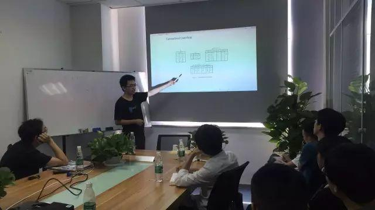
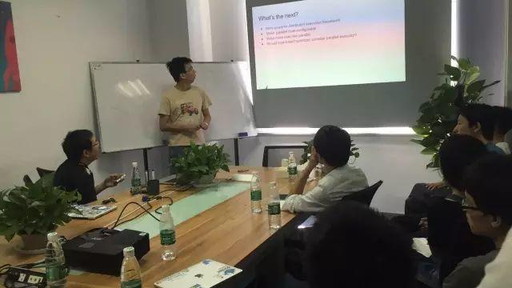

今天是 PingCAP 第 21 期 Meetup，主题是韩飞分享的《An Introduction to Join-Reorder in TiDB》以及申砾分享的《MPP and SMP in TiDB》。

## Topic 1：An Introduction to Join-Reorder in TiDB

韩飞 | PingCAP

**Content：**

本次分享详细介绍了 TiDB 中 Join-Reorder 的流程。包括 Join-Reorder 的动机，outer-join 的 reorder 局限性和解决办法。为了解决某些 outer join re-association 的问题，我们可以引入的新算子 Generalized outerJoin。最后介绍了通过为 Join Query 建立 Query Graph 进行启发式搜索和动态规划的 Join-Reorder 算法。

## Topic 2：MPP and SMP in TiDB

申砾 | PingCAP

**Content：**

TiDB 是一个支持水平扩展的分布式数据库，除了提供海量数据存储能力之外，还需要提供海量数据的计算能力，这样才能帮助用户更好、更容易地使用数据。为此我们开发了一套分布式计算框架，一方面利用海量的存储节点的计算能力，加快数据处理速度；另一方面在单个计算节点内，我们利用 Go 的并发优势，通过 SMP 方式提高计算并行度。

本次 Talk 首先介绍了 TiDB 分布式计算架构，并举例说明计算的具体流程；然后分享了最近 TiDB 针对索引查询和 Join 做的一系列优化，性能有大幅度提高；最后列出了一些 NewSQL database 中如何做计算值得思考的问题。

