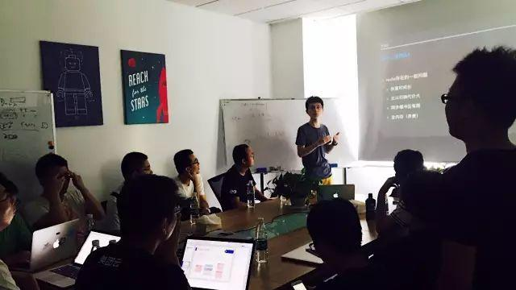
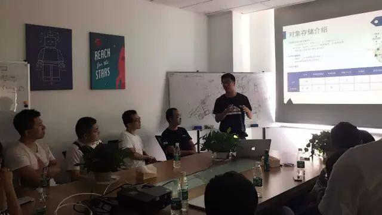

今天是 PingCAP 第 22 期 Meetup，主题是 360 基础架构组研发工程师宋昭分享的《360 开发的大容量 redis -pika》以及美团云工程师张帅分享的《分布式对象存储系统设计介绍》。

### Topic 1：360 开发的大容量 redis -pika

 

>讲师介绍：宋昭，360 基础架构组研发工程师。专注于分布式存储领域，目前负责 360 开源项目 pika 相关的设计和开发工作。

Content：

目前 pika 在 360 内部大量使用，有 300 多实例，主要解决大容量的 redis（400G,800G）场景；在外部，被微博、美团、万达电商、garena、apus 等使用于线上核心系统中。本次分享主要介绍 pika 的系统设计和实现。

### Topic 2：分布式对象存储系统设计介绍

>讲师介绍：张帅，美团云工程师。对分布式数据库及分布式存储系统有浓厚的兴趣。

Content：

分享关于大规模分布式对象存储的一些想法和思考。

